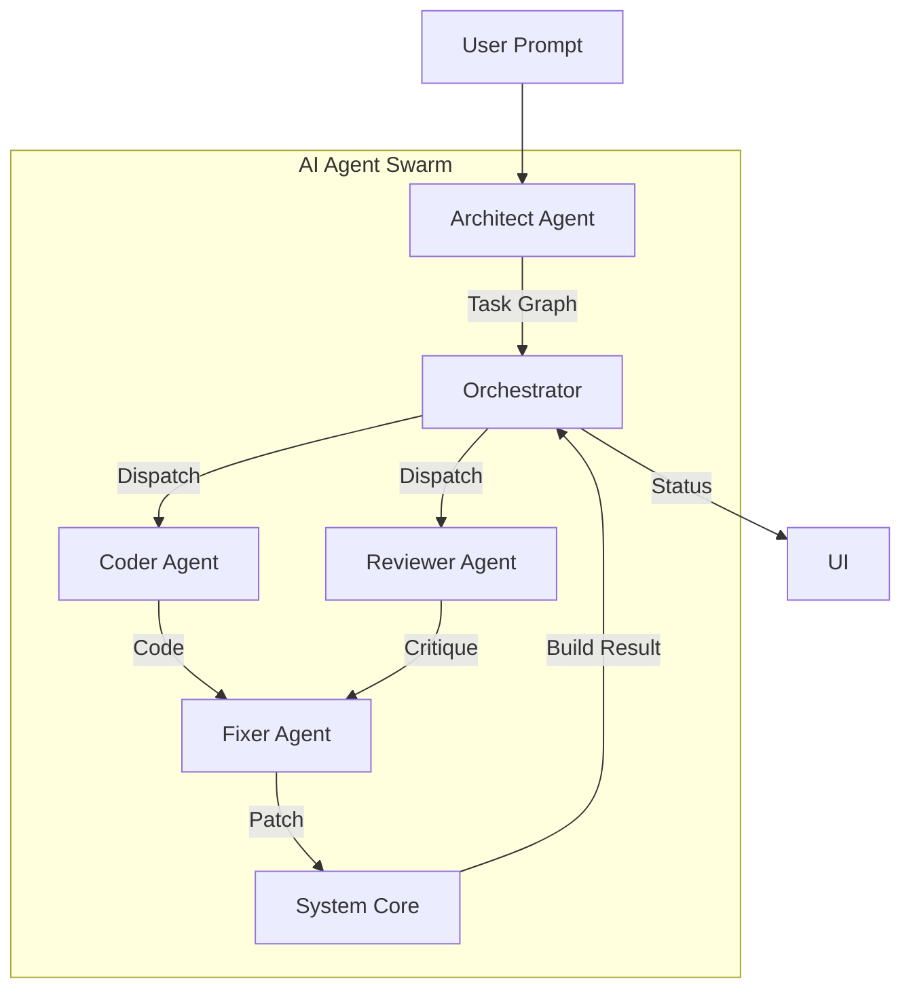

# AI AGENTS AND PLANNING

> **The AI Construction Engine: Blueprint Design, Adaptive Planning & Multi-Agent Coordination**
>
> **Related Core Document:** [AI_RUNTIME_MODEL.md](./AI_RUNTIME_MODEL.md) — Defines the relationship between AI Construction Engine (Primary Brain) and Runtime Safety Kernel (Enforcement Layer).
>
> _The AI Construction Engine is the PRIMARY BRAIN. It designs adaptive blueprints, learns from errors, and owns the entire construction strategy. The Runtime Safety Kernel enforces hard boundaries silently._

---

## Table of Contents

1. [Overview](#1-overview)
2. [AI Architecture Blueprint Model](#2-ai-architecture-blueprint-model)
3. [Adaptive Planning Layer](#3-adaptive-planning-layer)
4. [Multi-Agent Specifications](#4-multi-agent-specifications)
5. [Agent Execution Contracts](#5-agent-execution-contracts)
6. [Agent Orchestration Pattern](#6-agent-orchestration-pattern)
7. [AI Engine Integration](#7-ai-engine-integration)
8. [Context Window Management](#8-context-window-management)

---

## 1. Overview

The AI Construction Engine transforms unstructured user prompts into adaptive architectural blueprints and coordinates multiple specialized agents to generate complete, runnable applications.

### AI-Primary Architecture

```
┌─────────────────────────────────────────────────────────────┐
│  AI CONSTRUCTION ENGINE (Primary Brain)                     │
│  ┌─────────────────────────────────────────────────────────┐│
│  │ Blueprint Designer    → Adaptive architecture design    ││
│  │ Multi-Agent System    → Specialized code generation     ││
│  │ Planning Engine       → Task graph construction         ││
│  │ Retry Controller      → Error recovery strategy (1-9)   ││
│  └─────────────────────────────────────────────────────────┘│
├─────────────────────────────────────────────────────────────┤
│  RUNTIME SAFETY KERNEL (Enforcement Layer)                  │
│  ┌─────────────────────────────────────────────────────────┐│
│  │ Mutation Guard       → Validate before apply            ││
│  │ Snapshot Manager     → Restore points                   ││
│  │ Retry Governor       → Hard ceiling (10+)               ││
│  │ Operation Whitelist  → Only approved operations         ││
│  └─────────────────────────────────────────────────────────┘│
└─────────────────────────────────────────────────────────────┘
```

### Core Responsibilities

1. **Blueprint Design**: AI creates adaptive architectural blueprints, not rigid specs
2. **Intent Understanding**: Natural language → semantic understanding → creative design
3. **Adaptive Planning**: Task graphs that evolve based on build feedback
4. **Agent Coordination**: Orchestrate multiple specialized agents
5. **Code Generation**: Produce syntactically correct C#/XAML code
6. **Self-Correction**: AI learns from errors and adapts strategy

---

## 2. AI Architecture Blueprint Model

### 2.1 Purpose

The AI Construction Engine creates **adaptive architectural blueprints**, not rigid specifications. The blueprint is a living model that evolves based on build feedback, error patterns, and user refinements.

> **Key Difference from Deterministic Specs:**
> - Old: Rigid JSON schema → fixed pipeline → single output
> - New: AI Blueprint → adaptive design → evolves with feedback

### 2.2 Blueprint Structure

The AI Architecture Blueprint contains these components:

```
AI ARCHITECTURE BLUEPRINT
├── Architecture Intent Model
│   ├── User Intent (semantic understanding)
│   ├── Implicit Requirements (AI-inferred)
│   └── Constraint Set (user + system constraints)
│
├── Component Graph
│   ├── UI Components (pages, dialogs, controls)
│   ├── Services (business logic, data access)
│   ├── Models (entities, DTOs, view models)
│   └── Infrastructure (database, configuration)
│
├── Domain Model
│   ├── Entities (persistent data structures)
│   ├── Relationships (entity associations)
│   ├── Business Rules (validation, invariants)
│   └── Data Flows (how data moves through system)
│
├── Service Contracts
│   ├── Service Interfaces (what each service does)
│   ├── Dependencies (service-to-service relationships)
│   └── Integration Points (external APIs, database)
│
├── Navigation Graph
│   ├── Page Hierarchy (navigation structure)
│   ├── Routes (how users move through app)
│   └── State Transitions (view state changes)
│
└── Cross-Cutting Concerns
    ├── Authentication & Authorization
    ├── Error Handling Strategy
    ├── Logging & Diagnostics
    └── Performance Considerations
```

### 2.3 Blueprint Generation Flow

**Input:**
```
"Build a CRM with authentication, role-based access,
customer database, and analytics dashboard"
```

**AI Processing (NOT deterministic extraction):**

1. **Semantic Understanding** - AI comprehends intent, not just keywords
2. **Creative Design** - AI proposes architecture based on best practices
3. **Constraint Integration** - System constraints merged with user requirements
4. **Blueprint Synthesis** - AI creates comprehensive architectural model
5. **Validation Loop** - Blueprint validated against known patterns

**Output (AI Architecture Blueprint):**

```json
{
  "blueprint_id": "bp_crm_20260220",
  "version": 1,
  "architecture_intent": {
    "user_intent": "CRM system with auth, RBAC, customer data, analytics",
    "implicit_requirements": [
      "Session management for authentication",
      "Password hashing for security",
      "Audit logging for compliance",
      "Export functionality for reports"
    ],
    "design_philosophy": "Enterprise-grade, maintainable, testable"
  },
  "component_graph": {
    "ui_components": {
      "pages": ["Dashboard", "CustomerList", "CustomerDetail", "Analytics", "Login"],
      "dialogs": ["AddCustomer", "EditCustomer", "ConfirmDelete"],
      "controls": ["CustomerCard", "MetricWidget", "ChartDisplay"]
    },
    "services": {
      "core": ["AuthService", "CustomerService", "AnalyticsService"],
      "infrastructure": ["DatabaseService", "NavigationService", "DialogService"]
    },
    "models": {
      "entities": ["Customer", "Contact", "Interaction", "User", "Role"],
      "view_models": ["DashboardViewModel", "CustomerListViewModel"],
      "dtos": ["CustomerDto", "AnalyticsReportDto"]
    }
  },
  "domain_model": {
    "entities": [
      {
        "name": "Customer",
        "properties": ["Id", "Name", "Email", "CreatedAt", "Status"],
        "relationships": ["hasMany:Contact", "hasMany:Interaction"]
      }
    ],
    "business_rules": [
      "Email must be unique across customers",
      "Customer status cannot be changed to 'deleted' if active interactions exist"
    ]
  },
  "navigation_graph": {
    "entry_point": "Login",
    "routes": [
      { "from": "Login", "to": "Dashboard", "condition": "authenticated" },
      { "from": "Dashboard", "to": "CustomerList", "trigger": "menu_click" },
      { "from": "CustomerList", "to": "CustomerDetail", "trigger": "item_select" }
    ]
  },
  "cross_cutting": {
    "authentication": { "method": "WindowsAuth", "session_timeout": "30min" },
    "authorization": { "model": "RBAC", "roles": ["Admin", "Manager", "User"] },
    "error_handling": { "strategy": "user_friendly_messages", "logging": "structured" }
  }
}
```

### 2.4 Adaptive Blueprint Evolution

The blueprint **evolves** during construction:

```
Initial Blueprint (v1)
       ↓
Build Attempt #1 → Errors detected
       ↓
AI analyzes errors, adapts blueprint
       ↓
Revised Blueprint (v2)
       ↓
Build Attempt #2 → New errors
       ↓
AI learns pattern, adapts strategy
       ↓
Revised Blueprint (v3)
       ↓
Build Succeeds → Final Blueprint locked
```

### 2.5 Key Differences from Deterministic Specs

| Aspect | Deterministic Spec (Old) | AI Blueprint (New) |
|--------|--------------------------|-------------------|
| **Structure** | Rigid JSON schema | Flexible semantic model |
| **Evolution** | Fixed after creation | Evolves with feedback |
| **Error Handling** | Pipeline fails | AI adapts strategy |
| **Creativity** | Template-based | AI-designed |
| **Validation** | Schema validation | Pattern validation |
| **Retry Strategy** | Fixed retry count | AI decides based on error type |

### 2.6 Blueprint Governance

| Aspect | Owner | Description |
|--------|-------|-------------|
| Blueprint creation | AI Construction Engine | AI designs initial architecture |
| Blueprint adaptation | AI Construction Engine | AI modifies based on build feedback |
| Blueprint validation | Runtime Safety Kernel | Kernel enforces hard boundaries |
| Blueprint persistence | Runtime Safety Kernel | Snapshots of blueprint versions |

---

## 3. Planning Layer (Task Graph / DAG)

### 3.1 Purpose

Convert feature spec into an ordered, executable task graph where dependencies are explicit and parallelizable work is identified.

### 3.2 Threading Clarification

> Parallelizable tasks are planned in DAG, but execution is serialized at mutation layer. AI planning may be parallel. Filesystem mutation is strictly sequential.

### 3.3 Task Graph Structure

```text
Task {
  id: "setup-auth",
  type: "infrastructure",
  description: "Configure Windows Authentication",
  dependencies: ["init-project"],
  files_to_create: ["Models/User.cs", "Services/AuthService.cs"],
  validation_strategy: "compile-check",
  expected_artifacts: [
    "AuthService class",
    "User model",
    "Authentication middleware"
  ]
}
```

### 3.4 Example DAG for CRM App

```text
init-project [0]
    ↓
setup-database [1]
    ↓
    ├─→ define-models [2]
    │   ├─→ customer-model
    │   ├─→ contact-model
    │   └─→ interaction-model
    │
    ├─→ setup-auth [2]
    │   ├─→ auth-service
    │   └─→ user-model
    │
    └─→ db-migrations [2]
        ├─→ create-tables
        └─→ seed-data

generate-ui [3]
    ├─→ login-page (requires: setup-auth)
    ├─→ dashboard-page (requires: setup-database)
    └─→ customer-table (requires: define-models)

wire-api-routes [4]
    ├─→ auth-routes (requires: setup-auth)
    ├─→ customer-crud (requires: customer-model)
    ├─→ analytics-routes (requires: setup-database)
    └─→ rbac-middleware (requires: setup-auth)

validation & fix [5]
    → compile & test
    → detect errors
    → auto-fix
    → retry
```

### 3.5 Key Insights

- **Parallelizable work** - Tasks at same level can run concurrently
- **Dependencies clear** - Prevents race conditions
- **Validation points** - Each task has success criteria
- **Rollback safe** - Can retry individual tasks

### 3.6 Task Graph Contract

```json
{
  "$schema": "http://json-schema.org/draft-07/schema#",
  "type": "object",
  "properties": {
    "tasks": {
      "type": "array",
      "items": {
        "type": "object",
        "properties": {
          "id": { "type": "string" },
          "type": { "enum": ["INFRASTRUCTURE", "MODEL", "SERVICE", "UI", "INTEGRATION", "FIX"] },
          "description": { "type": "string" },
          "targetFiles": { "type": "array", "items": { "type": "string" } },
          "dependencies": { "type": "array", "items": { "type": "string" } },
          "validationStrategy": { "enum": ["COMPILE", "UNIT_TEST", "XAML_PARSE"] }
        },
        "required": ["id", "type", "description", "targetFiles", "dependencies"]
      }
    }
  },
  "required": ["tasks"]
}
```

### 3.7 Blueprint → TaskType Mapping Layer (CRITICAL)

> **INVARIANT**: The AI Blueprint uses flexible semantic task types. The Runtime Safety Kernel requires bounded `TaskType` enum values. The Mapping Layer translates between these two worlds.

#### Mapping Architecture

```
┌─────────────────────────────────────────────────────────────┐
│                AI BLUEPRINT LAYER                           │
│            (Flexible Semantic Task Types)                   │
│                                                              │
│  "create-authentication-system"                             │
│  "build-customer-management-ui"                             │
│  "implement-data-persistence"                               │
│  "add-analytics-dashboard"                                  │
└─────────────────────────────────────────────────────────────┘
                              │
                              │ BlueprintTaskMapper.Translate()
                              ▼
┌─────────────────────────────────────────────────────────────┐
│              RUNTIME SAFETY KERNEL LAYER                    │
│              (Bounded TaskType Enum)                        │
│                                                              │
│  CREATE_PROJECT, ADD_VIEW, ADD_VIEWMODEL, ADD_SERVICE,      │
│  ADD_DEPENDENCY, PATCH_FILE, MODIFY_FILE, etc.              │
└─────────────────────────────────────────────────────────────┘
```

#### Mapping Rules

| Blueprint Task Type | Maps To TaskType | AgentRole | Notes |
|---------------------|------------------|-----------|-------|
| `create-project` | `CREATE_PROJECT` | ARCHITECT | Root task |
| `create-page`, `add-view`, `build-ui` | `ADD_VIEW` | FRONTEND | UI creation |
| `create-viewmodel`, `add-vm` | `ADD_VIEWMODEL` | FRONTEND | VM creation |
| `create-service`, `add-logic` | `ADD_SERVICE` | BACKEND | Service layer |
| `add-nuget`, `install-package` | `ADD_DEPENDENCY` | INTEGRATION | Package management |
| `fix-error`, `patch-code` | `PATCH_FILE` | FIXER | Error repair |
| `modify-*`, `update-*` | `MODIFY_FILE` | FIXER | Modifications |
| `generate-manifest` | `GENERATE_MANIFEST` | INTEGRATION | Packaging |
| `infer-capabilities` | `INFER_CAPABILITIES` | INTEGRATION | Capability scan |

#### BlueprintTaskMapper Implementation

```csharp
public class BlueprintTaskMapper
{
    /// <summary>
    /// Translates flexible blueprint task types to bounded TaskType enum.
    /// This is the ONLY place where translation happens.
    /// </summary>
    public TaskType MapToTaskType(string blueprintTaskType)
    {
        // Normalize to lowercase for matching
        var normalized = blueprintTaskType.ToLowerInvariant().Replace("-", "_").Replace(" ", "_");

        return normalized switch
        {
            // Project-level
            "create_project" or "init_project" or "new_project" => TaskType.CREATE_PROJECT,

            // UI Layer
            "create_page" or "add_page" or "add_view" or "create_view" or "build_ui" => TaskType.ADD_VIEW,

            // ViewModel Layer
            "create_viewmodel" or "add_viewmodel" or "add_vm" or "create_vm" => TaskType.ADD_VIEWMODEL,

            // Service Layer
            "create_service" or "add_service" or "add_logic" or "implement_service" => TaskType.ADD_SERVICE,

            // Dependencies
            "add_dependency" or "add_nuget" or "install_package" or "add_package" => TaskType.ADD_DEPENDENCY,

            // Modifications
            "modify_file" or "update_file" or "change_file" => TaskType.MODIFY_FILE,

            // Fixes
            "patch_file" or "fix_error" or "fix_file" or "repair_file" => TaskType.PATCH_FILE,

            // File Operations
            "add_file" or "create_file" => TaskType.ADD_FILE,
            "delete_file" or "remove_file" => TaskType.DELETE_FILE,
            "refactor_file" or "restructure_file" => TaskType.REFACTOR_FILE,

            // Packaging
            "generate_manifest" or "create_manifest" => TaskType.GENERATE_MANIFEST,
            "infer_capabilities" or "detect_capabilities" => TaskType.INFER_CAPABILITIES,
            "configure_packaging" => TaskType.CONFIGURE_PACKAGING,
            "generate_certificate" => TaskType.GENERATE_CERTIFICATE,
            "sign_package" => TaskType.SIGN_PACKAGE,
            "build_msix" => TaskType.BUILD_MSIX,

            // Database
            "migrate_schema" or "run_migration" => TaskType.MIGRATE_SCHEMA,

            // Unknown - safe default
            _ => TaskType.PATCH_FILE // Safest default for unknown operations
        };
    }

    /// <summary>
    /// Maps TaskType to AgentRole for execution context injection.
    /// </summary>
    public AgentRole MapToAgentRole(TaskType taskType) => taskType switch
    {
        TaskType.CREATE_PROJECT => AgentRole.ARCHITECT,
        TaskType.ADD_VIEW => AgentRole.FRONTEND,
        TaskType.ADD_VIEWMODEL => AgentRole.FRONTEND,
        TaskType.ADD_SERVICE => AgentRole.BACKEND,
        TaskType.ADD_DEPENDENCY => AgentRole.INTEGRATION,
        TaskType.MODIFY_FILE => AgentRole.FIXER,
        TaskType.PATCH_FILE => AgentRole.FIXER,
        TaskType.ADD_FILE => AgentRole.FIXER,
        TaskType.DELETE_FILE => AgentRole.FIXER,
        TaskType.REFACTOR_FILE => AgentRole.FIXER,
        TaskType.GENERATE_MANIFEST => AgentRole.INTEGRATION,
        TaskType.INFER_CAPABILITIES => AgentRole.INTEGRATION,
        TaskType.CONFIGURE_PACKAGING => AgentRole.INTEGRATION,
        TaskType.GENERATE_CERTIFICATE => AgentRole.INTEGRATION,
        TaskType.SIGN_PACKAGE => AgentRole.INTEGRATION,
        TaskType.BUILD_MSIX => AgentRole.INTEGRATION,
        TaskType.MIGRATE_SCHEMA => AgentRole.SCHEMA,
        _ => AgentRole.FIXER
    };
}
```

#### Translation Flow

```
1. AI creates Blueprint with semantic task types:
   {
     "tasks": [
       { "type": "create-page", "name": "LoginScreen" },
       { "type": "build-auth-service", "name": "AuthService" }
     ]
   }

2. BlueprintTaskMapper.Translate() called for each task:
   "create-page" → TaskType.ADD_VIEW
   "build-auth-service" → TaskType.ADD_SERVICE

3. Orchestrator receives bounded TaskType:
   - Validates against enum (compile-time safety)
   - Creates AgentExecutionContext with mapped AgentRole
   - Enforces mutation ceilings

4. Execution proceeds with deterministic safety guarantees
```

#### Validation Rule

> **The Runtime Safety Kernel NEVER sees raw blueprint task types.** All task types MUST be translated through `BlueprintTaskMapper` before reaching the state machine. Unknown task types default to `PATCH_FILE` with `FIXER` role for safety.

---

## 4. Multi-Agent Specifications

### 4.1 Purpose

Decompose complex app generation into specialized agents, each with narrow responsibility and deterministic output schema.

### 4.2 The Agent Stack

| Agent | Responsibility |
| ----- | -------------- |
| **Planner** | Decomposes user prompt into task graph |
| **Coder** | Generates C#/XAML per task |
| **Fixer** | Patches code after build errors |
| **Reviewer** | Validates architectural consistency |

### 4.3 Agent Architecture Pattern



### 4.4 Detailed Agent Specifications

#### Architect Agent

**Responsibility:** Define overall app structure

**Input:**
```json
{
  "spec": {...},
  "task": "design-project-structure"
}
```

**Output:**
```json
{
  "project_structure": {
    "Models": ["Customer.cs", "Contact.cs"],
    "Services": ["CustomerService.cs", "AuthService.cs"],
    "UI": ["MainWindow.xaml", "CustomerPage.xaml"],
    "Database": ["DbContext.cs"]
  },
  "design_patterns": ["MVVM", "Repository", "Dependency Injection"]
}
```

#### Schema Agent

**Responsibility:** Generate database models and migrations

**Input:**
```json
{
  "entities": [
    {
      "name": "Customer",
      "properties": [
        { "name": "id", "type": "int", "pk": true },
        { "name": "name", "type": "string" }
      ]
    }
  ]
}
```

**Output:**
```csharp
// Generated Customer.cs
[Table("customers")]
public class Customer
{
    [Key]
    public int Id { get; set; }

    [Required]
    [StringLength(200)]
    public string Name { get; set; }
}
```

#### Frontend Agent

**Responsibility:** Generate UI components and pages

**Input:**
```json
{
  "pages": [
    {
      "name": "CustomerPage",
      "components": ["DataGrid", "Form", "Button"],
      "data_binding": "customer"
    }
  ]
}
```

**Output:**
```xaml
<Page x:Class="CRM.CustomerPage">
  <Grid>
    <DataGrid ItemsSource="{Binding Customers}" />
    <Button Content="Add" Click="OnAdd" />
  </Grid>
</Page>
```

#### Backend Agent

**Responsibility:** Generate API routes and services

**Input:**
```json
{
  "routes": [
    {
      "path": "/api/customers",
      "methods": ["GET", "POST"],
      "auth_required": true
    }
  ]
}
```

**Output:**
```csharp
[ApiController]
[Route("api/[controller]")]
[Authorize]
public class CustomersController : ControllerBase
{
    [HttpGet]
    public async Task<ActionResult<List<CustomerDto>>> GetAll()
    {
        return await _service.GetAllAsync();
    }
}
```

#### Integration Agent

**Responsibility:** Wire dependencies together

**Input:**
```json
{
  "dependencies": {
    "CustomerController": ["CustomerService"],
    "CustomerService": ["ICustomerRepository", "ILogger"]
  }
}
```

**Output:**
```csharp
// Updates Program.cs
services.AddScoped<ICustomerRepository, CustomerRepository>();
services.AddScoped<CustomerService>();
services.AddScoped<CustomersController>();
```

#### Fix Agent

**Responsibility:** Detect and repair build failures

**Input:**
```json
{
  "error": "CS1503: Cannot convert type 'string' to 'int'",
  "file": "Models/Customer.cs",
  "line": 15,
  "context": "public int CustomerId { get; set; } = customerId;"
}
```

**Output:**
```json
{
  "fix_type": "type_conversion",
  "suggestions": [
    {
      "code": "public int CustomerId { get; set; } = int.Parse(customerId);",
      "confidence": 0.85
    },
    {
      "code": "public int CustomerId { get; set; } = Convert.ToInt32(customerId);",
      "confidence": 0.9
    }
  ]
}
```

---

## 5. Agent Execution Contracts

### 5.1 Agent Input/Output Contracts

#### Architect Agent Contract

**Input Schema:**
```json
{
  "spec": {
    "projectType": "windows-desktop-app",
    "features": [...],
    "stack": {...}
  },
  "task": "design-project-structure"
}
```

**Output Schema:**
```json
{
  "project_structure": {
    "Models": ["Customer.cs", "Contact.cs"],
    "Services": ["CustomerService.cs", "AuthService.cs"],
    "UI": ["MainWindow.xaml", "CustomerPage.xaml"],
    "Database": ["DbContext.cs"]
  },
  "design_patterns": ["MVVM", "Repository", "Dependency Injection"],
  "naming_conventions": {
    "models": "PascalCase",
    "private_fields": "_camelCase",
    "public_properties": "PascalCase"
  }
}
```

#### Schema Agent Contract

**Input Schema:**
```json
{
  "entities": [
    {
      "name": "Customer",
      "properties": [
        { "name": "id", "type": "int", "pk": true },
        { "name": "name", "type": "string" }
      ]
    }
  ]
}
```

**Output Schema:**
```csharp
// Generated Customer.cs
[Table("customers")]
public class Customer
{
    [Key]
    public int Id { get; set; }

    [Required]
    [StringLength(200)]
    public string Name { get; set; }
}
```

#### Fix Agent Contract

**Input Schema:**
```json
{
  "error": "CS1503: Cannot convert type 'string' to 'int'",
  "file": "Models/Customer.cs",
  "line": 15,
  "context": "public int CustomerId { get; set; } = customerId;"
}
```

**Output Schema:**
```json
{
  "fix_type": "type_conversion",
  "suggestions": [
    {
      "code": "public int CustomerId { get; set; } = int.Parse(customerId);",
      "confidence": 0.85
    },
    {
      "code": "public int CustomerId { get; set; } = Convert.ToInt32(customerId);",
      "confidence": 0.9
    }
  ]
}
```

### 5.2 Patch Definition Contract

**Source:** Generation Agents (Layer 4)  
**Purpose:** Targeted modifications for the Patch Engine (Layer 5)

```json
{
  "type": "object",
  "properties": {
    "filePatches": {
      "array": {
        "items": {
          "type": "object",
          "properties": {
            "path": { "type": "string" },
            "changes": {
              "type": "array",
              "items": {
                "type": "object",
                "required": ["action", "content"],
                "properties": {
                  "action": {
                    "enum": [
                      "ADD_CLASS",
                      "ADD_METHOD",
                      "ADD_PROPERTY",
                      "ADD_FIELD",
                      "MODIFY_METHOD_BODY",
                      "MODIFY_PROPERTY",
                      "INSERT_USING",
                      "REMOVE_MEMBER",
                      "UPDATE_XAML_NODE",
                      "ADD_XAML_ELEMENT",
                      "MODIFY_XAML_ATTRIBUTE"
                    ]
                  },
                  "targetSymbol": { "type": "string" },
                  "content": { "type": "string" }
                }
              }
            }
          }
        }
      }
    }
  }
}
```

---

## 6. Agent Orchestration Pattern

### 6.1 AI-Primary Ownership Model

> **The AI Construction Engine owns the construction strategy. The Runtime Safety Kernel enforces hard boundaries.**

The Agent Orchestration follows the AI-Primary model defined in [AI_RUNTIME_MODEL.md](./AI_RUNTIME_MODEL.md):

| Responsibility | Owner | Description |
|----------------|-------|-------------|
| Task planning | AI Construction Engine | Agents create, modify, and adapt plans |
| Code generation | AI Construction Engine | Agents generate all code and patches |
| Retry strategy (1-9) | AI Construction Engine | Agents decide how to fix errors |
| Mutation ceilings | Runtime Safety Kernel | Hard limits on files/nodes modified |
| Retry ceiling (10+) | Runtime Safety Kernel | Hard abort with rollback |
| Operation whitelist | Runtime Safety Kernel | Only approved operations allowed |

### 6.2 Orchestration Logic

```python
# Conceptual Orchestration Logic
async def orchestrate_generation(spec, task_graph):
    for task in task_graph.topological_sort():
        context = await retrieval_service.get_context(task)

        # 1. Select Specialist Agent
        agent = agent_factory.get_agent(task.type)

        # 2. Generate Candidate Code
        candidate = await agent.generate(spec, context)

        # 3. Apply via Patch Engine (Dry Run)
        if not await patch_engine.validate(candidate):
            # 4. Self-Correction Loop
            attempts = 0
            while attempts < 3:
                error = patch_engine.get_last_error()
                candidate = await fix_agent.fix(candidate, error)
                if await patch_engine.validate(candidate):
                    break
                attempts += 1

        # 5. Commit if Valid
        if await patch_engine.validate(candidate):
            await patch_engine.commit(candidate)
```

### 6.2 Stage Execution Flow

**Stage 1: Planning & Structure**
```python
arch_output = architect_agent(spec)
results['architecture'] = arch_output
```

**Stage 2: Parallel Generation (tasks with no deps)**
```python
schema_output = schema_agent(spec)
auth_output = backend_agent(spec, auth_tasks)
results['schema'] = schema_output
results['auth'] = auth_output
```

**Stage 3: UI Generation (needs auth context)**
```python
ui_output = frontend_agent(spec, auth_output)
results['ui'] = ui_output
```

**Stage 4: Integration (wires everything)**
```python
integration_output = integration_agent(results)
results['integration'] = integration_output
```

**Stage 5: Build & Validate**
```python
build_result = validate_and_build()
```

**Stage 6: Auto-fix if needed**
```python
if build_result.has_errors:
    for error in build_result.errors:
        fix_output = fix_agent(error, results)
        apply_fix(fix_output)
    # Retry build
    build_result = validate_and_build()

return results, build_result
```

---

## 7. AI Engine Integration

### 7.1 Integration Architecture

The AI Engine generates code, but **never directly renders or displays it**. The Preview System is a separate layer that consumes AI-generated code.

```
User Prompt → Orchestrator → AI Engine (Patches) → Roslyn Engine (Apply) → Preview Service (Render)
```

### 7.2 Separation of Concerns

| Component           | Responsibility               | Does NOT Do                      |
| ------------------- | ---------------------------- | -------------------------------- |
| **AI Engine**       | Generate code patches (JSON) | ❌ Write files, Render preview   |
| **Roslyn Engine**   | Apply patches to workspace   | ❌ Generate code, Render preview |
| **Preview Service** | Render/display code          | ❌ Generate code, Modify files   |

### 7.3 Operation Whitelist

Only whitelisted operations are permitted from AI-generated patches:

```csharp
private static readonly HashSet<string> AllowedOperations = new()
{
    "ADD_CLASS", "MODIFY_METHOD", "ADD_PROPERTY",
    "ADD_DEPENDENCY", "UPDATE_XAML", "DELETE_FILE", "MOVE_FILE"
};
```

**Security Note:** Any operation not in this list is automatically rejected, preventing potentially dangerous modifications.

---

## 8. Context Window Management

### 8.1 Principle

AI context is managed through intelligent relevance-based retrieval:

- **Relevance scoring** - Files ordered by relevance to current task
- **Semantic retrieval** - Only include files that are semantically related to the task
- **Dependency-aware context** - Include files based on symbol dependencies, not arbitrary limits
- **No hardcoded token limits** - The AI model handles its own context window constraints

### 8.2 Context Assembly Implementation

```csharp
public async Task<string> BuildContextAsync(List<ContextFile> files, string taskDescription)
{
    // Score files by relevance to the task
    var scoredFiles = await ScoreByRelevanceAsync(files, taskDescription);

    // Sort by relevance score (highest first)
    var sortedFiles = scoredFiles.OrderByDescending(f => f.RelevanceScore);

    var result = new StringBuilder();

    foreach (var file in sortedFiles)
    {
        // Include the file content - the AI model will handle context window limits
        result.AppendLine($"// File: {file.Path}");
        result.AppendLine(file.Content);
        result.AppendLine();
    }

    return result.ToString();
}

private async Task<List<ContextFile>> ScoreByRelevanceAsync(List<ContextFile> files, string taskDescription)
{
    // Use semantic similarity to score files against the task
    var taskEmbedding = await _embeddingService.GetEmbeddingAsync(taskDescription);

    foreach (var file in files)
    {
        var fileEmbedding = await _embeddingService.GetEmbeddingAsync(file.Content);
        file.RelevanceScore = CosineSimilarity(taskEmbedding, fileEmbedding);
    }

    return files;
}
```

### 8.3 Context Assembly Priority

1. **System Rules** — WinUI constraints
2. **Project Summary** — High-level architecture
3. **Target Symbol Definition** — Full code of target
4. **Direct Dependencies** — Interfaces, services used
5. **XAML Bindings** — Corresponding XAML file
6. **Error Context** — If in fix mode

### 8.4 AI Context Cache

```csharp
public class AIContextCache
{
    // Three named cache keys
    private const string ProjectSummaryKey   = "project_summary";
    private const string DependencyGraphKey  = "dependency_graph";
    private const string RecentChangesKey    = "recent_changes";

    public async Task PrepareContextAsync(string projectPath)
    {
        // Step 1: Load project summary from graph DB
        // Step 2: Serialize dependency graph edges
        // Step 3: Collect recent file change metadata
    }
}
```

Called during `AI_PLANNING` state. Results cached under the three named keys above.

---

## References

- [SYSTEM_ARCHITECTURE.md](./SYSTEM_ARCHITECTURE.md) — 7-layer overview, global invariants
- [ORCHESTRATION_ENGINE.md](./ORCHESTRATION_ENGINE.md) — State machine, task lifecycle
- [CODE_INTELLIGENCE.md](./CODE_INTELLIGENCE.md) — Roslyn indexing, symbol graph
- [AGENT_EXECUTION_CONTRACT.md](./AGENT_EXECUTION_CONTRACT.md) — Detailed agent execution specification
