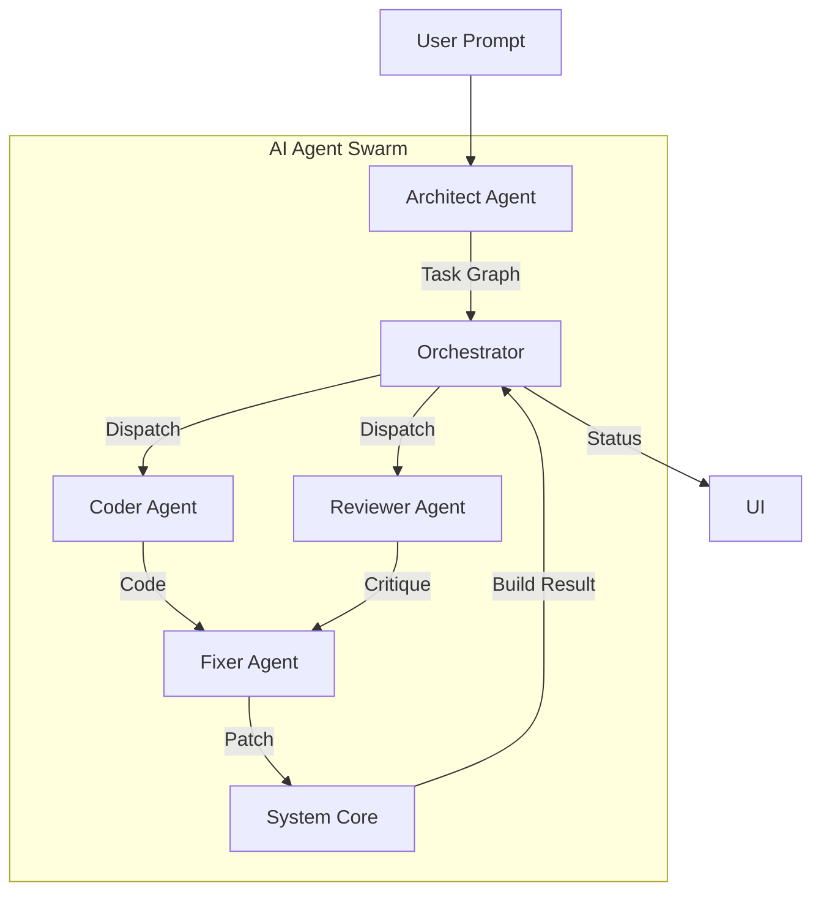

# AI AGENTS AND PLANNING

> **The Intelligence Layer: Intent Parsing, DAG Planning, Multi-Agent Specifications & Execution Contracts**
>
> _Governs how user prompts become structured plans and how agents collaborate to generate code._

---

## Table of Contents

1. [Overview](#1-overview)
2. [Intent and Specification Layer](#2-intent-and-specification-layer)
3. [Planning Layer (Task Graph / DAG)](#3-planning-layer-task-graph--dag)
4. [Multi-Agent Specifications](#4-multi-agent-specifications)
5. [Agent Execution Contracts](#5-agent-execution-contracts)
6. [Agent Orchestration Pattern](#6-agent-orchestration-pattern)
7. [AI Engine Integration](#7-ai-engine-integration)
8. [Context Window Management](#8-context-window-management)

---

## 1. Overview

The AI Agents and Planning layer transforms unstructured user prompts into structured, executable task graphs and coordinates multiple specialized agents to generate code.

### Architectural Position

```
┌─────────────────────────────────────────────────────────────┐
│  Layer 7: User Interface (WinUI 3 / XAML)                   │
├─────────────────────────────────────────────────────────────┤
│  Layer 6: Orchestrator Engine                               │
├─────────────────────────────────────────────────────────────┤
│  Layer 5: AI Agent Layer ← THIS SPEC                        │
├─────────────────────────────────────────────────────────────┤
│  Layer 4: Code Intelligence (Roslyn)                        │
└─────────────────────────────────────────────────────────────┘
```

### Core Responsibilities

1. **Intent Parsing**: Transform natural language into structured specifications
2. **Task Graph Generation**: Create ordered, executable plans (DAGs)
3. **Agent Coordination**: Orchestrate multiple specialized agents
4. **Code Generation**: Produce syntactically correct C#/XAML code
5. **Self-Correction**: Fix errors through iterative refinement

---

## 2. Intent and Specification Layer

### 2.1 Purpose

Transform unstructured user prompts into structured, machine-readable specifications that prevent hallucination and ensure consistency.

### 2.2 Process Flow

**Input:**
```
"Build a CRM with authentication, role-based access,
customer database, and analytics dashboard"
```

**Processing:**

1. **NLP Feature Extraction** - Identify requested features
2. **Stack Selection** - Choose appropriate tech stack
3. **Constraint Inference** - Deduce implicit requirements (e.g., auth implies session management)
4. **Dependency Mapping** - Identify feature interdependencies
5. **Validation** - Check for conflicts or impossibilities

**Output (Structured JSON):**

```json
{
  "projectType": "windows-desktop-app",
  "projectName": "CRM System",
  "features": [
    {
      "id": "authentication",
      "type": "auth",
      "subType": "windows-auth",
      "dependencies": ["user-database"],
      "priority": 1
    },
    {
      "id": "rbac",
      "type": "access-control",
      "roles": ["admin", "manager", "user"],
      "dependencies": ["authentication"],
      "priority": 2
    },
    {
      "id": "customer-database",
      "type": "data-model",
      "tables": ["customers", "contacts", "interactions"],
      "dependencies": ["database-setup"],
      "priority": 1
    },
    {
      "id": "analytics-dashboard",
      "type": "ui",
      "components": ["charts", "metrics", "filters"],
      "dependencies": ["customer-database", "rbac"],
      "priority": 3
    }
  ],
  "stack": {
    "ui": "WinUI3",
    "backend": ".NET8",
    "database": "SQLite",
    "auth": "Windows Authentication"
  },
  "constraints": {
    "maxComplexity": "medium",
    "requiredPackages": ["Microsoft.UI.Xaml", "System.Data.Sqlite"],
    "incompatibleFeatures": []
  }
}
```

### 2.3 Benefits

- **No hallucination** - Features derived from extraction, not free-form
- **Explicit dependencies** - Clear what depends on what
- **Conflict detection** - Catch contradictory requirements early
- **Stack consistency** - All modules use same tech choices

### 2.4 Project Specification Contract

```json
{
  "$schema": "http://json-schema.org/draft-07/schema#",
  "type": "object",
  "properties": {
    "projectId": { "type": "string" },
    "projectName": { "type": "string" },
    "stack": {
      "type": "object",
      "properties": {
        "ui": { "enum": ["WinUI3", "WPF", "Console"] },
        "language": { "const": "C#" },
        "framework": { "const": ".NET 8.0" },
        "database": { "enum": ["SQLite", "None"] }
      },
      "required": ["ui", "language", "framework"]
    },
    "features": {
      "type": "array",
      "items": {
        "type": "object",
        "properties": {
          "id": { "type": "string" },
          "type": { "type": "string" },
          "description": { "type": "string" },
          "dependencies": { "type": "array", "items": { "type": "string" } }
        },
        "required": ["id", "type", "description"]
      }
    }
  },
  "required": ["projectId", "projectName", "stack", "features"]
}
```

---

## 3. Planning Layer (Task Graph / DAG)

### 3.1 Purpose

Convert feature spec into an ordered, executable task graph where dependencies are explicit and parallelizable work is identified.

### 3.2 Threading Clarification

> Parallelizable tasks are planned in DAG, but execution is serialized at mutation layer. AI planning may be parallel. Filesystem mutation is strictly sequential.

### 3.3 Task Graph Structure

```text
Task {
  id: "setup-auth",
  type: "infrastructure",
  description: "Configure Windows Authentication",
  dependencies: ["init-project"],
  files_to_create: ["Models/User.cs", "Services/AuthService.cs"],
  validation_strategy: "compile-check",
  expected_artifacts: [
    "AuthService class",
    "User model",
    "Authentication middleware"
  ]
}
```

### 3.4 Example DAG for CRM App

```text
init-project [0]
    ↓
setup-database [1]
    ↓
    ├─→ define-models [2]
    │   ├─→ customer-model
    │   ├─→ contact-model
    │   └─→ interaction-model
    │
    ├─→ setup-auth [2]
    │   ├─→ auth-service
    │   └─→ user-model
    │
    └─→ db-migrations [2]
        ├─→ create-tables
        └─→ seed-data

generate-ui [3]
    ├─→ login-page (requires: setup-auth)
    ├─→ dashboard-page (requires: setup-database)
    └─→ customer-table (requires: define-models)

wire-api-routes [4]
    ├─→ auth-routes (requires: setup-auth)
    ├─→ customer-crud (requires: customer-model)
    ├─→ analytics-routes (requires: setup-database)
    └─→ rbac-middleware (requires: setup-auth)

validation & fix [5]
    → compile & test
    → detect errors
    → auto-fix
    → retry
```

### 3.5 Key Insights

- **Parallelizable work** - Tasks at same level can run concurrently
- **Dependencies clear** - Prevents race conditions
- **Validation points** - Each task has success criteria
- **Rollback safe** - Can retry individual tasks

### 3.6 Task Graph Contract

```json
{
  "$schema": "http://json-schema.org/draft-07/schema#",
  "type": "object",
  "properties": {
    "tasks": {
      "type": "array",
      "items": {
        "type": "object",
        "properties": {
          "id": { "type": "string" },
          "type": { "enum": ["INFRASTRUCTURE", "MODEL", "SERVICE", "UI", "INTEGRATION", "FIX"] },
          "description": { "type": "string" },
          "targetFiles": { "type": "array", "items": { "type": "string" } },
          "dependencies": { "type": "array", "items": { "type": "string" } },
          "validationStrategy": { "enum": ["COMPILE", "UNIT_TEST", "XAML_PARSE"] }
        },
        "required": ["id", "type", "description", "targetFiles", "dependencies"]
      }
    }
  },
  "required": ["tasks"]
}
```

---

## 4. Multi-Agent Specifications

### 4.1 Purpose

Decompose complex app generation into specialized agents, each with narrow responsibility and deterministic output schema.

### 4.2 The Agent Stack

| Agent | Responsibility |
| ----- | -------------- |
| **Planner** | Decomposes user prompt into task graph |
| **Coder** | Generates C#/XAML per task |
| **Fixer** | Patches code after build errors |
| **Reviewer** | Validates architectural consistency |

### 4.3 Agent Architecture Pattern



### 4.4 Detailed Agent Specifications

#### Architect Agent

**Responsibility:** Define overall app structure

**Input:**
```json
{
  "spec": {...},
  "task": "design-project-structure"
}
```

**Output:**
```json
{
  "project_structure": {
    "Models": ["Customer.cs", "Contact.cs"],
    "Services": ["CustomerService.cs", "AuthService.cs"],
    "UI": ["MainWindow.xaml", "CustomerPage.xaml"],
    "Database": ["DbContext.cs"]
  },
  "design_patterns": ["MVVM", "Repository", "Dependency Injection"]
}
```

#### Schema Agent

**Responsibility:** Generate database models and migrations

**Input:**
```json
{
  "entities": [
    {
      "name": "Customer",
      "properties": [
        { "name": "id", "type": "int", "pk": true },
        { "name": "name", "type": "string" }
      ]
    }
  ]
}
```

**Output:**
```csharp
// Generated Customer.cs
[Table("customers")]
public class Customer
{
    [Key]
    public int Id { get; set; }

    [Required]
    [StringLength(200)]
    public string Name { get; set; }
}
```

#### Frontend Agent

**Responsibility:** Generate UI components and pages

**Input:**
```json
{
  "pages": [
    {
      "name": "CustomerPage",
      "components": ["DataGrid", "Form", "Button"],
      "data_binding": "customer"
    }
  ]
}
```

**Output:**
```xaml
<Page x:Class="CRM.CustomerPage">
  <Grid>
    <DataGrid ItemsSource="{Binding Customers}" />
    <Button Content="Add" Click="OnAdd" />
  </Grid>
</Page>
```

#### Backend Agent

**Responsibility:** Generate API routes and services

**Input:**
```json
{
  "routes": [
    {
      "path": "/api/customers",
      "methods": ["GET", "POST"],
      "auth_required": true
    }
  ]
}
```

**Output:**
```csharp
[ApiController]
[Route("api/[controller]")]
[Authorize]
public class CustomersController : ControllerBase
{
    [HttpGet]
    public async Task<ActionResult<List<CustomerDto>>> GetAll()
    {
        return await _service.GetAllAsync();
    }
}
```

#### Integration Agent

**Responsibility:** Wire dependencies together

**Input:**
```json
{
  "dependencies": {
    "CustomerController": ["CustomerService"],
    "CustomerService": ["ICustomerRepository", "ILogger"]
  }
}
```

**Output:**
```csharp
// Updates Program.cs
services.AddScoped<ICustomerRepository, CustomerRepository>();
services.AddScoped<CustomerService>();
services.AddScoped<CustomersController>();
```

#### Fix Agent

**Responsibility:** Detect and repair build failures

**Input:**
```json
{
  "error": "CS1503: Cannot convert type 'string' to 'int'",
  "file": "Models/Customer.cs",
  "line": 15,
  "context": "public int CustomerId { get; set; } = customerId;"
}
```

**Output:**
```json
{
  "fix_type": "type_conversion",
  "suggestions": [
    {
      "code": "public int CustomerId { get; set; } = int.Parse(customerId);",
      "confidence": 0.85
    },
    {
      "code": "public int CustomerId { get; set; } = Convert.ToInt32(customerId);",
      "confidence": 0.9
    }
  ]
}
```

---

## 5. Agent Execution Contracts

### 5.1 Agent Input/Output Contracts

#### Architect Agent Contract

**Input Schema:**
```json
{
  "spec": {
    "projectType": "windows-desktop-app",
    "features": [...],
    "stack": {...}
  },
  "task": "design-project-structure"
}
```

**Output Schema:**
```json
{
  "project_structure": {
    "Models": ["Customer.cs", "Contact.cs"],
    "Services": ["CustomerService.cs", "AuthService.cs"],
    "UI": ["MainWindow.xaml", "CustomerPage.xaml"],
    "Database": ["DbContext.cs"]
  },
  "design_patterns": ["MVVM", "Repository", "Dependency Injection"],
  "naming_conventions": {
    "models": "PascalCase",
    "private_fields": "_camelCase",
    "public_properties": "PascalCase"
  }
}
```

#### Schema Agent Contract

**Input Schema:**
```json
{
  "entities": [
    {
      "name": "Customer",
      "properties": [
        { "name": "id", "type": "int", "pk": true },
        { "name": "name", "type": "string" }
      ]
    }
  ]
}
```

**Output Schema:**
```csharp
// Generated Customer.cs
[Table("customers")]
public class Customer
{
    [Key]
    public int Id { get; set; }

    [Required]
    [StringLength(200)]
    public string Name { get; set; }
}
```

#### Fix Agent Contract

**Input Schema:**
```json
{
  "error": "CS1503: Cannot convert type 'string' to 'int'",
  "file": "Models/Customer.cs",
  "line": 15,
  "context": "public int CustomerId { get; set; } = customerId;"
}
```

**Output Schema:**
```json
{
  "fix_type": "type_conversion",
  "suggestions": [
    {
      "code": "public int CustomerId { get; set; } = int.Parse(customerId);",
      "confidence": 0.85
    },
    {
      "code": "public int CustomerId { get; set; } = Convert.ToInt32(customerId);",
      "confidence": 0.9
    }
  ]
}
```

### 5.2 Patch Definition Contract

**Source:** Generation Agents (Layer 4)  
**Purpose:** Targeted modifications for the Patch Engine (Layer 5)

```json
{
  "type": "object",
  "properties": {
    "filePatches": {
      "array": {
        "items": {
          "type": "object",
          "properties": {
            "path": { "type": "string" },
            "changes": {
              "type": "array",
              "items": {
                "type": "object",
                "required": ["action", "content"],
                "properties": {
                  "action": {
                    "enum": [
                      "ADD_CLASS",
                      "ADD_METHOD",
                      "ADD_PROPERTY",
                      "ADD_FIELD",
                      "MODIFY_METHOD_BODY",
                      "MODIFY_PROPERTY",
                      "INSERT_USING",
                      "REMOVE_MEMBER",
                      "UPDATE_XAML_NODE",
                      "ADD_XAML_ELEMENT",
                      "MODIFY_XAML_ATTRIBUTE"
                    ]
                  },
                  "targetSymbol": { "type": "string" },
                  "content": { "type": "string" }
                }
              }
            }
          }
        }
      }
    }
  }
}
```

---

## 6. Agent Orchestration Pattern

### 6.1 Orchestration Logic

```python
# Conceptual Orchestration Logic
async def orchestrate_generation(spec, task_graph):
    for task in task_graph.topological_sort():
        context = await retrieval_service.get_context(task)

        # 1. Select Specialist Agent
        agent = agent_factory.get_agent(task.type)

        # 2. Generate Candidate Code
        candidate = await agent.generate(spec, context)

        # 3. Apply via Patch Engine (Dry Run)
        if not await patch_engine.validate(candidate):
            # 4. Self-Correction Loop
            attempts = 0
            while attempts < 3:
                error = patch_engine.get_last_error()
                candidate = await fix_agent.fix(candidate, error)
                if await patch_engine.validate(candidate):
                    break
                attempts += 1

        # 5. Commit if Valid
        if await patch_engine.validate(candidate):
            await patch_engine.commit(candidate)
```

### 6.2 Stage Execution Flow

**Stage 1: Planning & Structure**
```python
arch_output = architect_agent(spec)
results['architecture'] = arch_output
```

**Stage 2: Parallel Generation (tasks with no deps)**
```python
schema_output = schema_agent(spec)
auth_output = backend_agent(spec, auth_tasks)
results['schema'] = schema_output
results['auth'] = auth_output
```

**Stage 3: UI Generation (needs auth context)**
```python
ui_output = frontend_agent(spec, auth_output)
results['ui'] = ui_output
```

**Stage 4: Integration (wires everything)**
```python
integration_output = integration_agent(results)
results['integration'] = integration_output
```

**Stage 5: Build & Validate**
```python
build_result = validate_and_build()
```

**Stage 6: Auto-fix if needed**
```python
if build_result.has_errors:
    for error in build_result.errors:
        fix_output = fix_agent(error, results)
        apply_fix(fix_output)
    # Retry build
    build_result = validate_and_build()

return results, build_result
```

---

## 7. AI Engine Integration

### 7.1 Integration Architecture

The AI Engine generates code, but **never directly renders or displays it**. The Preview System is a separate layer that consumes AI-generated code.

```
User Prompt → Orchestrator → AI Engine (Patches) → Roslyn Engine (Apply) → Preview Service (Render)
```

### 7.2 Separation of Concerns

| Component           | Responsibility               | Does NOT Do                      |
| ------------------- | ---------------------------- | -------------------------------- |
| **AI Engine**       | Generate code patches (JSON) | ❌ Write files, Render preview   |
| **Roslyn Engine**   | Apply patches to workspace   | ❌ Generate code, Render preview |
| **Preview Service** | Render/display code          | ❌ Generate code, Modify files   |

### 7.3 Operation Whitelist

Only whitelisted operations are permitted from AI-generated patches:

```csharp
private static readonly HashSet<string> AllowedOperations = new()
{
    "ADD_CLASS", "MODIFY_METHOD", "ADD_PROPERTY",
    "ADD_DEPENDENCY", "UPDATE_XAML", "DELETE_FILE", "MOVE_FILE"
};
```

**Security Note:** Any operation not in this list is automatically rejected, preventing potentially dangerous modifications.

---

## 8. Context Window Management

### 8.1 Principle

AI context is managed through intelligent relevance-based retrieval:

- **Relevance scoring** - Files ordered by relevance to current task
- **Semantic retrieval** - Only include files that are semantically related to the task
- **Dependency-aware context** - Include files based on symbol dependencies, not arbitrary limits
- **No hardcoded token limits** - The AI model handles its own context window constraints

### 8.2 Context Assembly Implementation

```csharp
public async Task<string> BuildContextAsync(List<ContextFile> files, string taskDescription)
{
    // Score files by relevance to the task
    var scoredFiles = await ScoreByRelevanceAsync(files, taskDescription);

    // Sort by relevance score (highest first)
    var sortedFiles = scoredFiles.OrderByDescending(f => f.RelevanceScore);

    var result = new StringBuilder();

    foreach (var file in sortedFiles)
    {
        // Include the file content - the AI model will handle context window limits
        result.AppendLine($"// File: {file.Path}");
        result.AppendLine(file.Content);
        result.AppendLine();
    }

    return result.ToString();
}

private async Task<List<ContextFile>> ScoreByRelevanceAsync(List<ContextFile> files, string taskDescription)
{
    // Use semantic similarity to score files against the task
    var taskEmbedding = await _embeddingService.GetEmbeddingAsync(taskDescription);

    foreach (var file in files)
    {
        var fileEmbedding = await _embeddingService.GetEmbeddingAsync(file.Content);
        file.RelevanceScore = CosineSimilarity(taskEmbedding, fileEmbedding);
    }

    return files;
}
```

### 8.3 Context Assembly Priority

1. **System Rules** — WinUI constraints
2. **Project Summary** — High-level architecture
3. **Target Symbol Definition** — Full code of target
4. **Direct Dependencies** — Interfaces, services used
5. **XAML Bindings** — Corresponding XAML file
6. **Error Context** — If in fix mode

### 8.4 AI Context Cache

```csharp
public class AIContextCache
{
    // Three named cache keys
    private const string ProjectSummaryKey   = "project_summary";
    private const string DependencyGraphKey  = "dependency_graph";
    private const string RecentChangesKey    = "recent_changes";

    public async Task PrepareContextAsync(string projectPath)
    {
        // Step 1: Load project summary from graph DB
        // Step 2: Serialize dependency graph edges
        // Step 3: Collect recent file change metadata
    }
}
```

Called during `AI_PLANNING` state. Results cached under the three named keys above.

---

## References

- [SYSTEM_ARCHITECTURE.md](./SYSTEM_ARCHITECTURE.md) — 7-layer overview, global invariants
- [ORCHESTRATION_ENGINE.md](./ORCHESTRATION_ENGINE.md) — State machine, task lifecycle
- [CODE_INTELLIGENCE.md](./CODE_INTELLIGENCE.md) — Roslyn indexing, symbol graph
- [AGENT_EXECUTION_CONTRACT.md](./AGENT_EXECUTION_CONTRACT.md) — Detailed agent execution specification
