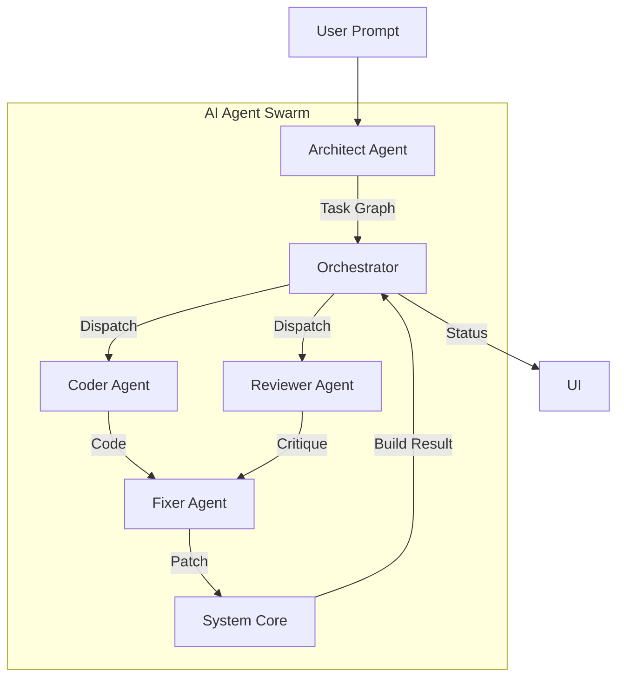
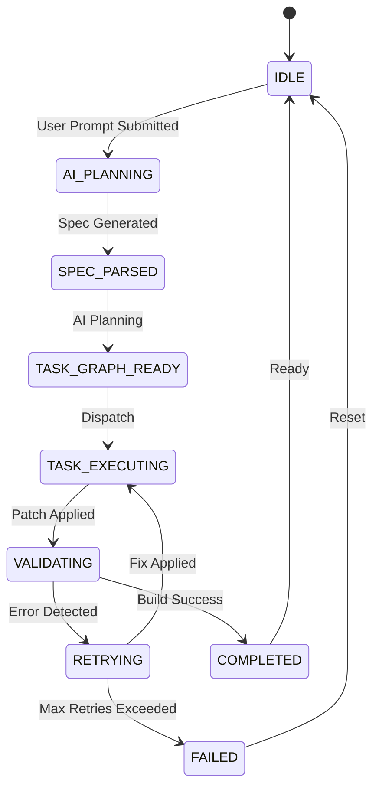
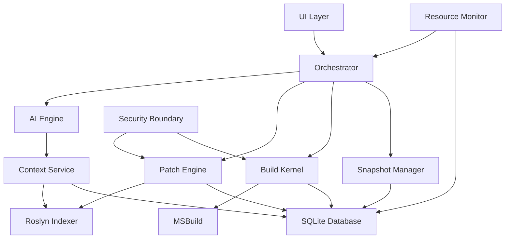
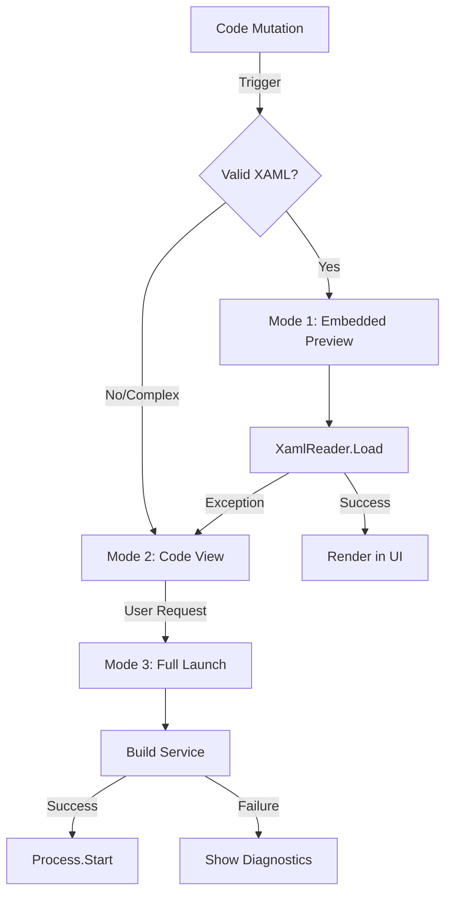

# SYSTEM ARCHITECTURE

> **The Big Picture: 7-Layer Architecture, Deployment Model, Process Lifecycle & Hidden Background Systems**
>

**Framework**: WinUI 3 (.NET 8)
**Target OS**: Windows 10 Build 22621+ (Windows 11 standard)
**Deployment**: MSIX packaging
**Complexity**: High (distributed system concerns locally)
**Risk**: CRITICAL if skipped (foundation of reliability)
**Estimated Total LOC**: ~2,650 lines C# core

---

**Related Documentation**:

> - [ORCHESTRATION_ENGINE.md](ORCHESTRATION_ENGINE.md) (Orchestrator Logic)
> - [CODE_INTELLIGENCE.md](CODE_INTELLIGENCE.md) (Roslyn & Indexing)
> - [UI_IMPLEMENTATION.md](UI_IMPLEMENTATION.md) (Frontend Specs)
> - [PREVIEW_SYSTEM.md](PREVIEW_SYSTEM.md) (Live Preview)
> - [USER_WORKFLOWS.md](USER_WORKFLOWS.md) (User Flows)
> - [PROJECT_HANDBOOK.md](PROJECT_HANDBOOK.md) (Dev Guide)

---

## Table of Contents

1. [System Overview](#1-system-overview)
2. [The 7-Layer Architecture](#2-the-7-layer-architecture)
3. [Intent and Specification Layer](#3-intent-and-specification-layer)
4. [Planning Layer (Task Graph / DAG)](#4-planning-layer-task-graph-dag)
5. [Multi-Agent Specifications](#5-multi-agent-specifications)
6. [Data Flow](#6-data-flow)
7. [AI Engine Integration with Preview System](#7-ai-engine-integration-with-preview-system)
8. [Validation and Silent Retry Loop](#8-validation-and-silent-retry-loop)
9. [Memory and State Layer](#9-memory-and-state-layer)
10. [Embedded Subsystems](#10-embedded-subsystems)
11. [Execution Lifecycle](#11-execution-lifecycle)
    - 11.1 [Phase 0 — Pre-Execution Guard](#111-phase-0--pre-execution-guard)
    - 11.2 [6 Boot Sequence Stages](#112-6-boot-sequence-stages)
12. [Background Systems](#12-background-systems)
    - 12.1 [9 Lettered Hidden Systems (A-I)](#121-9-lettered-hidden-systems-a-i)
    - 12.2 [5 Background Processes](#122-5-background-processes)
    - 12.3 [Operation Whitelist](#123-operation-whitelist)
    - 12.4 [Token Budget Guard](#124-token-budget-guard)
    - 12.5 [What User SHOULD NEVER See](#125-what-user-should-never-see-list)
13. [Security and Isolation](#13-security-and-isolation)
14. [Machine Variability Handling](#14-machine-variability-handling)
15. [Deployment Model](#15-deployment-model)
16. [Builder Project Structure](#16-builder-project-structure)
17. [Module Structure](#17-module-structure)
18. [Concurrency & Serialization Rules](#18-concurrency--serialization-rules)
19. [Local-Only Implementation Reality](#19-local-only-implementation-reality)
20. [System-Level Stack](#20-system-level-stack)
21. [Implementation Roadmap](#21-implementation-roadmap)
22. [Key Architectural Decisions](#22-key-architectural-decisions)
23. [Performance Considerations](#23-performance-considerations)
24. [Comparison with Traditional Approaches](#24-comparison-with-traditional-approaches)
25. [Future Evolution](#25-future-evolution)

---

## 1. System Overview

### What is Sync AI?

> **Sync AI is Lovable for Windows Desktop** — a local-first, autonomous AI full-stack builder that generates, compiles, fixes, previews, and packages complete native .NET applications end-to-end from natural language.

It is **not** a coding assistant. It is a **fully autonomous Windows-native software construction system**.

**The User does not develop. The System constructs.**

### Core Capabilities (End-to-End)

Sync AI abstracts the entire .NET development lifecycle, just as Lovable abstracts the web stack:

1.  **Frontend (Native UI)**: WinUI 3, XAML, MVVM, Theming, Navigation.
2.  **Application Layer**: Services, Dependency Injection, Validation.
3.  **Data Layer**: SQLite, Repository Pattern, Schema Migrations.
4.  **Build System**: Hidden MSBuild, NuGet Restore, XAML Compilation.
5.  **Runtime**: Live Preview, Hot Reload, Full Compiled Launch.
6.  **Packaging & Permissions**:
    - Automatic AppxManifest generation
    - Capability inference and injection
    - MSIX bundle generation
    - Certificate generation and signing
    - Deterministic mutation-based version increment
    - Production-ready installer output

...

### Detailed 7-Layer Stack

````text
┌─────────────────────────────────────────────────────────────┐
│  Layer 7: User Interface (WinUI 3 / XAML)                   │
│  ─ Prompt input, real-time preview, version timeline         │
├─────────────────────────────────────────────────────────────┤
│  Layer 6: Orchestrator Engine                                │
│  ─ Task decomposition, state machine, retry logic            │
├─────────────────────────────────────────────────────────────┤
│  Layer 5: AI Agent Layer                                     │
│  ─ Multi-agent code generation, prompt engineering           │
├─────────────────────────────────────────────────────────────┤
│  Layer 4: Code Intelligence (Roslyn)                         │
│  ─ AST parsing, symbol indexing, impact analysis             │
├─────────────────────────────────────────────────────────────┤
│  Layer 3: Patch Engine                                       │
│  ─ Transactional code mutations, conflict detection          │
├─────────────────────────────────────────────────────────────┤
│  Layer 2.5: Packaging & Manifest Engine                      │
│  ─ Manifest generator, Capability inference                  │
│  ─ MSIX bundler, Certificate manager, Signing pipeline       │
├─────────────────────────────────────────────────────────────┤
│  Layer 2: Execution Kernel                                   │
│  ─ In-process MSBuild, NuGet restore, app execution          │
├─────────────────────────────────────────────────────────────┤
│  Layer 1: Filesystem Sandbox + SQLite Graph DB               │
│  ─ Isolated projects, snapshots, symbol/dependency storage   │
└─────────────────────────────────────────────────────────────┘

...

## 26. Packaging & Permission Automation

### Manifest Subsystem Responsibilities

*   **Generate `Package.appxmanifest`**: Automatically creates the manifest with correct identity and publisher info.
*   **Infer `<Capabilities>`**: Analyzes API usage to inject required capabilities (e.g., `internetClient`, `location`).
*   **Inject `<uap:VisualElements>`**: Configures logos, splash screens, and tile colors from assets.
*   **Identity Management**: Ensures Publisher ID matches the signing certificate.

### Capability Inference Engine

*   **Map Windows API usage → Required capability**: Uses Roslyn analysis to detect calls to restricted namespaces.
*   **Prevent over-permissioning**: Only requests capabilities actually used by the code.
*   **Retry build if missing capability**: If a build fails due to a missing capability, the engine identifies and injects it.

#### Capability Inference Implementation Contract

```csharp
/// <summary>
/// Coupling between Roslyn analysis and packaging layer.
/// Scans compiled code for restricted Windows API usage and maps to capabilities.
/// </summary>
public class CapabilityInferenceEngine
{
    private readonly IRoslynService _roslynService;
    private readonly IPackageManifestService _manifestService;

    // Pre-computed namespace → capability mapping
    private static readonly Dictionary<string, string[]> NamespaceCapabilityMap = new()
    {
        ["Windows.Devices.Geolocation"] = new[] { "location" },
        ["Windows.Devices.Bluetooth"] = new[] { "bluetooth" },
        ["Windows.Devices.WiFi"] = new[] { "wiFiControl" },
        ["Windows.Networking.Sockets"] = new[] { "internetClient", "internetClientServer" },
        ["Windows.Web.Http"] = new[] { "internetClient" },
        ["Windows.Media.Capture"] = new[] { "microphone", "webcam" },
        ["Windows.Devices.Enumeration"] = new[] { "serialcommunication" },
        ["Windows.ApplicationModel.Contacts"] = new[] { "contactsSystem" },
        ["Windows.ApplicationModel.Appointments"] = new[] { "appointmentsSystem" },
        ["Windows.Storage"] = new[] { "broadFileSystemAccess" },  // Requires special handling
        ["Windows.Networking.PushNotifications"] = new[] { "internetClient" },
        ["Windows.ApplicationModel.UserDataAccounts"] = new[] { "userAccountInformation" }
    };

    /// <summary>
    /// Scans project for restricted namespace usage and returns required capabilities.
    /// </summary>
    public async Task<CapabilityInferenceResult> InferCapabilitiesAsync(string projectPath)
    {
        var usings = await _roslynService.GetAllUsingStatementsAsync(projectPath);
        var detectedCapabilities = new HashSet<string>();
        var detectedNamespaces = new List<string>();

        foreach (var usingStatement in usings)
        {
            foreach (var (namespace_, capabilities) in NamespaceCapabilityMap)
            {
                if (usingStatement.StartsWith(namespace_, StringComparison.OrdinalIgnoreCase))
                {
                    detectedNamespaces.Add(namespace_);
                    foreach (var cap in capabilities)
                    {
                        detectedCapabilities.Add(cap);
                    }
                }
            }
        }

        return new CapabilityInferenceResult
        {
            DetectedCapabilities = detectedCapabilities.ToList(),
            DetectedNamespaces = detectedNamespaces,
            MissingCapabilities = await GetMissingCapabilitiesAsync(detectedCapabilities)
        };
    }

    /// <summary>
    /// Compares detected capabilities against current manifest and returns missing ones.
    /// </summary>
    private async Task<List<string>> GetMissingCapabilitiesAsync(HashSet<string> detected)
    {
        var currentManifest = await _manifestService.LoadManifestAsync();
        var currentCapabilities = currentManifest?.Capabilities ?? new List<string>();

        return detected.Except(currentCapabilities).ToList();
    }

    /// <summary>
    /// Injects missing capabilities into the manifest.
    /// Called during packaging phase after capability scan.
    /// </summary>
    public async Task<ManifestUpdateResult> InjectCapabilitiesAsync(
        string manifestPath,
        List<string> capabilitiesToAdd)
    {
        if (capabilitiesToAdd.Count == 0)
            return ManifestUpdateResult.NoChangesNeeded;

        var manifest = await _manifestService.LoadManifestAsync();

        foreach (var capability in capabilitiesToAdd)
        {
            // Validate capability is valid Windows capability
            if (!IsValidWindowsCapability(capability))
            {
                _logger.LogWarning("Unknown capability detected: {Capability}", capability);
                continue;
            }

            manifest.Capabilities.Add(capability);
        }

        await _manifestService.SaveManifestAsync(manifest);

        return new ManifestUpdateResult
        {
            Updated = true,
            AddedCapabilities = capabilitiesToAdd,
            ManifestPath = manifestPath
        };
    }

    private bool IsValidWindowsCapability(string capability)
    {
        // List of valid Windows capabilities
        var validCapabilities = new HashSet<string>
        {
            "internetClient", "internetClientServer", "privateNetworkClientServer",
            "location", "microphone", "webcam", "usb", "humaninterfacedevice",
            "bluetooth", "wiFiControl", "radio", "lowLevelDevices",
            "enterpriseAuthentication", "sharedUserCertificates", "documentsLibrary",
            "picturesLibrary", "videosLibrary", "musicLibrary", "removableStorage",
            "appointmentsSystem", "contactsSystem", "userAccountInformation",
            "phoneCall", "voipCall", "chat", "backgroundMediaPlayback",
            "backgroundMediaRecording", "userNotificationListener",
            "serialcommunication", "broadFileSystemAccess"
        };

        return validCapabilities.Contains(capability);
    }
}

public record CapabilityInferenceResult
{
    public List<string> DetectedCapabilities { get; init; } = new();
    public List<string> DetectedNamespaces { get; init; } = new();
    public List<string> MissingCapabilities { get; init; } = new();
    public bool HasMissing => MissingCapabilities.Count > 0;
}

public record ManifestUpdateResult
{
    public bool Updated { get; init; }
    public List<string> AddedCapabilities { get; init; } = new();
    public string ManifestPath { get; init; }

    public static ManifestUpdateResult NoChangesNeeded => new() { Updated = false };
}
```

#### Packaging Pipeline Integration

```csharp
/// <summary>
/// Packaging service that orchestrates capability inference, manifest update, and signing.
/// Implements the atomic packaging pipeline defined in Section 26.
/// </summary>
public class PackagingService
{
    private readonly CapabilityInferenceEngine _capabilityEngine;
    private readonly IBuildService _buildService;
    private readonly ISigningService _signingService;
    private readonly Orchestrator _orchestrator;

    /// <summary>
    /// Atomic packaging pipeline with mandatory capability inference.
    /// </summary>
    public async Task<PackagingResult> PackageAsync(string projectPath, CancellationToken ct = default)
    {
        var pipelineLog = new List<string>();

        try
        {
            // STEP 1: CAPABILITY_SCAN (MANDATORY)
            pipelineLog.Add("CAPABILITY_SCAN");
            var capabilityResult = await _capabilityEngine.InferCapabilitiesAsync(projectPath);

            if (capabilityResult.HasMissing)
            {
                // STEP 2: MANIFEST_UPDATE
                pipelineLog.Add("MANIFEST_UPDATE");
                await _capabilityEngine.InjectCapabilitiesAsync(
                    Path.Combine(projectPath, "Package.appxmanifest"),
                    capabilityResult.MissingCapabilities);
            }

            // STEP 3: VERSION_SYNC
            pipelineLog.Add("VERSION_SYNC");
            var version = _orchestrator.GetCurrentContext().ProjectMetadata["AppVersion"] as string;
            await SyncManifestVersionAsync(projectPath, version);

            // STEP 4: BUILD_RELEASE
            pipelineLog.Add("BUILD_RELEASE");
            var buildResult = await _buildService.BuildAsync(projectPath, new BuildOptions
            {
                Configuration = "Release",
                Timeout = TimeSpan.FromMinutes(5)
            }, ct);

            if (!buildResult.Success)
            {
                return PackagingResult.Failed($"Build failed: {buildResult.ErrorMessage}", pipelineLog);
            }

            // STEP 5: PACKAGE_CREATE
            pipelineLog.Add("PACKAGE_CREATE");
            var msixPath = await CreateMsixBundleAsync(projectPath);

            // STEP 6: SIGN
            pipelineLog.Add("SIGN");
            var signResult = await _signingService.SignAsync(msixPath);
            if (!signResult.Success)
            {
                return PackagingResult.Failed($"Signing failed: {signResult.ErrorMessage}", pipelineLog);
            }

            // STEP 7: VERIFY
            pipelineLog.Add("VERIFY");
            var verifyResult = await _signingService.VerifySignatureAsync(msixPath);
            if (!verifyResult.Valid)
            {
                return PackagingResult.Failed($"Signature verification failed: {verifyResult.ErrorMessage}", pipelineLog);
            }

            return PackagingResult.Success(msixPath, pipelineLog);
        }
        catch (Exception ex)
        {
            return PackagingResult.Failed($"Packaging failed: {ex.Message}", pipelineLog);
        }
    }

    /// <summary>
    /// Updates manifest version using XML DOM manipulation (NOT regex).
    /// This complies with CODE_INTELLIGENCE.md "No Raw File Writes" principle.
    /// </summary>
    private async Task SyncManifestVersionAsync(string projectPath, string version)
    {
        var manifestPath = Path.Combine(projectPath, "Package.appxmanifest");

        // ✅ Use XDocument for structured XML manipulation
        // ❌ NEVER use Regex.Replace on XML - violates mutation safety principle
        var doc = XDocument.Load(manifestPath);

        // Find Identity element in the correct namespace
        XNamespace ns = "http://schemas.microsoft.com/appx/manifest/foundation/windows10";
        var identityElement = doc.Descendants(ns + "Identity").FirstOrDefault();

        if (identityElement != null)
        {
            // Update Version attribute with new version
            identityElement.SetAttributeValue("Version", version);
        }

        // Save with preserved formatting
        var settings = new XmlWriterSettings
        {
            OmitXmlDeclaration = false,
            Indent = true,
            Encoding = System.Text.Encoding.UTF8
        };

        using (var writer = XmlWriter.Create(manifestPath, settings))
        {
            doc.Save(writer);
        }
    }

    private async Task<string> CreateMsixBundleAsync(string projectPath)
    {
        // Generate MSIX bundle via MakeAppx or MSBuild packaging target
        var distPath = Path.Combine(projectPath, "dist");
        Directory.CreateDirectory(distPath);

        var msixPath = Path.Combine(distPath, "app.msixbundle");
        // ... packaging implementation ...

        return msixPath;
    }
}

public record PackagingResult
{
    public bool Success { get; init; }
    public string OutputPath { get; init; }
    public string ErrorMessage { get; init; }
    public List<string> PipelineLog { get; init; } = new();

    public static PackagingResult Success(string outputPath, List<string> pipelineLog) =>
        new() { Success = true, OutputPath = outputPath, PipelineLog = pipelineLog };

    public static PackagingResult Failed(string error, List<string> pipelineLog) =>
        new() { Success = false, ErrorMessage = error, PipelineLog = pipelineLog };
}
```

**Key Coupling Points:**

1. **Roslyn → Capability Mapping**: `CapabilityInferenceEngine` depends on `IRoslynService.GetAllUsingStatementsAsync()` to detect namespace usage
2. **Capability → Manifest**: `IPackageManifestService` is updated based on inference results
3. **Orchestrator → Version**: `PackagingService` reads version from `BuilderContext.ProjectMetadata["AppVersion"]`
4. **Build → Package**: `IBuildService.BuildAsync()` is called in Release configuration before packaging
5. **Package → Sign**: `ISigningService` is invoked after MSIX bundle creation

**INVARIANT**: Capability inference MUST run BEFORE build. Missing capabilities cause build failures that require retry.

### MSIX Automation

*   **Generate packaging project**: Creates a `.wapproj` or generally compatible packaging layout.
*   **Create or load signing certificate**: Auto-generates self-signed certs for dev; supports imported certs for prod.
*   **Sign bundle**: Signs the final `.msixbundle` automatically.
*   **Validate signature**: Verifies the signature before deployment.

### Version Authority (Mandatory)

```
Single Source of Truth:
BuilderContext.ProjectMetadata["AppVersion"]

Manifest version must be derived exclusively from this value.
Snapshots and installer versions must match.
```

### Atomic Packaging Rule (CRITICAL)

Packaging is an atomic operation that creates an installation artifact. Unlike preview execution, packaging requires:

```text
PACKAGING PIPELINE (Atomic - All-or-Nothing):
┌─────────────────────────────────────────────────────────────┐
│ 1. CAPABILITY_SCAN → Detect required permissions            │
│ 2. MANIFEST_GENERATE → Create Package.appxmanifest         │
│ 3. VERSION_SYNC → Ensure manifest matches BuilderContext    │
│ 4. BUILD_RELEASE → Compile in Release configuration         │
│ 5. PACKAGE_CREATE → Generate MSIX bundle                    │
│ 6. SIGN → Apply code signature                              │
│ 7. VERIFY → Validate signature integrity                    │
└─────────────────────────────────────────────────────────────┘
        │
        ▼ (any step fails)
┌─────────────────────────────────────────────────────────────┐
│ ROLLBACK → Restore previous stable package (if exists)      │
│ REPORT → Surface actionable error to user                   │
└─────────────────────────────────────────────────────────────┘
```

**Key Differences from Preview Launch:**

| Aspect | Preview Launch | Packaging |
|--------|---------------|-----------|
| Build Config | Debug | Release |
| Signing | Optional | **Mandatory** |
| Isolation | Windows Sandbox / AppContainer | N/A (artifact output) |
| Output | Running process | `.msixbundle` file |
| Reversibility | Kill process | Delete file |
| Capability Inference | Runtime detection | **Pre-build injection** |

**INVARIANT**: Packaging MUST NOT modify source files. Manifest generation creates a NEW file in the `packaging/` directory.

### Layer Details

#### Layer 1: Filesystem Sandbox + SQLite Graph DB

**Purpose**: Isolated workspace management and persistent storage.

- Each project lives in `%USERPROFILE%\.syncai\Workspaces\{ProjectId}\`
- Snapshots stored as compressed diffs before every mutation
- SQLite stores: files, symbols, dependencies, errors, architectural decisions, execution logs

**Workspace Structure**:

```text
%USERPROFILE%\.syncai\
├── Workspaces/
│   └── {ProjectId}/
│       ├── src/                    ← Generated code
│       ├── .snapshots/             ← Version history (compressed diffs)
│       ├── .diffs/                 ← Patch files for version control
│       │   ├── diff_001-002.patch
│       │   └── diff_002-003.patch
│       ├── .metadata.json          ← Project metadata
│       ├── packaging/              ← Manifests & Certificates
│       │   ├── Package.appxmanifest
│       │   └── certificate.pfx
│       ├── dist/                   ← Final MSIX Bundles
│       │   └── app.msixbundle
│       └── .build-output/          ← Compiled binaries
├── Temp/
│   ├── build_workspace_001/        ← Isolated copy for build stability
│   ├── build_workspace_002/
│   └── (cleaned after each build)
├── Database/
│   └── sync-ai.db                  ← SQLite graph DB
├── Cache/
│   ├── NuGet/                      ← Local NuGet cache
│   ├── Embeddings/                 ← Vector cache
│   ├── roslyn_symbols/             ← Cached Roslyn symbol data
│   └── dependency_graph/           ← Cached dependency graph data
└── Logs/
    └── execution.log               ← Debug log (hidden from user)
````

> **Source**: `EXECUTION_ARCHITECTURE.md` — Part 3.1 (Filesystem Sandbox Subsystem Architecture)

#### Layer 2: Execution Kernel

**Purpose**: In-process build and run capabilities.

```csharp
using Microsoft.Build.Evaluation;
using Microsoft.Build.Execution;
using Microsoft.Build.Framework;
using Microsoft.Build.Locator;

public class ExecutionKernel
{
    private readonly ILogger<ExecutionKernel> _logger;
    private readonly FileSystemSandbox _sandbox;
    private static bool _isInitialized;

    public ExecutionKernel(ILogger<ExecutionKernel> logger, FileSystemSandbox sandbox)
    {
        _logger = logger;
        _sandbox = sandbox;
        InitializeMSBuild();
    }

    /// <summary>
    /// One-time initialization of MSBuild Locator
    /// </summary>
    private static void InitializeMSBuild()
    {
        if (!_isInitialized)
        {
            // Locate the embedded SDK/MSBuild instance
            MSBuildLocator.RegisterDefaults();
            _isInitialized = true;
        }
    }

    /// <summary>
    /// Builds project in an ISOLATED workspace copy to prevent mutation race conditions
    /// </summary>
    public async Task<BuildResult> BuildAsync(
        string projectPath,
        string configuration = "Debug")
    {
        // ISOLATION STEP: Copy source to %USERPROFILE%\.syncai\Temp\{BuildId} before build
        var isolatedPath = await _sandbox.CreateIsolatedCopyAsync(projectPath);

        return await Task.Run(() =>
        {
            var projectCollection = new ProjectCollection();
            var buildLogger = new StructuredLogger();

            try
            {
                // Load project into memory
                var project = projectCollection.LoadProject(Path.Combine(isolatedPath, "SyncAIAppBuilder.csproj"));

                // Set properties
                project.SetProperty("Configuration", configuration);
                project.SetProperty("Platform", "Any CPU");

                // Configure logger
                var buildParameters = new BuildParameters(projectCollection)
                {
                    Loggers = new[] { buildLogger },
                    MaxNodeCount = Environment.ProcessorCount // Parallel build
                };

                // Create build request
                var buildRequest = new BuildRequestData(
                    project.CreateProjectInstance(),
                    new[] { "Restore", "Build" } // Run Restore then Build
                );

                // Execute Build
                var result = BuildManager.DefaultBuildManager
                    .Build(buildParameters, buildRequest);

                return new BuildResult
                {
                    Success = result.OverallResult == BuildResultCode.Success,
                    Output = buildLogger.Output,
                    Errors = buildLogger.Errors,
                    ExitCode = result.OverallResult == BuildResultCode.Success ? 0 : 1
                };
            }
            finally
            {
                projectCollection.Dispose();
            }
        });
    }

    /// <summary>
    /// Builds with timeout and cancellation support
    /// </summary>
    public async Task<BuildResult> BuildWithTimeoutAsync(
        string projectPath,
        TimeSpan timeout,
        CancellationToken cancellationToken = default)
    {
        using var cts = CancellationTokenSource.CreateLinkedTokenSource(cancellationToken);
        cts.CancelAfter(timeout);

        try
        {
            return await BuildAsync(projectPath, "Debug");
        }
        catch (OperationCanceledException)
        {
            return new BuildResult
            {
                Success = false,
                Errors = $"Build timed out after {timeout.TotalSeconds} seconds",
                TimedOut = true
            };
        }
    }

    /// <summary>
    /// Builds with real-time progress reporting
    /// </summary>
    public async Task<BuildResult> BuildWithProgressAsync(
        string projectPath,
        IProgress<BuildPhase>? progress = null)
    {
        progress?.Report(new BuildPhase { Phase = "Restoring packages", Percentage = 10 });
        await Task.Delay(100); // Simulate restore

        progress?.Report(new BuildPhase { Phase = "Compiling", Percentage = 50 });
        var result = await BuildAsync(projectPath);

        progress?.Report(new BuildPhase { Phase = "Complete", Percentage = 100 });
        return result;
    }

    /// <summary>
    /// Captures build output efficiently
    /// </summary>
    private class StructuredLogger : ILogger
    {
        public string Output { get; private set; } = string.Empty;
        public string Errors { get; private set; } = string.Empty;
        public string FullLog { get; private set; } = string.Empty;

        public void Initialize(IEventSource eventSource)
        {
            eventSource.ErrorRaised += (s, e) => Errors += $"{e.File}:{e.LineNumber}: error {e.Code}: {e.Message}\n";
            eventSource.WarningRaised += (s, e) => Output += $"{e.File}:{e.LineNumber}: warning {e.Code}: {e.Message}\n";
            eventSource.MessageRaised += (s, e) => FullLog += e.Message + "\n";
        }

        public void Shutdown() { }
        public LoggerVerbosity Verbosity { get; set; }
        public string? Parameters { get; set; }
    }
}

public class BuildPhase
{
    public string Phase { get; set; } = string.Empty;
    public int Percentage { get; set; }
}
```

**Key Capabilities**:

- `In-process NuGet restore via NuGet.Commands` → In-process NuGet restore via `NuGet.Commands`
- `In-process MSBuild via Microsoft.Build API` → In-process MSBuild via `Microsoft.Build`
- App execution via `ProcessSandbox` (Wrapper for Windows Sandbox execution)
- Structured error output (not raw CLI text)

#### Layer 3: Patch Engine

**Purpose**: Transactional, conflict-detecting, reversible code mutations.

```csharp
public interface IPatchTransaction : IAsyncDisposable
{
    Task AddAttributeAsync(string className, string attributeName);
    Task AddUsingAsync(string namespaceName);
    Task ModifyPropertyAsync(string propertyName, string newValue);
    Task AddMethodAsync(string methodCode);
    Task CommitAsync();
    Task RollbackAsync();
}
```

> **Source**: `EXECUTION_ARCHITECTURE.md` — Section 3.4 (`IPatchTransaction` interface definition)

**Guarantees**:

- **Atomic**: Entire patch succeeds or fails
- **Reversible**: Snapshot available for rollback
- **Conflict-Free**: Detect overlapping changes
- **Auditable**: Track every patch

#### Implementation Pattern: Transactional Patch Engine

```csharp
public class TransactionalPatchEngine
{
    private readonly FileSystemSandbox _sandbox;
    private Stack<ISnapshot> _undoStack = new();

    /// Begin patch operation
    public async Task<IPatchTransaction> BeginPatchAsync(string filePath)
    {
        // Create snapshot before patching
        var snapshot = await _sandbox.CreateSnapshotAsync(Path.GetDirectoryName(filePath)!);
        return new PatchTransaction(filePath, snapshot, _undoStack);
    }
}

public class PatchTransaction : IPatchTransaction
{
    private readonly string _filePath;
    private List<Patch> _patches = new();
    private bool _committed = false;

    public async Task AddAttributeAsync(string className, string attributeName)
    {
        // Rosslyn SyntaxTree manipulation...
        var syntax = CSharpSyntaxTree.ParseText(await File.ReadAllTextAsync(_filePath));
        var root = syntax.GetCompilationUnitSyntax();
        // ... (Find class, add attribute via SyntaxFactory) ...
        _patches.Add(new Patch { Type = PatchType.AddAttribute, NewContent = newRoot.ToFullString() });
    }

    public async Task CommitAsync()
    {
        if (_committed) throw new InvalidOperationException("Already committed");
        // Write all patches to file
        await File.WriteAllTextAsync(_filePath, _patches.Last().NewContent);
        _committed = true;
    }

    public async Task RollbackAsync()
    {
        // Restore from snapshot if needed
    }
}
```

**Key Comparison: Traditional vs AST**:
Validation that simple LLM rewrites destroy code (formatting, comments), while AST patches (Roslyn) preserve structure safe for production.

```csharp
// Only modify target node implies:
// - Comments preserved
// - Formatting preserved
// - Minimal diffs
```

#### Layer 4: Code Intelligence (Roslyn)

**Purpose**: Deep understanding of generated code.

- Parse C# into AST (Abstract Syntax Trees)
- Detect breaking changes before build

#### Implementation: Roslyn Code Intelligence Service

```csharp
public class RoslynCodeIntelligenceService
{
    private readonly string _projectPath;
    private Compilation? _cachedCompilation;
    private Dictionary<string, ISymbol>? _symbolIndex;

    /// Build or update symbol index (Async, non-blocking)
    public async Task IndexProjectAsync()
    {
        var workspace = MSBuildWorkspace.Create();
        var project = await workspace.OpenProjectAsync(_projectPath);
        var compilation = await project.GetCompilationAsync();

        _cachedCompilation = compilation;
        _symbolIndex = new Dictionary<string, ISymbol>();

        // Recursively index all symbols in the global namespace
        IndexSymbolsRecursive(compilation.GlobalNamespace);
    }

    /// Analyze impact of changing a file
    public async Task<FileImpactAnalysis> AnalyzeChangeImpactAsync(string filePath)
    {
        // 1. Find syntax tree for file
        // 2. Find all symbols declared in file
        // 3. Find all REFERENCES to those symbols in other files
        var dependentFiles = await FindDependentFiles(filePath);

        return new FileImpactAnalysis
        {
            FilePath = filePath,
            AffectedFiles = dependentFiles,
            ImpactLevel = dependentFiles.Count > 20 ? ImpactLevel.High : ImpactLevel.Low
        };
    }

    /// Incremental Re-Indexing Strategy (Detail)
    public async Task IncrementalIndexFileAsync(string filePath)
    {
        // 1. Parse only the changed file
        var tree = await CSharpSyntaxTree.ParseTextAsync(File.ReadAllText(filePath));

        // 2. Update SyntaxTree Cache
        _syntaxTrees[filePath] = tree;

        // 3. Extract Symbols (Parallel)
        var root = await tree.GetRootAsync();
        var declaredSymbols = ExtractSymbols(root);

        // 4. Update the Symbol Graph (Atomic Swap)
        await _symbolGraph.UpdateSymbolsAsync(filePath, declaredSymbols);
    }
}
```

### Roslyn Workspace Allocation Strategies

Three options were evaluated for Roslyn workspace management:

**Option A (Recommended): Single shared AdhocWorkspace with incremental updates**

- One `AdhocWorkspace` instance per project, protected by `_workspaceLock`
- Files updated incrementally via `IncrementalIndexFileAsync()`
- Lowest memory overhead; best performance for iterative patch cycles

**Option B: Per-session AdhocWorkspace**

- New workspace created for each `ExecutionSession`
- Ensures isolation but incurs full re-index cost per session
- Rejected: too slow for iterative generation

**Option C: MSBuildWorkspace (full fidelity)**

- Loads full project via MSBuild for maximum accuracy
- Rejected for primary path: slow startup, SDK dependency complexity
- Acceptable for one-time diagnostics only

### detailed Schema

#### File Index

```json
{
  "files": [
    {
      "path": "Models/Customer.cs",
      "type": "class",
      "dependencies": ["System.Data", "DbContext"],
      "exports": ["Customer", "CustomerValidator"],
      "imports": ["System", "System.ComponentModel.DataAnnotations"],
      "size_bytes": 2048,
      "last_modified": "2026-02-16"
    }
  ]
}
```

#### Dependency Graph

```text
Customer.cs
  ├─ imports: DbContext
  ├─ imports: Validator
  └─ used by: CustomerService.cs

CustomerService.cs
  ├─ imports: Customer.cs
  ├─ imports: ILogger
  └─ used by: CustomerController.cs

CustomerController.cs
  ├─ imports: CustomerService.cs
  └─ user-accessible routes: /api/customers/*
```

#### Route Registry

```json
{
  "routes": [
    {
      "path": "/api/customers",
      "method": "GET",
      "handler": "CustomerController.GetAll",
      "auth_required": true,
      "roles": ["admin", "manager"]
    },
    {
      "path": "/api/customers/{id}",
      "method": "GET",
      "handler": "CustomerController.GetById",
      "auth_required": true,
      "roles": ["admin", "manager"]
    }
  ]
}
```

#### Database Schema Map

```json
{
  "tables": [
    {
      "name": "customers",
      "columns": [
        { "name": "id", "type": "int", "pk": true },
        { "name": "name", "type": "string", "nullable": false },
        { "name": "email", "type": "string", "unique": true }
      ],
      "relationships": [{ "foreign_key": "contact_id", "references": "contacts.id" }],
      "models_using": ["Customer.cs"]
    }
  ]
}
```

#### Layer 5: AI Agent Layer

**Purpose**: Multi-agent code generation.

| Agent | Responsibility |
| ----- | -------------- |

### 5.1 Agent Architecture Pattern



| **Planner** | Decomposes user prompt into task graph |
| **Coder** | Generates C#/XAML per task |
| **Fixer** | Patches code after build errors |
| **Reviewer** | Validates architectural consistency |

> **Note**: See [Section 3](#3-multi-agent-specifications) for detailed JSON contracts and input/output examples.

#### Layer 6: Orchestrator Engine

> **Constraint**: Only 1 mutation task at time (Priority Mandate).
> **Invariant**: No parallel patching. No concurrent filesystem writes.

**Purpose**: The brain — deterministic state machine governing all operations.

**🔴 CRITICAL FOUNDATION: Must Implement First**
Without deterministic orchestration, Roslyn indexing and patching will create nondeterministic mutation loops that silently corrupt code.

- **State Transitions**: `IDLE` → `SPEC_PARSED` → `TASK_GRAPH_READY` → `TASK_EXECUTING` → `VALIDATING` → `RETRYING` → `COMPLETED` / `FAILED`.
- **Constraint**: Only 1 mutation task at time (no parallel patching)

See [ORCHESTRATION_ENGINE.md](ORCHESTRATION_ENGINE.md) for complete details.

#### Layer 7: User Interface

**Purpose**: Thin WinUI 3 shell — hides all internal complexity.

- Single prompt input
- Real-time build progress (spinner, not logs)
- App preview (XAML renderer or full launch)
- Version timeline slider

---

## 3. Intent and Specification Layer

### Purpose

Transform unstructured user prompts into structured, machine-readable specifications that prevent hallucination and ensure consistency.

### Process

**Input:**

```
"Build a CRM with authentication, role-based access,
customer database, and analytics dashboard"
```

**Processing:**

1. **NLP Feature Extraction** - Identify requested features
2. **Stack Selection** - Choose appropriate tech stack
3. **Constraint Inference** - Deduce implicit requirements (e.g., auth implies session management)
4. **Dependency Mapping** - Identify feature interdependencies
5. **Validation** - Check for conflicts or impossibilities

**Output (Structured JSON):**

```json
{
  "projectType": "windows-desktop-app",
  "projectName": "CRM System",
  "features": [
    {
      "id": "authentication",
      "type": "auth",
      "subType": "windows-auth",
      "dependencies": ["user-database"],
      "priority": 1
    },
    {
      "id": "rbac",
      "type": "access-control",
      "roles": ["admin", "manager", "user"],
      "dependencies": ["authentication"],
      "priority": 2
    },
    {
      "id": "customer-database",
      "type": "data-model",
      "tables": ["customers", "contacts", "interactions"],
      "dependencies": ["database-setup"],
      "priority": 1
    },
    {
      "id": "analytics-dashboard",
      "type": "ui",
      "components": ["charts", "metrics", "filters"],
      "dependencies": ["customer-database", "rbac"],
      "priority": 3
    }
  ],
  "stack": {
    "ui": "WinUI3",
    "backend": ".NET8",
    "database": "SQLite",
    "auth": "Windows Authentication"
  },
  "constraints": {
    "maxComplexity": "medium",
    "requiredPackages": ["Microsoft.UI.Xaml", "System.Data.Sqlite"],
    "incompatibleFeatures": []
  }
}
```

### Benefits

- **No hallucination** - Features derived from extraction, not free-form
- **Explicit dependencies** - Clear what depends on what
- **Conflict detection** - Catch contradictory requirements early
- **Stack consistency** - All modules use same tech choices

---

## 4. Planning Layer (Task Graph / DAG)

> **Threading Clarification**: Parallelizable tasks are planned in DAG, but execution is serialized at mutation layer. AI planning may be parallel. Filesystem mutation is strictly sequential.

### Purpose

Convert feature spec into an ordered, executable task graph where dependencies are explicit and parallelizable work is identified.

### Task Graph Structure

```text
Task {
  id: "setup-auth",
  type: "infrastructure",
  description: "Configure Windows Authentication",
  dependencies: ["init-project"],
  files_to_create: ["Models/User.cs", "Services/AuthService.cs"],
  validation_strategy: "compile-check",
  expected_artifacts: [
    "AuthService class",
    "User model",
    "Authentication middleware"
  ]
}
```

### Example DAG for CRM App

```text
init-project [0]
    ↓
setup-database [1]
    ↓
    ├─→ define-models [2]
    │   ├─→ customer-model
    │   ├─→ contact-model
    │   └─→ interaction-model
    │
    ├─→ setup-auth [2]
    │   ├─→ auth-service
    │   └─→ user-model
    │
    └─→ db-migrations [2]
        ├─→ create-tables
        └─→ seed-data

generate-ui [3]
    ├─→ login-page (requires: setup-auth)
    ├─→ dashboard-page (requires: setup-database)
    └─→ customer-table (requires: define-models)

wire-api-routes [4]
    ├─→ auth-routes (requires: setup-auth)
    ├─→ customer-crud (requires: customer-model)
    ├─→ analytics-routes (requires: setup-database)
    └─→ rbac-middleware (requires: setup-auth)

validation & fix [5]
    → compile & test
    → detect errors
    → auto-fix
    → retry
```

### Key Insights

- **Parallelizable work** - Tasks at same level can run concurrently
- **Dependencies clear** - Prevents race conditions
- **Validation points** - Each task has success criteria
- **Rollback safe** - Can retry individual tasks

---

## 5. Multi-Agent Specifications

### Purpose

Decompose complex app generation into specialized agents, each with narrow responsibility and deterministic output schema.

### The Agent Stack

#### 1. Architect Agent

**Responsibility:** Define overall app structure

**Input:**

```json
{
  "spec": {...},
  "task": "design-project-structure"
}
```

**Output:**

```json
{
  "project_structure": {
    "Models": ["Customer.cs", "Contact.cs"],
    "Services": ["CustomerService.cs", "AuthService.cs"],
    "UI": ["MainWindow.xaml", "CustomerPage.xaml"],
    "Database": ["DbContext.cs"]
  },
  "design_patterns": ["MVVM", "Repository", "Dependency Injection"]
}
```

#### 2. Schema Agent

**Responsibility:** Generate database models and migrations

**Input:**

```json
{
  "entities": [
    {
      "name": "Customer",
      "properties": [
        { "name": "id", "type": "int", "pk": true },
        { "name": "name", "type": "string" }
      ]
    }
  ]
}
```

**Output:**

```csharp
// Generated Customer.cs
[Table("customers")]
public class Customer
{
    [Key]
    public int Id { get; set; }

    [Required]
    [StringLength(200)]
    public string Name { get; set; }
}
```

#### 3. Frontend Agent

**Responsibility:** Generate UI components and pages

**Input:**

```json
{
  "pages": [
    {
      "name": "CustomerPage",
      "components": ["DataGrid", "Form", "Button"],
      "data_binding": "customer"
    }
  ]
}
```

**Output:**

```xaml
<Page x:Class="CRM.CustomerPage">
  <Grid>
    <DataGrid ItemsSource="{Binding Customers}" />
    <Button Content="Add" Click="OnAdd" />
  </Grid>
</Page>
```

#### 4. Backend Agent

**Responsibility:** Generate API routes and services

**Input:**

```json
{
  "routes": [
    {
      "path": "/api/customers",
      "methods": ["GET", "POST"],
      "auth_required": true
    }
  ]
}
```

**Output:**

```csharp
[ApiController]
[Route("api/[controller]")]
[Authorize]
public class CustomersController : ControllerBase
{
    [HttpGet]
    public async Task<ActionResult<List<CustomerDto>>> GetAll()
    {
        return await _service.GetAllAsync();
    }
}
```

#### 5. Integration Agent

**Responsibility:** Wire dependencies together

**Input:**

```json
{
  "dependencies": {
    "CustomerController": ["CustomerService"],
    "CustomerService": ["ICustomerRepository", "ILogger"]
  }
}
```

**Output:**

```csharp
// Updates Program.cs
services.AddScoped<ICustomerRepository, CustomerRepository>();
services.AddScoped<CustomerService>();
services.AddScoped<CustomersController>();
```

#### 6. Fix Agent

**Responsibility:** Detect and repair build failures

**Input:**

```json
{
  "error": "CS1503: Cannot convert type 'string' to 'int'",
  "file": "Models/Customer.cs",
  "line": 15,
  "context": "public int CustomerId { get; set; } = customerId;"
}
```

**Output:**

```csharp
// Fix suggestion
public int CustomerId { get; set; } = int.Parse(customerId);
// or
public int CustomerId { get; set; } = Convert.ToInt32(customerId);
```

### 5.2 Agent Orchestration Pattern

Detailed interaction logic between agents:

```python
# Conceptual Orchestration Logic
async def orchestrate_generation(spec, task_graph):
    for task in task_graph.topological_sort():
        context = await retrieval_service.get_context(task)

        # 1. Select Specialist Agent
        agent = agent_factory.get_agent(task.type)

        # 2. Generate Candidate Code
        candidate = await agent.generate(spec, context)

        # 3. Apply via Patch Engine (Dry Run)
        if not await patch_engine.validate(candidate):
            # 4. Self-Correction Loop
            attempts = 0
            while attempts < 3:
                error = patch_engine.get_last_error()
                candidate = await fix_agent.fix(candidate, error)
                if await patch_engine.validate(candidate):
                    break
                attempts += 1

        # 5. Commit if Valid
        if await patch_engine.validate(candidate):
            await patch_engine.commit(candidate)
```

### 5.3 Detailed Agent Orchestration Flow

**Stage 1: Planning & Structure**

```python
arch_output = architect_agent(spec)
results['architecture'] = arch_output
```

**Stage 2: Parallel Generation (tasks with no deps)**

```python
schema_output = schema_agent(spec)
auth_output = backend_agent(spec, auth_tasks)
results['schema'] = schema_output
results['auth'] = auth_output
```

**Stage 3: UI Generation (needs auth context)**

```python
ui_output = frontend_agent(spec, auth_output)
results['ui'] = ui_output
```

**Stage 4: Integration (wires everything)**

```python
integration_output = integration_agent(results)
results['integration'] = integration_output
```

**Stage 5: Build & Validate**

```python
build_result = validate_and_build()
```

**Stage 6: Auto-fix if needed**

```python
if build_result.has_errors:
    for error in build_result.errors:
        fix_output = fix_agent(error, results)
        apply_fix(fix_output)
    # Retry build
    build_result = validate_and_build()

return results, build_result
```

**Note**: All agent communications are handled through the `z-ai-web-dev-sdk`.

### 5.4 Agent Input/Output Contracts

#### Architect Agent Contract

**Input Schema:**

```json
{
  "spec": {
    "projectType": "windows-desktop-app",
    "features": [...],
    "stack": {...}
  },
  "task": "design-project-structure"
}
```

**Output Schema:**

```json
{
  "project_structure": {
    "Models": ["Customer.cs", "Contact.cs"],
    "Services": ["CustomerService.cs", "AuthService.cs"],
    "UI": ["MainWindow.xaml", "CustomerPage.xaml"],
    "Database": ["DbContext.cs"]
  },
  "design_patterns": ["MVVM", "Repository", "Dependency Injection"],
  "naming_conventions": {
    "models": "PascalCase",
    "private_fields": "_camelCase",
    "public_properties": "PascalCase"
  }
}
```

#### Schema Agent Contract

**Input Schema:**

```json
{
  "entities": [
    {
      "name": "Customer",
      "properties": [
        { "name": "id", "type": "int", "pk": true },
        { "name": "name", "type": "string" }
      ]
    }
  ]
}
```

**Output Schema:**

```csharp
// Generated Customer.cs
[Table("customers")]
public class Customer
{
    [Key]
    public int Id { get; set; }

    [Required]
    [StringLength(200)]
    public string Name { get; set; }
}
```

#### Fix Agent Contract

**Input Schema:**

```json
{
  "error": "CS1503: Cannot convert type 'string' to 'int'",
  "file": "Models/Customer.cs",
  "line": 15,
  "context": "public int CustomerId { get; set; } = customerId;"
}
```

**Output Schema:**

```json
{
  "fix_type": "type_conversion",
  "suggestions": [
    {
      "code": "public int CustomerId { get; set; } = int.Parse(customerId);",
      "confidence": 0.85
    },
    {
      "code": "public int CustomerId { get; set; } = Convert.ToInt32(customerId);",
      "confidence": 0.9
    }
  ]
}
```

---

## 6. Data Flow and Orchestration

### 6.1 State Machine Definition (Authoritative)

The Orchestrator is the deterministic "brain" that governs all operations. It ensures that the system never enters an invalid state.

**State Machine Transitions**:



#### 6.1.1 State Definitions (Formal)

| State                | Description                                                                                                                    | Allowed Transitions        |
| :------------------- | :----------------------------------------------------------------------------------------------------------------------------- | :------------------------- |
| **IDLE**             | System waiting for user input.                                                                                                 | `AI_PLANNING`              |
| **AI_PLANNING**      | Prompt submitted; workspace locked; AI context being prepared. Set immediately upon session submission in Pre-Execution Guard. | `SPEC_PARSED`              |
| **SPEC_PARSED**      | Intent understood, spec generated.                                                                                             | `TASK_GRAPH_READY`         |
| **TASK_GRAPH_READY** | DAG created, ready to execute.                                                                                                 | `TASK_EXECUTING`           |
| **TASK_EXECUTING**   | Agent/Compiler working.                                                                                                        | `VALIDATING`               |
| **VALIDATING**       | Checks (Tests, Build) running.                                                                                                 | `RETRYING`, `COMPLETED`    |
| **RETRYING**         | Error found, attempting fix.                                                                                                   | `TASK_EXECUTING`, `FAILED` |
| **COMPLETED**        | Success.                                                                                                                       | `IDLE`                     |
| **FAILED**           | Max retries exhausted.                                                                                                         | `IDLE`                     |

> **Source**: `EXECUTION_LIFECYCLE_SPECIFICATION.md` — Phase 0, Pre-Execution Guard: `_currentState = OrchestratorState.AI_PLANNING` set immediately upon session submission.

**Key Responsibilities**:

- **Concurrency Control**: Enforces "One Mutation at a Time" rule.
- **Retry Budget**: Tracks attempts (Max 3 per task, Max 10 total).
- **Error Classification**: Maps huge MSBuild logs to actionable error codes.
- **Timeout Management**: Kills hung processes after 5 minutes (configurable).

### 6.2 The 15-Step Hidden Engine Stack

The following is the complete, explicit sequential flow from user prompt to completed generation:

| Step | Action                                                              | Thread              |
| ---- | ------------------------------------------------------------------- | ------------------- |
| 1    | User submits prompt → `GenerateCommand` record created              | UI Thread           |
| 2    | `GenerateCommand` enqueued to `_sessionQueue`                       | UI Thread           |
| 3    | `OrchestratorLoop` dequeues session                                 | Orchestrator Thread |
| 4    | Pre-Execution Guard: state → `AI_PLANNING`, workspace locked        | Orchestrator Thread |
| 5    | `AIContextCache.PrepareContextAsync()` loads 3 cache keys           | Orchestrator Thread |
| 6    | AI model invoked → JSON task graph produced                         | AI Worker Pool      |
| 7    | Schema validation; on fail → `CorrectTaskGraphAsync()`              | Orchestrator Thread |
| 8    | `TaskGraph` materialized; state → `TASK_GRAPH_READY`                | Orchestrator Thread |
| 9    | For each task node: `GeneratePatchAsync()` (semaphore-gated, max 2) | AI Worker Pool      |
| 10   | `IPatchTransaction` applies patch; `IncrementalIndexFileAsync()`    | Patch Worker        |
| 11   | `BuildAsync()` executed; on fail → `ParseBuildExceptions()` → retry | Build Worker        |
| 12   | Validation pass; `SnapshotService.CreateSnapshotAsync()`            | Orchestrator Thread |
| 13   | `ProjectVersion` entity written to database                         | Orchestrator Thread |
| 14   | `EventAggregator.PublishAsync(new PreviewRefreshEvent {...})`       | Orchestrator Thread |
| 15   | `_workspaceLock` released; state → `COMPLETED`                      | Orchestrator Thread |

### 6.3 Application Data Flow

```text
User Prompt
    ↓
Intent Parser → Structured Spec
    ↓
Planning Service → Task Graph (DAG)
    ↓
Code Intelligence (Indexing) → Project Context
    ↓
Multi-Agent Orchestrator
    ├─ Architect Agent
    ├─ Schema Agent
    ├─ Frontend Agent
    ├─ Backend Agent
    ├─ Integration Agent
    └─ [Parallel execution where possible]
    ↓
Structured Patch Engine (Roslyn)
    ├─ Parse to AST
    ├─ Apply patches
    └─ Preserve formatting
    ↓
Build System (MSBuild)
    ├─ Compile
    ├─ [If errors] → Fix Agent → Retry
    └─ Success? → Show to user
    ↓
Live Preview / Deploy
```

**Key Insight**: What looks like "instant generation" is actually:

- Multiple agents working in parallel via the **AI Engine**
- Smart context retrieval (not full project dump)
- Automatic error fixing (hidden from user)
- Silent retries (only success shown)

---

## 7. AI Engine Integration with Preview System

### Overview

The AI Engine generates code, but **never directly renders or displays it**. The Preview System is a separate layer that consumes AI-generated code and provides visual feedback to users.

### Integration Architecture

```
User Prompt → Orchestrator → AI Engine (Patches) → Roslyn Engine (Apply) → Preview Service (Render)
```

### Preview Modes (Parallel Support)

1. **Embedded XAML Preview**: `XamlReader.Load()` for instant visual feedback of UI components.
2. **Code View**: Syntax-highlighted read-only view of the generated source.
3. **Full Launch**: `MSBuild` compile & `Process.Start()` to run the actual executables.

### Key Separation of Concerns

| Component           | Responsibility               | Does NOT Do                      |
| ------------------- | ---------------------------- | -------------------------------- |
| **AI Engine**       | Generate code patches (JSON) | ❌ Write files, Render preview   |
| **Roslyn Engine**   | Apply patches to workspace   | ❌ Generate code, Render preview |
| **Preview Service** | Render/display code          | ❌ Generate code, Modify files   |

### Preview Update Triggers

The preview system updates under three specific conditions:

1. **Trigger 1: After successful patch application**
   - Patch Engine commits changes
   - Preview Service automatically refreshes
   - Shows updated UI within 500ms

2. **Trigger 2: User manually requests refresh**
   - User clicks "Refresh Preview" button
   - Forces full re-render of current state
   - Useful after external file changes

3. **Trigger 3: Build completes successfully**
   - MSBuild finishes without errors
   - Preview updates to show compiled result
   - Enables interaction with live app

### XamlParseException Handling Flow

When AI generates invalid XAML, the system handles it gracefully:

```
AI generates invalid XAML
        ↓
Roslyn applies patch (succeeds)
        ↓
Preview attempts render
        ↓
XamlReader.Load() throws XamlParseException
        ↓
Catch exception, show error to user
        ↓
Orchestrator triggers retry
        ↓
AI receives error context, generates fix
        ↓
Retry patch application
```

**Error Recovery:**

- Parse error location from exception
- Send context to Fix Agent
- Attempt automatic correction
- Fallback to code view if unrecoverable

### Debouncing

Preview updates are debounced with a 500ms delay to avoid excessive re-renders during rapid code changes.

```csharp
private DispatcherTimer _debounceTimer;

private void SchedulePreviewUpdate()
{
    _debounceTimer?.Stop();
    _debounceTimer = new DispatcherTimer
    {
        Interval = TimeSpan.FromMilliseconds(500)
    };
    _debounceTimer.Tick += (s, e) =>
    {
        _debounceTimer.Stop();
        RefreshPreview();
    };
    _debounceTimer.Start();
}
```

---

## 8. Error Classification & Silent Retry Strategy

### 8.1 Error Handling Philosophy

1. **User Never Sees Technical Details** - All errors translated to user-friendly messages
2. **Silent Recovery When Possible** - Retry automatically before showing errors
3. **Actionable Guidance** - Every error message includes next steps
4. **Preserve User Work** - Never lose user data, always snapshot before risky operations
5. **Graceful Degradation** - System remains usable even with partial failures

### 8.2 Error Severity Levels

| Level        | User Impact           | UI Indicator        | Action Required      |
| ------------ | --------------------- | ------------------- | -------------------- |
| **Info**     | None                  | Blue info icon      | None                 |
| **Warning**  | Minor, non-blocking   | Yellow warning icon | Optional user action |
| **Error**    | Blocking, recoverable | Red error icon      | User must resolve    |
| **Critical** | System-level failure  | Red with alert      | Immediate attention  |

### 8.3 Detailed Error Classification

#### 8.3.1 Domain-Level Error Taxonomy (Complete)

**Category 1: Build Domain Errors**

| Sub-Domain         | Error Code Range | Examples                              | Auto-Fixable |
| ------------------ | ---------------- | ------------------------------------- | ------------ |
| **C# Syntax**      | CS1000-CS1999    | Missing semicolons, unmatched braces  | ✅ Yes       |
| **C# Semantic**    | CS0001-CS0999    | Type mismatches, missing references   | ✅ Yes       |
| **C# Nullability** | CS8600-CS8999    | Nullable reference warnings           | ⚠️ Partial   |
| **XAML Parse**     | XDG0001-XDG0999  | Malformed XAML, missing attributes    | ✅ Yes       |
| **XAML Binding**   | XDG1000-XDG1999  | Invalid bindings, missing DataContext | ⚠️ Partial   |
| **NuGet**          | NU0001-NU9999    | Package not found, version conflicts  | ✅ Yes       |
| **MSBuild**        | MSB0001-MSB9999  | Project file errors, target failures  | ⚠️ Partial   |

**Category 2: AI Domain Errors**

| Sub-Domain   | Error Type | Examples                         | Auto-Fixable        |
| ------------ | ---------- | -------------------------------- | ------------------- |
| **API**      | Network    | Timeout, connection refused      | ✅ Yes (retry)      |
| **API**      | Auth       | Invalid key, quota exceeded      | ❌ No               |
| **Response** | Parse      | Malformed JSON, schema mismatch  | ✅ Yes (re-request) |
| **Response** | Content    | Policy violation, empty response | ⚠️ Partial          |

**Category 3: Filesystem Domain Errors**

| Sub-Domain   | Error Type | Examples                        | Auto-Fixable      |
| ------------ | ---------- | ------------------------------- | ----------------- |
| **IO**       | Access     | Permission denied, file locked  | ⚠️ Partial        |
| **IO**       | Space      | Disk full                       | ❌ No             |
| **Sandbox**  | Security   | Path traversal, restricted file | ❌ No (fatal)     |
| **Snapshot** | Corruption | Checksum mismatch               | ✅ Yes (rollback) |

**Category 4: Orchestrator Domain Errors**

| Sub-Domain  | Error Type | Examples                   | Auto-Fixable        |
| ----------- | ---------- | -------------------------- | ------------------- |
| **State**   | Invalid    | Invalid state transition   | ❌ No (bug)         |
| **Session** | Timeout    | Build exceeded 5 min limit | ✅ Yes (retry)      |
| **Retry**   | Exhausted  | Max retries exceeded       | ❌ No (escalate)    |
| **Lock**    | Conflict   | Workspace already locked   | ❌ No (user action) |

> **INVARIANT**: Errors marked ❌ No must surface to user. Errors marked ✅ Yes are silently handled. Errors marked ⚠️ Partial require context-dependent handling.

#### Build Error Types

```csharp
public enum BuildErrorType
{
    // C# Compiler Errors (CS0001-CS9999)
    CSharpSyntaxError,              // CS1001-CS1999: Syntax errors
    CSharpSemanticError,            // CS0001-CS0999: Type/member errors
    CSharpNullabilityWarning,       // CS8600-CS8999: Nullable reference warnings

    // XAML Errors (XDG0001-XDG9999)
    XamlParseError,                 // XDG0001-XDG0999: XML/XAML syntax
    XamlBindingError,               // XDG1000-XDG1999: Data binding
    XamlResourceError,              // XDG2000-XDG2999: Resource resolution

    // NuGet Errors (NU0001-NU9999)
    NuGetPackageNotFound,           // NU1101: Package doesn't exist
    NuGetVersionConflict,           // NU1107: Version conflict
    NuGetRestoreFailed,             // NU1000: General restore failure

    // MSBuild Errors (MSB0001-MSB9999)
    MSBuildProjectFileError,        // MSB4000-MSB4999: .csproj issues
    MSBuildTargetError,             // MSB3000-MSB3999: Build target failures

    // SDK Errors
    SdkNotFound,                    // .NET SDK not installed
    SdkVersionMismatch,             // Wrong SDK version

    // Timeout
    BuildTimeout,                   // Build exceeded timeout

    // Unknown
    UnknownBuildError
}
```

#### AI Engine Error Types

```csharp
public enum AIErrorType
{
    // API Errors
    ApiKeyMissing,                  // No API key configured
    ApiKeyInvalid,                  // Invalid API key
    ApiRateLimitExceeded,           // Too many requests
    ApiQuotaExceeded,               // Monthly quota exceeded
    ApiNetworkError,                // Network connectivity issue
    ApiTimeout,                     // Request timeout

    // Response Errors
    InvalidJsonResponse,            // Malformed JSON
    SchemaValidationFailed,         // Response doesn't match schema
    EmptyResponse,                  // No content returned

    // Content Errors
    ContentPolicyViolation,         // Prompt violates content policy
    TokenLimitExceeded,             // Prompt too long

    // Model Errors
    ModelNotAvailable,              // Selected model unavailable
    ModelDeprecated,                // Model no longer supported

    UnknownAIError
}
```

### 8.4 Retry Strategy with Exponential Backoff

```csharp
public class RetryPolicy
{
    public int MaxRetries { get; set; } = 3;
    public TimeSpan InitialDelay { get; set; } = TimeSpan.FromSeconds(1);
    public double BackoffMultiplier { get; set; } = 2.0;
    public TimeSpan MaxDelay { get; set; } = TimeSpan.FromSeconds(30);

    public async Task<T> ExecuteAsync<T>(
        Func<Task<T>> operation,
        Func<Exception, bool> shouldRetry)
    {
        var attempt = 0;
        var delay = InitialDelay;

        while (true)
        {
            try
            {
                return await operation();
            }
            catch (Exception ex) when (shouldRetry(ex) && attempt < MaxRetries)
            {
                attempt++;
                _logger.LogWarning(ex, "Attempt {Attempt} failed, retrying in {Delay}ms",
                    attempt, delay.TotalMilliseconds);

                await Task.Delay(delay);
                delay = TimeSpan.FromMilliseconds(
                    Math.Min(delay.TotalMilliseconds * BackoffMultiplier, MaxDelay.TotalMilliseconds));
            }
        }
    }
}
```

### 8.5 Retry Decision Matrix

| Error Type          | Retry? | Max Retries | Strategy             |
| ------------------- | ------ | ----------- | -------------------- |
| **Network Errors**  | ✅ Yes | 3           | Exponential backoff  |
| **API Rate Limit**  | ✅ Yes | 5           | Fixed delay (60s)    |
| **Syntax Errors**   | ✅ Yes | 3           | AI re-generation     |
| **Build Timeout**   | ✅ Yes | 1           | Increase timeout     |
| **SDK Not Found**   | ❌ No  | 0           | User must install    |
| **API Key Invalid** | ❌ No  | 0           | User must fix        |
| **Disk Full**       | ❌ No  | 0           | User must free space |

### 8.6 Auto-Fix Strategies

```csharp
public class BuildErrorRecoveryService
{
    public async Task<RecoveryResult> RecoverFromBuildErrorAsync(BuildError error)
    {
        return error.ErrorType switch
        {
            BuildErrorType.CSharpSyntaxError => await RecoverFromSyntaxErrorAsync(error),
            BuildErrorType.XamlParseError => await RecoverFromXamlErrorAsync(error),
            BuildErrorType.NuGetPackageNotFound => await RecoverFromNuGetErrorAsync(error),
            BuildErrorType.BuildTimeout => await RecoverFromTimeoutAsync(error),
            _ => RecoveryResult.Failed("No recovery strategy available")
        };
    }

    private async Task<RecoveryResult> RecoverFromSyntaxErrorAsync(BuildError error)
    {
        // 1. Extract error context
        var context = await ExtractErrorContextAsync(error);

        // 2. Ask AI to fix
        var fixPrompt = $@"
            The following code has a syntax error:

            File: {error.FilePath}
            Line: {error.LineNumber}
            Error: {error.Message}

            Code context:
            {context}

            Please provide a patch to fix this error.
        ";

        var patch = await _aiEngine.GeneratePatchAsync(fixPrompt);

        // 3. Apply patch
        var result = await _patchEngine.ApplyPatchAsync(patch);

        if (result.Success)
        {
            return RecoveryResult.Success("Syntax error fixed automatically");
        }

        return RecoveryResult.Failed("Unable to fix syntax error automatically");
    }
}
```

### 8.7 Circuit Breaker Pattern

```csharp
public class CircuitBreaker
{
    private int _failureCount;
    private DateTime _lastFailureTime;
    private CircuitState _state = CircuitState.Closed;

    private readonly int _failureThreshold = 5;
    private readonly TimeSpan _timeout = TimeSpan.FromMinutes(1);

    public async Task<T> ExecuteAsync<T>(Func<Task<T>> operation)
    {
        if (_state == CircuitState.Open)
        {
            if (DateTime.UtcNow - _lastFailureTime > _timeout)
            {
                _state = CircuitState.HalfOpen;
            }
            else
            {
                throw new CircuitBreakerOpenException("Circuit breaker is open");
            }
        }

        try
        {
            var result = await operation();

            if (_state == CircuitState.HalfOpen)
            {
                _state = CircuitState.Closed;
                _failureCount = 0;
            }

            return result;
        }
        catch (Exception ex)
        {
            _failureCount++;
            _lastFailureTime = DateTime.UtcNow;

            if (_failureCount >= _failureThreshold)
            {
                _state = CircuitState.Open;
            }

            throw;
        }
    }
}

public enum CircuitState
{
    Closed,     // Normal operation
    Open,       // Failing, reject all requests
    HalfOpen    // Testing if service recovered
}
```

### 8.8 Global Exception Handler

```csharp
public class GlobalExceptionHandler
{
    public void Initialize()
    {
        // Catch unhandled exceptions
        AppDomain.CurrentDomain.UnhandledException += OnUnhandledException;
        TaskScheduler.UnobservedTaskException += OnUnobservedTaskException;
        Application.Current.UnhandledException += OnApplicationUnhandledException;
    }

    private void OnUnhandledException(object sender, UnhandledExceptionEventArgs e)
    {
        var ex = e.ExceptionObject as Exception;
        _logger.LogCritical(ex, "Unhandled exception in AppDomain");

        // Show crash dialog
        ShowCrashDialog(ex);

        // Save crash dump
        SaveCrashDump(ex);
    }

    private void OnApplicationUnhandledException(object sender, Microsoft.UI.Xaml.UnhandledExceptionEventArgs e)
    {
        _logger.LogError(e.Exception, "Unhandled UI exception");

        // Mark as handled to prevent crash
        e.Handled = true;

        // Show error dialog
        ShowErrorDialog(e.Exception);
    }
}
```

---

## 9. Memory and State Layer

### Purpose

Preserve architectural decisions and context across iterations, preventing architectural drift.

### What Gets Remembered

#### Project Memory

```json
{
  "project_id": "crm-app-001",
  "stack_decisions": {
    "ui_framework": "WinUI3",
    "database": "SQLite",
    "auth_provider": "Windows-Auth",
    "orm": "Entity Framework Core"
  },
  "architectural_decisions": {
    "pattern": "MVVM",
    "dependency_injection": "Microsoft.Extensions.DependencyInjection",
    "logging": "Serilog"
  },
  "naming_conventions": {
    "models": "PascalCase",
    "private_fields": "_camelCase",
    "public_properties": "PascalCase"
  }
}
```

#### Pattern Memory

```json
{
  "file_naming": {
    "models": "Models/{EntityName}.cs",
    "services": "Services/{EntityName}Service.cs",
    "controllers": "Controllers/{EntityName}Controller.cs",
    "views": "UI/Pages/{PageName}.xaml"
  },
  "routing_style": {
    "api_base": "/api",
    "verb_placement": "method-based",
    "resource_naming": "plural"
  },
  "code_style": {
    "async_by_default": true,
    "nullable_enabled": true,
    "use_records": false
  }
}
```

#### Error Memory

```json
{
  "error_signatures": [
    {
      "error_code": "CS1503",
      "pattern": "Cannot convert type 'string' to 'int'",
      "successful_fix": "Convert.ToInt32(value)",
      "occurrence_count": 12
    },
    {
      "error_code": "CS0103",
      "pattern": "The name 'ILogger' does not exist",
      "successful_fix": "Add using Microsoft.Extensions.Logging;",
      "occurrence_count": 8
    }
  ]
}
```

### Storage Schema

````markdown
### Detailed Storage Schema (SQLite)

```sql
-- Core project data
CREATE TABLE projects (
    id TEXT PRIMARY KEY,
    name TEXT NOT NULL,
    path TEXT NOT NULL,
    created_at DATETIME,
    updated_at DATETIME
);

-- Architectural Decisions (prevent drift)
CREATE TABLE architectural_decisions (
    id TEXT PRIMARY KEY,
    project_id TEXT,
    topic TEXT,          -- e.g., "Pattern", "Logging"
    decision TEXT,       -- e.g., "MVVM", "Serilog"
    rationale TEXT,      -- e.g., "Standard for WinUI 3"
    made_at DATETIME,
    FOREIGN KEY (project_id) REFERENCES projects(id)
);

-- Snapshot Graph (Reversibility)
CREATE TABLE snapshots (
    id TEXT PRIMARY KEY,
    project_id TEXT,
    label TEXT,          -- e.g., "Added Customer Model"
    parent_snapshot_id TEXT,
    timestamp DATETIME,
    is_stable BOOLEAN,   -- True if build succeeded
    FOREIGN KEY (project_id) REFERENCES projects(id)
);

-- File index (for change detection)
CREATE TABLE files (
    id TEXT PRIMARY KEY,
    project_id TEXT,
    file_path TEXT,
    content_hash TEXT,
    content_size INT,
    indexed_at DATETIME,
    FOREIGN KEY (project_id) REFERENCES projects(id)
);

-- Symbol index (Code Intelligence)
CREATE TABLE symbols (
    id TEXT PRIMARY KEY,
    file_id TEXT,
    symbol_name TEXT,
    symbol_kind TEXT,  -- class, method, property
    line_number INT,
    namespace TEXT,
    FOREIGN KEY (file_id) REFERENCES files(id)
);

-- Dependencies (Impact Analysis)
CREATE TABLE dependencies (
    id TEXT PRIMARY KEY,
    source_file_id TEXT,
    target_symbol_id TEXT,
    dependency_type TEXT,  -- references, inherits
    FOREIGN KEY (source_file_id) REFERENCES files(id),
    FOREIGN KEY (target_symbol_id) REFERENCES symbols(id)
);

-- Build errors knowledge base
CREATE TABLE build_errors (
    id TEXT PRIMARY KEY,
    project_id TEXT,
    error_code TEXT,  -- CS0123
    error_message TEXT,
    file_id TEXT,
    line_number INT,
    solution TEXT,  -- Validated fix
    occurrence_count INT,
    FOREIGN KEY (project_id) REFERENCES projects(id)
);

-- Execution log (Deterministic Replay)
CREATE TABLE execution_log (
    id TEXT PRIMARY KEY,
    project_id TEXT,
    event_type TEXT,  -- task_started, build_failed
    event_data JSON,
    timestamp DATETIME,
    FOREIGN KEY (project_id) REFERENCES projects(id)
);

-- Semantic Embeddings (For RAG)
CREATE TABLE embeddings (
    id TEXT PRIMARY KEY,
    file_id TEXT,
    code_snippet TEXT,
    vector BLOB,      -- 1536-dim float array
    model_version TEXT,
    indexed_at DATETIME,
    FOREIGN KEY (file_id) REFERENCES files(id)
);
```
````

#### Graph Service Implementation

```csharp
public class ProjectGraphService
{
    private readonly SQLiteConnection _db;

    /// Get all symbols in project
    public async Task<List<Symbol>> GetProjectSymbolsAsync(string projectId)
    {
        return await _db.QueryAsync<Symbol>(
            @"SELECT s.* FROM symbols s
              JOIN files f ON s.file_id = f.id
              WHERE f.project_id = @projectId",
            new { projectId });
    }

    /// Find previous solutions for error
    public async Task<List<ErrorSolution>> FindErrorSolutionsAsync(string errorCode)
    {
        return await _db.QueryAsync<ErrorSolution>(
            @"SELECT error_message, solution FROM build_errors
              WHERE error_code = @errorCode
              ORDER BY occurrence_count DESC
              LIMIT 5",
            new { errorCode });
    }
}
```

````

---

## 10. Embedded Subsystems

### Why "Embedded"?


| Component         | Traditional Approach          | Sync AI Embedded Approach                           |
| ----------------- | ----------------------------- | --------------------------------------------------- |
| **Build**         | Shell out to `dotnet CLI`     | `Microsoft.Build.Execution.BuildManager` in-process |
| **NuGet**         | Shell out to `dotnet CLI`     | `NuGet.Commands.RestoreCommand` in-process          |
| **Code Analysis** | External linter               | `Microsoft.CodeAnalysis` (Roslyn) in-process        |
| **Database**      | External DB server            | `Microsoft.Data.Sqlite` embedded                    |
| **Preview**       | External browser              | WinUI 3 `WebView2` or XAML renderer                 |

### The 6 Embedded Subsystems

The architecture relies on 6 critical internal subsystems that must be implemented as embedded services:

1.  **Filesystem Sandbox**: Manages isolated workspaces, enforcing security boundaries and ensuring no cross-project contamination. It handles snapshot creation and atomic writes.
2.  **Execution Kernel**: The "engine room" that manages the .NET SDK, MSBuild, and NuGet operations in-process. It abstracts CLI complexity.
3.  **Roslyn Code Intelligence**: The "brain" that parses code into ASTs, maintains the symbol graph, and performs impact analysis for every change.
4.  **Transactional Patch Engine**: The "surgeon" that performs safe, reversible code mutations using AST manipulation, ensuring no syntax errors are introduced.
5.  **SQLite Project Graph**: The "memory" that persists the project's structure, symbols, dependencies, and execution history for intelligent decision-making.
6.  **Process Sandbox**: The "supervisor" that manages isolated execution of the generated app, enforcing resource limits and timeout policies.

### 10.1 Filesystem Sandbox (Deep Dive)

**Overview**:
The sandbox ensures that Sync AI never accidentally modifying user files outside the project scope. It acts as a virtualized file system wrapper.

**Key Responsibilities**:
- **Path Validation**: Rejects any path containing `..` or pointing outside `%AppData%/SyncAI/Workspaces/{Id}`.
- **Atomic Writes**: Uses `.tmp` files and `MoveFileEx` to ensure files are never half-written.
- **Snapshotting**: Differential compression of the entire workspace state before every mutation.

```csharp
public class FileSystemSandbox
{
    private readonly string _rootPath;
    private readonly IDiskSpaceValidator _diskValidator;

    public FileSystemSandbox(string rootPath)
    {
        _rootPath = Path.GetFullPath(rootPath);
        if (!Directory.Exists(_rootPath)) Directory.CreateDirectory(_rootPath);
    }

    public async Task WriteFileAsync(string relativePath, string content)
    {
        // 1. Security Check
        ValidatePath(relativePath);

        // 2. Resource Check
        if (!_diskValidator.HasSpace(content.Length))
            throw new InsufficientStorageException();

        var fullPath = Path.Combine(_rootPath, relativePath);
        var directory = Path.GetDirectoryName(fullPath);
        if (!Directory.Exists(directory)) Directory.CreateDirectory(directory);

        // 3. Atomic Write Pattern
        var tempPath = fullPath + ".tmp";
        await File.WriteAllTextAsync(tempPath, content);

        // 4. Move with Overwrite (Atomic on NTFS)
        File.Move(tempPath, fullPath, overwrite: true);

        // 5. Register Change for Snapshot
        _snapshotManager.RegisterChange(relativePath);
    }

    private void ValidatePath(string relativePath)
    {
        if (string.IsNullOrWhiteSpace(relativePath)) throw new ArgumentException("Invalid path");

        var fullPath = Path.GetFullPath(Path.Combine(_rootPath, relativePath));
        if (!fullPath.StartsWith(_rootPath, StringComparison.OrdinalIgnoreCase))
        {
            throw new SecurityException($"Access Warning: Path traversal attempt detected: {relativePath}");
        }

        if (IsSystemFile(relativePath))
        {
             throw new SecurityException($"Access Warning: Restricted file access: {relativePath}");
        }
    }

    public async Task<ISnapshot> CreateSnapshotAsync(string label)
    {
        // 1. Acquire Global Lock
        using (await _lock.AcquireAsync())
        {
            // 2. Compute Diff (New - Old)
            var diff = _diffEngine.ComputeDiff(_lastSnapshot, _currentWorkspace);

            // 3. Compress & Store
            var snapshotId = await _storage.SaveAsync(diff);

            // 4. Update Pointer
            _lastSnapshot = snapshotId;
            return new Snapshot(snapshotId, label, DateTime.UtcNow);
        }
    }
}

#### 10.1.1 Snapshot Compression Strategies

To optimize disk usage for local-only deployment, snapshots use selective compression with exclusion patterns:

```csharp
public class SnapshotCompression
{
    private static readonly string[] ExcludePatterns = new[]
    {
        "bin",
        "obj",
        ".vs",
        "node_modules",
        "*.tmp",
        "*.cache"
    };

    public async Task<string> CreateCompressedSnapshotAsync(string projectPath, string snapshotId)
    {
        var snapshotDir = Path.Combine(_snapshotsDir, snapshotId);
        Directory.CreateDirectory(snapshotDir);

        var snapshotPath = Path.Combine(snapshotDir, "snapshot.zip");

        // Create selective ZIP excluding build artifacts
        using var archive = ZipFile.Open(snapshotPath, ZipArchiveMode.Create);

        foreach (var file in GetProjectFiles(projectPath, ExcludePatterns))
        {
            var relativePath = GetRelativePath(file, projectPath);
            archive.CreateEntryFromFile(file, relativePath, CompressionLevel.Optimal);
        }

        _logger.LogInformation("Created compressed snapshot: {SnapshotPath}", snapshotPath);
        return snapshotPath;
    }

    private IEnumerable<string> GetProjectFiles(string projectPath, string[] excludePatterns)
    {
        var allFiles = Directory.GetFiles(projectPath, "*.*", SearchOption.AllDirectories);

        return allFiles.Where(file =>
        {
            var relativePath = GetRelativePath(file, projectPath);
            return !excludePatterns.Any(pattern =>
                relativePath.Contains(pattern, StringComparison.OrdinalIgnoreCase) ||
                MatchesWildcard(relativePath, pattern));
        });
    }

    private bool MatchesWildcard(string path, string pattern)
    {
        // Simple wildcard matching for *.tmp, *.cache, etc.
        if (pattern.StartsWith("*."))
        {
            var extension = pattern.Substring(1);
            return path.EndsWith(extension, StringComparison.OrdinalIgnoreCase);
        }
        return false;
    }
}
```

**Benefits**:
- **Reduced Size**: Excluding `bin/` and `obj/` reduces snapshot size by 60-80%
- **Faster Creation**: Less data to compress and write
- **Faster Restoration**: Smaller archives extract quicker
- **Disk Space Guard**: Prevents snapshots if available space < 500MB

**Snapshot Constraints (formally enforced):**
```csharp
private const int MaxSnapshots = 50;
private const long MinDiskSpaceBytes = 500 * 1024 * 1024; // 500 MB

// SnapshotPruner — standalone class, archives (does NOT delete) oldest snapshots
// when count exceeds MaxSnapshots. Archives are moved to Temp/snapshot_archive/.
public class SnapshotPruner
{
    public async Task PruneIfNeededAsync(string projectPath) { ... }
}
```
- Hard cap: maximum **50 snapshots** per project
- Disk guard: creation blocked if available disk space < **500 MB**
- Pruning: `SnapshotPruner` archives (does not delete) oldest entries on cap breach

### 10.2 Execution Kernel (Deep Dive)

**Overview**:
The Execution Kernel wraps the .NET SDK tools (MSBuild, NuGet) into a managed API. It **never** launches `dotnet.exe` processes, preferring in-process libraries for speed, reliability, and error structured handling.

**Key Responsibilities**:
- **MSBuild Localization**: Uses `Microsoft.Build.Locator` to find the correct SDK without user PATH configuration.
- **NuGet Cache Management**: Maintained a local package cache to avoid redownloading common packages.
- **Build Logger**: Implementation of `ILogger` that captures MSBuild events and converts them into structural definition (Error Code, File, Line).

```csharp
public class ExecutionKernel
{
    public async Task<BuildResult> BuildAsync(string projectPath)
    {
        // 1. Verify SDK
        if (!MSBuildLocator.IsRegistered) MSBuildLocator.RegisterDefaults();

        // 2. Prepare Request
        var projectCollection = new ProjectCollection();
        var buildParams = new BuildParameters(projectCollection)
        {
            Loggers = { new StructuredLogger() } // Captures errors structually
        };

        // 3. Execute In-Process
        var buildResult = BuildManager.DefaultBuildManager.Build(
            buildParams,
            new BuildRequestData(projectPath, new Dictionary<string, string>(), null, new[] { "Build" }, null)
        );

        return new BuildResult(buildResult);
    }
}
```

```text

┌─────────────────────────────────────────────────────────┐
│ SyncAI Process │
│ │
│ ┌──────────────┐ ┌──────────────┐ ┌──────────────┐ │
│ │ Execution │ │ Code │ │ Patch │ │
│ │ Kernel │ │ Intelligence│ │ Engine │ │
│ │ │ │ │ │ │ │
│ │ MSBuild API │ │ Roslyn AST │ │ Transactional│ │
│ │ NuGet API │ │ Symbol Graph │ │ Writes │ │
│ │ Process Mgr │ │ Dep. Anal. │ │ Rollback │ │
│ └──────────────┘ └──────────────┘ └──────────────┘ │
│ │
│ ┌──────────────┐ ┌──────────────┐ ┌──────────────┐ │
│ │ Filesystem │ │ SQLite │ │ Snapshot │ │
│ │ Sandbox │ │ Graph DB │ │ Manager │ │
│ │ │ │ │ │ │ │
│ │ Isolation │ │ Symbols │ │ Versioning │ │
│ │ Path Safety │ │ Deps │ │ Diff/Patch │ │
│ │ Workspace │ │ Errors │ │ Rollback │ │
│ └──────────────┘ └──────────────┘ └──────────────┘ │
└─────────────────────────────────────────────────────────┘

````

---

### 10.3 Patch Engine & Mutation Safety Guard

The Patch Engine is the "heart" of the builder, responsible for safely applying AI-generated changes.

#### The 5-Layer Mutation Shield (Safety Guard)

Before any patch is written to disk, it must pass a rigorous 5-layer safety check to prevent build breaks and runtime instability.

| Layer                    | Check                                        | Action on Failure               |
| :----------------------- | :------------------------------------------- | :------------------------------ |
| **1. Target Validation** | Does the file/symbol exist? Has it changed?  | **REJECT** (Stale Context)      |
| **2. Impact Radius**     | Calculate outgoing/incoming edges (Depth=2). | **ANALYZE** (Determine Scope)   |
| **3. Breaking Change**   | Does it modify public contracts or DI?       | **BLOCK** (If deps break)       |
| **4. AST Simulation**    | Dry-run apply on in-memory syntax tree.      | **REJECT** (Syntax Errors)      |
| **5. Pre-Commit Build**  | Run design-time build in sandbox.            | **REJECT** (Compilation Errors) |

#### Implementation

`csharp
return true;
}
catch
{
return false;
}
}

## 11. Execution Lifecycle

### 11.1 Phase 0 — Pre-Execution Guard

The Pre-Execution Guard runs **before** any AI planning or code generation begins. It ensures the system is in a valid state and prevents concurrent execution conflicts.

```csharp
// When user clicks Generate
public async Task SubmitGenerateRequestAsync(string prompt)
{
    // 1. Validate state
    if (_currentState != OrchestratorState.IDLE)
        throw new InvalidOperationException("Orchestrator busy");

    // 2. Lock workspace (mutex)
    await _workspaceLock.WaitAsync();

    // 3. Create ExecutionSession
    var session = new ExecutionSession
    {
        Id = Guid.NewGuid(),
        Prompt = prompt,
        StartTime = DateTime.UtcNow,
        CancellationToken = new CancellationTokenSource()
    };

    // 4. Transition state
    _currentState = OrchestratorState.AI_PLANNING;

    // 5. Queue for execution
    await _executionQueue.EnqueueAsync(session);
}
```

**ExecutionSession fields:**

- `SessionId`: Guid
- `ProjectPath`: string
- `Prompt`: string
- `RetryBudget`: int (default: 3 — maximum retry attempts per task node)

**OrchestratorLoop (governing lifecycle pattern):**

```csharp
// Orchestrator thread — ThreadPriority.AboveNormal
private readonly BlockingCollection<ExecutionSession> _sessionQueue = new();

void OrchestratorLoop()
{
    foreach (var session in _sessionQueue.GetConsumingEnumerable())
    {
        ProcessSessionAsync(session).GetAwaiter().GetResult();
    }
}
```

Thread priority set to `ThreadPriority.AboveNormal` to ensure responsive session dispatch.

#### 11.1.1 6 Named Thread Types

The system uses a carefully designed threading model with 6 distinct thread types, each with specific responsibilities and constraints:

| Thread                               | Color  | Purpose                                        | Concurrency        |
| ------------------------------------ | ------ | ---------------------------------------------- | ------------------ |
| 🟢 **UI Thread**                     | Green  | Rendering, user input, never blocks            | Single (main)      |
| 🔵 **Orchestrator Thread**           | Blue   | Single background thread, sequential execution | Single             |
| 🟣 **AI Worker Thread Pool**         | Purple | AI code generation tasks                       | Max 2 concurrent   |
| 🟡 **Patch Worker Thread**           | Yellow | File mutations, requires exclusive file lock   | Single-threaded    |
| 🔴 **Build Worker Thread**           | Red    | MSBuild compilation, isolated and killable     | Single (per build) |
| ⚪ **Background Maintenance Thread** | White  | Low priority cleanup, runs only when idle      | Single             |

**Threading Rules:**

- UI Thread never performs blocking I/O
- Only Patch Worker modifies files
- Build Worker can be forcefully terminated
- Background Thread yields to all other threads

#### 11.1.2 Thread Communication Model

All inter-thread communication follows strict patterns to prevent race conditions and deadlocks:

- **Channels or BlockingCollection** - All communication uses producer/consumer queues
- **Immutable command objects** - All messages are records (immutable by default)
- **Event-driven architecture** - No polling, only reactive event handling
- **CancellationToken everywhere** - All async operations support cancellation
- **Never share mutable state** - State changes only through message passing

```csharp
// Example: Thread-safe command passing
public record ExecuteTaskCommand(
    Guid TaskId,
    string Operation,
    Dictionary<string, object> Parameters,
    CancellationToken CancellationToken
);

// Channel-based communication
private readonly Channel<ExecuteTaskCommand> _orchestratorChannel =
    Channel.CreateUnbounded<ExecuteTaskCommand>();
```

### 11.2 Phase 1 — Spec Parsing (Orchestrator Thread)

The GenerateCommand record is deserialized and validated. The AI model produces a structured JSON task graph. On schema validation failure, `CorrectTaskGraphAsync()` is invoked for one corrective round-trip before aborting.

### 11.3 Phase 2 — Task Graph Construction (Orchestrator Thread)

The validated JSON is materialized into a `TaskGraph` object. Dependency edges are resolved. State transitions: `SPEC_PARSED → TASK_GRAPH_READY`.

### 11.4 Phase 3 — Task Execution Loop (Patch Worker + AI Worker Pool)

Each task node is executed sequentially:

1. AI Worker generates patch via `GeneratePatchAsync()`
2. Patch Worker applies patch via `IPatchTransaction`
3. Roslyn performs `IncrementalIndexFileAsync()` (mandatory between patch and build)
4. Build Worker executes `BuildAsync()`
5. On build failure: `ParseBuildExceptions(buildResult.Exception)` → retry or abort
6. On retry: state transitions `TASK_EXECUTING → RETRYING → TASK_EXECUTING`

### 11.5 Phase 4 — Validation (Build Worker)

Full project build is executed. Output is validated against the original spec. State: `VALIDATING`.

### 11.6 Phase 5 — Snapshot & Rollback (Orchestrator Thread)

On success: `SnapshotService.CreateSnapshotAsync()` with `TriggerReason` recorded.
On failure after retry budget exhausted: `SnapshotService.RollbackAsync()` → full Roslyn `IndexProjectAsync()` re-index required after rollback. State transitions to `FAILED`.

### 11.7 Phase 6 — Finalization (Orchestrator Thread)

1. `ProjectVersion` entity written to database (Id, ProjectId, SnapshotId, Description, Timestamp)
2. `EventAggregator.PublishAsync(new PreviewRefreshEvent { ProjectPath = session.ProjectPath })` triggers Preview Service refresh
3. Session marked `COMPLETED`
4. Workspace lock (`_workspaceLock`) released — **Step 4 of finalization**

### 11.8 Phase 7 — Packaging & Signing (Mandatory)

This phase is mandatory for every successful generation, ensuring a deployable artifact.

```text
PATCH
↓
INDEX
↓
BUILD
↓
VALIDATE
↓
CAPABILITY_SCAN (MANDATORY)
↓
MANIFEST_UPDATE
↓
REBUILD_IF_REQUIRED
↓
PACKAGE
↓
SIGN
↓
VERIFY_SIGNATURE
↓
PACKAGING_SUCCEEDED
```

> Capability inference is mandatory for every build. Packaging is not optional.

### 11.9 6 Boot Sequence Stages

The application follows a strict 6-stage boot sequence to ensure all dependencies are properly initialized:

1. **Stage 1: App Startup**
   - `OnLaunched` event fires
   - Display splash screen
   - Initialize logging

2. **Stage 2: Environment Validation**
   - Verify .NET SDK installation
   - Check MSBuild availability via MSBuildLocator
   - Validate disk space (minimum 2GB free)

3. **Stage 3: Load Project Registry**
   - Read SQLite metadata
   - Validate snapshot integrity
   - Load recent projects list

4. **Stage 4: Initialize Services**
   - Orchestrator Engine
   - Roslyn Code Intelligence
   - Patch Engine
   - Build Kernel
   - AI Engine connection

5. **Stage 5: Warm-Up Index**
   - Pre-load last opened project symbols
   - Initialize semantic cache
   - Pre-warm embeddings

6. **Stage 6: UI Ready**
   - Fade out splash screen
   - Show MainPage
   - Enable user input

#### 11.2.1 Safety Controls During Boot

Before completing boot, the system performs critical safety checks:

```csharp
await KillOrphanBuildProcessesAsync();
CleanLockFiles();
await TerminateStaleSessionsAsync();
// Check for incomplete session from crash
var incomplete = await _database.GetIncompleteSessionAsync();
if (incomplete != null)
    await HandleCrashRecoveryAsync(incomplete);
```

**Safety Operations:**

- Kill any orphaned build processes from previous crashes
- Clean stale lock files in workspace directories
- Terminate incomplete execution sessions
- Detect and recover from previous crash

#### 11.2.2 Crash Recovery Flow

When an incomplete session is detected from a previous crash:

```csharp
private async Task HandleCrashRecoveryAsync(ExecutionSession incomplete)
{
    // 1. Detect incomplete ExecutionSession
    _logger.LogWarning("Detected incomplete session: {SessionId}", incomplete.Id);

    // 2. Rollback to last stable snapshot
    var lastStable = await _database.GetLastStableSnapshotAsync(incomplete.ProjectId);
    await _snapshotManager.RollbackAsync(lastStable.Id);

    // 3. Mark previous version as failed
    await _database.MarkVersionAsFailedAsync(incomplete.Id);

    // 4. Notify user gently
    await ShowToastAsync("We restored your project to a stable version.",
        severity: InfoBarSeverity.Informational);
}
```

**Recovery Steps:**

1. Log the detection of incomplete session
2. Automatically rollback to last stable snapshot
3. Mark the crashed version as failed in history
4. Show gentle notification to user (no technical details)

## 12. Background Systems

### 12.1 9 Lettered Hidden Systems (A-I)

The architecture includes 9 critical background systems that operate invisibly:

| Letter | System                            | Responsibility                                     |
| ------ | --------------------------------- | -------------------------------------------------- |
| **A**  | Deterministic Orchestrator Engine | State machine, task scheduling, retry logic        |
| **B**  | Roslyn Indexing Engine            | Real-time AST parsing, symbol graph maintenance    |
| **C**  | Structured Patch Engine           | Transactional code mutations, conflict detection   |
| **D**  | Snapshot & Rollback System        | Version control, differential backups, restore     |
| **E**  | Build Kernel Supervisor           | MSBuild orchestration, error classification        |
| **F**  | Silent Retry Loop                 | Automatic error recovery without user visibility   |
| **G**  | Memory Layer (SQLite)             | Persistent storage for decisions, patterns, errors |
| **H**  | Workspace Sandbox Manager         | File isolation, path validation, security          |
| **I**  | Resource Monitor                  | Disk space, memory, CPU throttling                 |

### 12.2 5 Background Processes

Continuous background processes ensure system health and performance:

| Process                       | Trigger                  | Purpose                                   |
| ----------------------------- | ------------------------ | ----------------------------------------- |
| **A. Project Graph Sync**     | FileSystemWatcher events | Keep symbol index synchronized with files |
| **B. Incremental Indexing**   | File change events       | Update embeddings for modified code       |
| **C. Snapshot Pruning**       | Scheduled (daily)        | Remove old snapshots to free disk space   |
| **D. AI Context Preparation** | Predictive loading       | Pre-fetch likely needed context           |
| **E. Environment Validation** | Periodic checks          | Verify SDK health, clear corrupted caches |

**ProjectGraphSync — File System Watcher:**

```csharp
public class ProjectGraphSync
{
    private readonly FileSystemWatcher _watcher;

    public ProjectGraphSync(string projectPath)
    {
        _watcher = new FileSystemWatcher(projectPath, "*.cs")
        {
            NotifyFilter = NotifyFilters.FileName | NotifyFilters.LastWrite,
            IncludeSubdirectories = true,
            EnableRaisingEvents = true
        };
        _watcher.Changed += OnFileChanged;
        _watcher.Created += OnFileCreated;
        _watcher.Deleted += OnFileDeleted;
    }

    private async void OnFileChanged(object sender, FileSystemEventArgs e)
    {
        await _graphDb.UpdateFileMetadataAsync(e.FullPath);
        await _roslynService.IncrementalIndexFileAsync(e.FullPath);
    }
    // OnFileCreated and OnFileDeleted follow same dual-call pattern
}
```

Monitors `*.cs` files only. `IncludeSubdirectories = true`. Each change triggers both `UpdateFileMetadataAsync` AND `IncrementalIndexFileAsync`.

**AIContextCache — Context Preparation:**

```csharp
public class AIContextCache
{
    // Three named cache keys
    private const string ProjectSummaryKey   = "project_summary";
    private const string DependencyGraphKey  = "dependency_graph";
    private const string RecentChangesKey    = "recent_changes";

    public async Task PrepareContextAsync(string projectPath)
    {
        // Step 1: Load project summary from graph DB
        // Step 2: Serialize dependency graph edges
        // Step 3: Collect recent file change metadata
    }
}
```

Called during `AI_PLANNING` state. Results cached under the three named keys above.

### 12.3 Operation Whitelist

Only whitelisted operations are permitted from AI-generated patches:

```csharp
private static readonly HashSet<string> AllowedOperations = new()
{
    "ADD_CLASS", "MODIFY_METHOD", "ADD_PROPERTY",
    "ADD_DEPENDENCY", "UPDATE_XAML", "DELETE_FILE", "MOVE_FILE"
};
```

**Security Note:** Any operation not in this list is automatically rejected, preventing potentially dangerous modifications.

**OperationWhitelist.IsDependencySafe(packageName):**

```csharp
public bool IsDependencySafe(string packageName)
{
    return _approvedPackages.Contains(packageName.ToLowerInvariant());
}
```

Called during Phase 3 task execution before any NuGet package addition. Packages not in the approved set are rejected without AI retry.

### 12.4 Token Budget Guard

AI context is strictly managed to stay within token limits:

- **MaxTokensPerRequest = 8000**
- **TrimContextAsync()** - Intelligently trims context when approaching limit
- **Relevance scoring** - Files ordered by relevance to current task

```csharp
public async Task<string> TrimContextAsync(List<ContextFile> files, int maxTokens)
{
    var sortedFiles = files.OrderByDescending(f => f.RelevanceScore);
    var result = new StringBuilder();
    var currentTokens = 0;

    foreach (var file in sortedFiles)
    {
        var fileTokens = EstimateTokens(file.Content);
        if (currentTokens + fileTokens > maxTokens)
            break;

        result.AppendLine(file.Content);
        currentTokens += fileTokens;
    }

    return result.ToString();
}
```

### 12.5 "What User SHOULD NEVER See" List

The following internal details are always hidden from users:

- ❌ Task graph structure
- ❌ Patch operations and diffs
- ❌ Roslyn AST tree
- ❌ MSBuild raw output
- ❌ NuGet package resolution logs
- ❌ Snapshot IDs and versions
- ❌ Retry counts and attempts
- ❌ File diffs (by default, available in advanced mode only)

## 13. Security and Isolation

### 14.6 AI Trust Boundary & Validation Specification

The Orchestrator enforces a strict **Zero-Trust** policy on all AI-generated code. This section defines the mandatory validation gates that all AI-generated content must pass before touching the disk.

#### 14.6.1 Mandatory Validation Gates

All code generated by AI agents must pass these checks **before** any file operations:

**1. JSON Schema Compliance**

- Output must parse strictly against `TaskGraph` or `Patch` schemas
- Any schema violation triggers immediate rejection
- Invalid JSON results in retry with correction prompt

**2. Path Sandbox Enforcement**

- All paths must be relative to project root
- No absolute paths allowed
- No `..` directory traversal
- **Banned Directories**: `.git`, `.vs`, `bin`, `obj`, `.metadata.json`, `*.csproj`

**3. Symbol Consistency Check**

- Modified methods must exist in Roslyn Index
- Referenced classes must be resolvable
- Breaking changes must be flagged

**4. File Size Limits**

- No single file > 1MB generated
- Total patch size < 5MB
- Prevents memory exhaustion attacks

````csharp
public class AITrustBoundary
{
    private readonly string _projectRoot;
    private readonly RoslynIndexer _indexer;

    private static readonly HashSet<string> BannedDirectories = new()
    {
        ".git", ".vs", "bin", "obj",
        ".metadata.json"
    };

> **Note:** `*.csproj` files are intentionally excluded from `BannedDirectories` — they must remain accessible for build operations.

**SandboxManager.CleanBuildArtifactsAsync():**
```csharp
public async Task CleanBuildArtifactsAsync(string projectPath)
{
    // Removes obj/, bin/ intermediate artifacts from Temp/build_workspace_*/
    // Called after each completed or failed session
}
````

    private const long MaxFileSizeBytes = 1 * 1024 * 1024; // 1MB
    private const long MaxPatchSizeBytes = 5 * 1024 * 1024; // 5MB

    public ValidationResult ValidatePatch(Patch patch)
    {
        // 1. Path validation
        if (!IsPathSafe(patch.FilePath))
        {
            return ValidationResult.Failed($"AI attempted sandbox violation: {patch.FilePath}");
        }

        // 2. File size check
        if (patch.Content.Length > MaxFileSizeBytes)
        {
            return ValidationResult.Failed($"File exceeds size limit: {patch.Content.Length} bytes");
        }

        // 3. Symbol existence
        if (patch.Operation == PatchOperation.MODIFY_METHOD)
        {
            if (!_indexer.MethodExists(patch.TargetClass, patch.TargetMethod))
            {
                return ValidationResult.Failed($"Target method not found: {patch.TargetMethod}");
            }
        }

        // 4. JSON schema validation
        if (!ValidateJsonSchema(patch.Metadata))
        {
            return ValidationResult.Failed("JSON schema validation failed");
        }

        return ValidationResult.Success();
    }

    private bool IsPathSafe(string path)
    {
        // Check for absolute paths
        if (Path.IsPathRooted(path))
            return false;

        // Check for directory traversal
        if (path.Contains(".."))
            return false;

        // Check for banned directories
        var normalizedPath = path.Replace('\\', '/').ToLowerInvariant();
        foreach (var banned in BannedDirectories)
        {
            if (normalizedPath.Contains($"/{banned}/") ||
                normalizedPath.StartsWith($"{banned}/"))
                return false;
        }

        // Ensure path is within project root
        var fullPath = Path.GetFullPath(Path.Combine(_projectRoot, path));
        var rootPath = Path.GetFullPath(_projectRoot);
        return fullPath.StartsWith(rootPath, StringComparison.OrdinalIgnoreCase);
    }

}

````

#### 14.6.2 Validation Failure Handling

When validation fails:

1. **Log the violation** with full context
2. **Reject the patch** without applying
3. **Request AI correction** with specific error details
4. **Track violation pattern** for security analysis
5. **Escalate to user** after repeated failures

```csharp
public async Task<PatchResult> ValidateAndApplyAsync(Patch patch)
{
    var validation = _trustBoundary.ValidatePatch(patch);

    if (!validation.IsValid)
    {
        _securityLogger.LogWarning("AI validation failed: {Error}", validation.Error);
        _violationTracker.Record(validation);

        // Request AI to fix
        var correction = await _aiClient.RequestCorrectionAsync(patch, validation.Error);
        return await ValidateAndApplyAsync(correction);
    }

    return await _patchEngine.ApplyAsync(patch);
}
````

#### 14.6.3 Security Invariants

- **Zero Trust**: Never assume AI output is safe
- **Defense in Depth**: Multiple validation layers
- **Fail Closed**: Reject if any check fails
- **Audit Everything**: Log all validation attempts

### 14.8 Retry Budget Controller

**Prevents**: Infinite AI retry loops, endless build cycles, resource exhaustion

**Implementation**:

```csharp
public class RetryController
{
    private const int SilentRetryLimit = 3;
    private const int TotalRetryLimit = 10;

    public async Task<BuildResult> BuildWithRetryAsync(string projectPath)
    {
        for (int attempt = 1; attempt <= TotalRetryLimit; attempt++)
        {
            var result = await _buildKernel.BuildProjectAsync(projectPath);

            if (result.Success)
            {
                // Silent success
                _logger.LogInformation("Build succeeded on attempt {Attempt}", attempt);
                return result;
            }

            // Log internally
            _logger.LogWarning("Build failed on attempt {Attempt}: {Error}", attempt, result.Error);

            // Update UI state based on attempt count
            if (attempt > SilentRetryLimit)
            {
                // Show "Optimizing build…" to user
                _uiStateManager.TransitionTo(UIState.SOFT_RECOVERY);
            }

            // Get AI fix
            var fix = await _aiEngine.GenerateFixAsync(result.Error);

            // Apply patch
            await _patchEngine.ApplyPatchAsync(fix.Patch);

            // Exponential backoff
            await Task.Delay(TimeSpan.FromSeconds(Math.Pow(2, attempt - 1)));
        }

        // Retry budget exhausted
        return BuildResult.Failed("Retry limit exceeded");
    }
}
```

### Compliance & Data Privacy

- **User prompts not stored** (privacy-first)
- **Generated code validated** before compilation
- **API keys in secure storage** (Azure Key Vault / env vars)
- **Rate limiting** on API calls
- **Input sanitization**

---

## 15. Machine Variability Handling

### 15.1 The Local-Only Challenge

Unlike cloud environments with fixed infrastructure, local execution must handle:

| Issue                          | Solution                                  |
| ------------------------------ | ----------------------------------------- |
| **Embedded Runtime Corrupted** | App self-repair / Reinstall prompt        |
| **Missing Windows Runtime**    | Detected by MSIX installer                |
| **Antivirus blocking MSBuild** | Sign binaries with trusted cert           |
| **Low disk space**             | Check before build, warn user             |
| **Broken NuGet cache**         | Clear local cache, retry restore          |
| **Limited RAM**                | Use incremental builds, limit parallelism |
| **Slow disk**                  | Use smaller snapshots, avoid full ZIP     |
| **Power loss during build**    | Snapshot before = safe recovery           |

### 15.2 Embedded Runtime Validation

**Implementation**:

```csharp
public class EmbeddedEnvironmentValidator
{
    private readonly string _embeddedSdkPath;

    public bool ValidateEnvironment()
    {
        // 1. Verify MSBuild assemblies are present
        if (!File.Exists(Path.Combine(_embeddedSdkPath, "Microsoft.Build.dll")))
            return false;

        // 2. Verify .NET Runtime is functional
        // (Self-check handled by app startup)

        return true;
    }
}
```

### 15.3 Antivirus Interference Handling

**Problem**: Antivirus software may block MSBuild or NuGet operations

**Solutions**:

1. **Sign binaries with trusted certificate**
2. **Provide user guidance for exclusions**
3. **Detect and retry with delays**

**Implementation**:

```csharp
public class AntivirusAwareBuildService
{
    public async Task<BuildResult> BuildWithRetryAsync(string projectPath)
    {
        var maxRetries = 3;
        var delay = TimeSpan.FromSeconds(2);

        for (int i = 0; i < maxRetries; i++)
        {
            try
            {
                return await _buildKernel.BuildAsync(projectPath);
            }
            catch (UnauthorizedAccessException ex)
            {
                // Possibly antivirus blocking
                _logger.LogWarning("Build blocked (attempt {Attempt}): {Error}", i + 1, ex.Message);

                if (i < maxRetries - 1)
                {
                    await Task.Delay(delay);
                    delay = TimeSpan.FromSeconds(delay.TotalSeconds * 2); // Exponential backoff
                }
            }
        }

        // Suggest user add exclusion
        return BuildResult.Failed("Build blocked. Consider adding an antivirus exclusion for the workspace.");
    }
}
```

### 15.4 Resource-Based Adaptive Builds

**Implementation**:

```csharp
public class AdaptiveBuildService
{
    public async Task<BuildResult> BuildWithAdaptiveSettingsAsync(string projectPath)
    {
        // Get system resources
        var availableMemoryGB = GC.GetTotalMemory(false) / (1024.0 * 1024 * 1024);
        var processorCount = Environment.ProcessorCount;
        var driveInfo = new DriveInfo(Path.GetPathRoot(projectPath));
        var availableDiskGB = driveInfo.AvailableFreeSpace / (1024.0 * 1024 * 1024);

        // Adjust build parameters based on resources
        var buildSettings = new BuildSettings
        {
            MaxParallelTasks = availableMemoryGB < 4 ? 1 : Math.Max(1, processorCount - 1),
            EnableIncrementalBuild = availableDiskGB < 10,
            UseSparseSnapshots = availableDiskGB < 5
        };

        return await _buildKernel.BuildAsync(projectPath, buildSettings);
    }
}
```

### 15.5 Error Handling with Fallbacks

```csharp
public class MachineVariabilityHandler
{
    public async Task<BuildResult> BuildWithFallbacksAsync(
        string projectPath,
        IProgress<BuildPhase>? progress = null)
    {
        // Phase 1: Verify Embedded Environment
        if (!_envValidator.ValidateEnvironment())
        {
             return BuildResult.CriticalFailure("Embedded SDK is corrupted.");
        }

        // Phase 2: Attempt restore (In-Process)
        var restoreResult = await _kernel.BuildAsync(projectPath, "Debug"); // Restore is part of build targets
        if (!restoreResult.Success)
        {
            // Try clearing cache + retry
            if (restoreResult.HasNuGetConnectionError)
            {
                _logger.LogInformation("Clearing NuGet cache...");
                await ClearNuGetCacheAsync();

                restoreResult = await _kernel.BuildAsync(projectPath, "Debug");
                if (!restoreResult.Success)
                    return restoreResult;
            }
        }

        return restoreResult;
    }

    private async Task<bool> ClearNuGetCacheAsync()
    {
        var localAppData = Environment.GetFolderPath(Environment.SpecialFolder.LocalApplicationData);
        var nugetCache = Path.Combine(localAppData, "NuGet", "v3-cache");

        try
        {
            if (Directory.Exists(nugetCache))
            {
                Directory.Delete(nugetCache, recursive: true);
                _logger.LogInformation("NuGet cache cleared");
            }
            return true;
        }
        catch (Exception ex)
        {
            _logger.LogWarning($"Failed to clear NuGet cache: {ex.Message}");
            return false;
        }
    }
}
```

### Critical Stability Constraints

The kernel must detect and mitigate machine variability that cloud-based systems typically avoid:

- **Environment Bootstrapping**: Automatically detect missing .NET SDKs and **guide the user through installation** or install automatically.
- **SDK Variability**: Detect missing .NET workloads (WinUI 3, XAML) and handle version mismatches.
- **Resource Intelligence**: Monitor disk space and RAM (disable parallel builds if <4GB); warn when system resources are critically low.
- **External Interference**: Detect and handle Antivirus blocking builds or NuGet cache corruption with "self-repair" strategies.
- **Corruption Recovery**: Automated partial project corruption detection and rollback via the snapshot system.

---

## 16. Deployment Model

### 16.1 Deployment Philosophy: Local-First vs Cloud

| Dimension      | Cloud Containers               | Sync AI (Local Native)            |
| :------------- | :----------------------------- | :-------------------------------- |
| **OS API**     | Linux (Emulated/Containerized) | **Windows Native** (Exact Target) |
| **Filesystem** | Virtual/Ephemeral              | **NTFS** (Real Persistence)       |
| **Latency**    | Network RTT + Boot (7-15s)     | **Zero** (In-Process)             |
| **Offline**    | No                             | **Yes** (After AI reasoning)      |
| **Data**       | Lives on server                | **Stays on device**               |
| **Cost**       | $27-65/user/month              | **$0** (User Hardware)            |

> **Implication**: Sync AI builds are **deployment-ready binaries**, not just prototypes.

### 16.1.1 Cloud Dependencies Clarification

To be precise regarding "Zero Cloud":

- **Build Infrastructure**: **Local-First**. MSBuild, NuGet, Compilers, and Runtime are embedded locally.
- **AI Reasoning**: **Cloud-Dependent**. Requires internet for LLM token generation.
- **AI Reasoning**: **Cloud Required**. Large Language Model inference (Architect/Coder agents) runs in the cloud.

| Feature             | Location  | Connection Needed? |
| :------------------ | :-------- | :----------------- |
| **Code Generation** | Cloud API | **Yes**            |
| **Compilation**     | Local PC  | **No**             |
| **NuGet Restore**   | Local PC  | **No** (if cached) |
| **App Execution**   | Local PC  | **No**             |
| **Vector Indexing** | Local PC  | **No**             |

### 16.2 Hybrid Architecture (Future)

While primarily local, the system supports a hybrid mode for scale:

```csharp
public async Task<BuildResult> ExecuteAsync(BuildRequest request)
{
    // Hybrid execution logic:
    // 1. AI planning in cloud (if local model insufficient)
    // 2. Local execution (default)
    // 3. Cloud offload (backup/scale)
}
```

### 16.3 Internationalization & Localization

Ensure the application is ready for global use:

- [ ] **Resource Management**: Use strict `PRI` resource separation (`.resw` files).
- [ ] **XAML Localization**: Use `x:Uid` for all XAML controls.
- [ ] **Code-Behind**: Use `ResourceLoader` for C# strings.
- [ ] **Formatting**: Use `CultureInfo.CurrentCulture`.

### 16.4 Update Distribution (MSIX)

Updates are handled via MSIX / AppInstaller:

1. **Check**: Query `api.syncai.app/updates` with current version.
2. **Download**: Securely signed MSIX bundle.
3. **Install**: Trigger `msixmgr.exe` or Windows App Installer.

```csharp
// Auto-update check logic
var update = await _updateService.CheckForUpdatesAsync();
if (update.Available) await _updateService.DownloadAndInstallAsync(update);
```

### 16.5 3 Deployment Choices

The system supports three deployment models, each with distinct tradeoffs:

#### Choice A: Local Desktop Application

**Architecture**: Full WinUI 3 application running on user's Windows machine

| Aspect          | Pros                              | Cons                             |
| --------------- | --------------------------------- | -------------------------------- |
| **Performance** | Zero latency, instant builds      | Limited by user hardware         |
| **Cost**        | No server costs                   | Requires powerful user machines  |
| **Privacy**     | Data stays local                  | User responsible for security    |
| **Offline**     | Works without internet (after AI) | AI features require connectivity |
| **Maintenance** | Simple updates via MSIX           | Harder to push critical fixes    |

#### Choice B: Server-Hosted (Lovable Model)

**Architecture**: Web interface with cloud containers for builds

| Aspect          | Pros                 | Cons                         |
| --------------- | -------------------- | ---------------------------- |
| **Performance** | Consistent, scalable | Network latency (7-15s boot) |
| **Cost**        | Recurring revenue    | High server costs            |
| **Privacy**     | Centralized security | Data leaves user device      |
| **Offline**     | Never works          | Always requires connectivity |
| **Maintenance** | Instant updates      | Complex infrastructure       |

#### Choice C: Hybrid (Recommended)

**Architecture**: Local-first with cloud AI reasoning

| Aspect                | Implementation         |
| --------------------- | ---------------------- |
| **AI Reasoning**      | Cloud API calls        |
| **Build & Execution** | Local MSBuild          |
| **Data Storage**      | Local SQLite           |
| **Offline Mode**      | Cached AI responses    |
| **Updates**           | MSIX with cloud config |

**Recommendation**: Choice C provides the best balance of performance, privacy, and maintainability.

## 17. Builder Project Structure

The builder application itself is partitioned to ensure clean separation between the user interface, the deterministic engine, and the local execution kernel.

```text
SyncAIAppBuilder/
├── UI/                        # WinUI 3: Prompt Console, Explorer, Logs, Status
├── Orchestrator/              # StateMachine.cs, TaskExecutor.cs, RetryController.cs
├── Kernel/                    # BuildRunner.cs, RoslynIndexer.cs, PatchEngine.cs, SandboxManager.cs
├── Memory/                    # DatabaseContext.cs, GraphRepository.cs (SQLite)
├── Services/                  # IntentService.cs, PlanningService.cs
├── Agents/                    # Specialized AI Agent logic for code generation
└── Infrastructure/            # AI Engine Wrapper (z-ai-web-dev-sdk)
```

---

## 18. Concurrency & Serialization Rules

The system enforces strict concurrency rules to prevent race conditions and data corruption:

### Parallel Operations (✅ Safe to run concurrently)

| Operation                | Reasoning                              |
| ------------------------ | -------------------------------------- |
| **Planning Layer**       | No shared state, read-only analysis    |
| **AI Code Generation**   | Stateless, independent API calls       |
| **Retrieval & Indexing** | Read operations on immutable snapshots |

### Serialized Operations (🔒 Must run sequentially)

| Operation             | Reasoning                                   |
| --------------------- | ------------------------------------------- |
| **Patch Application** | File system mutations must be atomic        |
| **Indexing**          | Symbol graph updates require exclusive lock |
| **Restore**           | Rollback operations cannot overlap          |
| **Build**             | MSBuild requires project lock               |
| **Snapshot**          | Disk writes must be ordered                 |

### The Golden Rule

> **"Reads can be parallel. Writes must be serial."**

```csharp
// Example: Serialization enforcement
private readonly SemaphoreSlim _writeLock = new(1, 1);

public async Task ApplyPatchAsync(Patch patch)
{
    // All write operations acquire exclusive lock
    await _writeLock.WaitAsync();
    try
    {
        await _patchEngine.ApplyAsync(patch);
        await _indexer.UpdateIndexAsync(patch.FilePath);
        await _snapshotManager.CreateSnapshotAsync();
    }
    finally
    {
        _writeLock.Release();
    }
}
```

**AI Worker Concurrency Limit:**

```csharp
private readonly SemaphoreSlim _aiConcurrencyLimit = new SemaphoreSlim(2, 2);
```

Maximum **2 concurrent AI worker threads** at any time. All `GeneratePatchAsync()` calls must acquire this semaphore before invoking the model.

## 19. Local-Only Implementation Reality

Building a fully local system presents unique challenges and benefits:

### What Gets Harder

1. **Environment Consistency**
   - Must handle varying .NET SDK versions across machines
   - Different Windows versions and patches
   - User-specific antivirus and security software

2. **Error Recovery**
   - No cloud rollback safety net
   - Must handle power failures during builds
   - Local disk corruption scenarios

3. **Performance Variability**
   - Wide range of hardware capabilities (4GB to 64GB RAM)
   - Slow HDD vs fast SSD builds
   - Thermal throttling on laptops

4. **Offline AI Limitations**
   - Cannot use largest models (require cloud)
   - Limited context window on local models
   - No centralized error learning

5. **Distribution Complexity**
   - MSIX signing and certification
   - Windows Store approval process
   - Enterprise deployment restrictions

### What Gets Easier

1. **Latency**
   - Zero network round-trips for builds
   - Instant file system access
   - Real-time preview updates

2. **Privacy**
   - Source code never leaves machine
   - No data retention concerns
   - Enterprise-friendly (no cloud egress)

3. **Cost Structure**
   - No per-user server costs
   - No bandwidth charges
   - Predictable fixed development cost

4. **Offline Capability**
   - Works without internet (after initial AI reasoning)
   - No cloud dependency for core features
   - Resilient to network outages

---

## 20. Module Structure

```text
SYNC-AI-FULL-STACK-APP-BUILDER/
├── docs/                              # Documentation
│   ├── SYSTEM_ARCHITECTURE.md         # System design (this file)
│   ├── PROJECT_HANDBOOK.md            # Internal guide
│   └── ...
│
├── src/
│   ├── SyncAIAppBuilder/              # Main WinUI 3 app
│   │   ├── UI/                        # User interface (thin layer)
│   │   ├── Services/
│   │   │   ├── IntentService.cs       # Intent & spec parsing
│   │   │   ├── PlanningService.cs     # Task graph generation
│   │   │   ├── CodeIntelligenceService.cs  # Project indexing
│   │   │   ├── AgentOrchestrator.cs   # Multi-agent coordination
│   │   │   ├── PatchEngine.cs         # AST-based patching
│   │   │   ├── BuildService.cs        # MSBuild wrapper
│   │   │   ├── ErrorClassifier.cs     # Error categorization
│   │   │   ├── FixAgent.cs            # Auto-error fixing
│   │   │   └── StateManager.cs        # Persistent memory
│   │   ├── Agents/
│   │   │   ├── ArchitectAgent.cs
│   │   │   ├── SchemaAgent.cs
│   │   │   ├── FrontendAgent.cs
│   │   │   ├── BackendAgent.cs
│   │   │   └── IntegrationAgent.cs
│   │   ├── Models/
│   │   ├── ViewModels/
│   │   └── Utils/
│   │
│   ├── SyncAIAppBuilder.Core/         # Shared interfaces
│   │   ├── Interfaces/
│   │   │   ├── IAgent.cs
│   │   │   ├── ICodeGenerator.cs
│   │   │   ├── IPatchEngine.cs
│   │   │   ├── IStateManager.cs
│   │   │   └── ...
│   │   ├── Models/
│   │   └── Enums/
│   │
│   └── SyncAIAppBuilder.Tests/
│
├── templates/                         # Working templates
├── ai-agents/                         # Agent prompts
├── scripts/                           # Build automation
└── README.md
```

---

## 21. System-Level Stack

Complete stack when fully internalized:

```text
┌──────────────────────────────────────────────────┐
│          WinUI 3 Frontend (Thin Layer)           │
│    (Prompt input, progress, app preview)         │
└──────────────┬───────────────────────────────────┘
               │
┌──────────────▼───────────────────────────────────┐
│       Orchestrator API / HTTP Layer              │
│   (Task dispatch, status queries, results)       │
└──────────────┬───────────────────────────────────┘
               │
┌──────────────▼───────────────────────────────────┐
│         Orchestrator Engine (State Machine)      │
│  (Task graph, retries, error classification)     │
└──────────────┬───────────────────────────────────┘
               │
    ┌──────────┼──────────┐
    │          │          │
┌───▼───┐  ┌──▼───┐  ┌──▼─────┐
│ Code  │  │Patch │  │Execute │
│ Intel │  │Engine│  │Kernel  │
├───────┤  ├──────┤  ├────────┤
│Roslyn │  │Trans-│  │MSBuild │
│Indexer│  │action│  │NuGet   │
│Symbol │  │Writes│  │DotNet  │
│Graph  │  │Rollb │  │Process │
└───┬───┘  └──┬───┘  └───┬────┘
    │         │          │
    └─────────┼──────────┘
              │
    ┌─────────▼────────────┐
    │   File System        │
    │   Sandbox            │
    ├──────────────────────┤
    │ Isolated Projects    │
    │ Snapshots + Diffs    │
    │ Temp Workspaces      │
    └────────┬─────────────┘
             │
    ┌────────▼──────────────┐
    │  SQLite Graph DB      │
    ├───────────────────────┤
    │ Symbols               │
    │ Dependencies          │
    │ Errors                │
    │ Decisions             │
    │ Execution Log         │
    └───────────────────────┘
```

---

## 22. Implementation Roadmap

### 20.1 Phase 1: Core Infrastructure (Weeks 1-4)

- [ ] **Project Setup**
  - Initialize WinUI 3 project structure
  - Configure MSIX packaging
  - Set up CI/CD pipeline

- [ ] **Database Layer**
  - Design SQLite schema
  - Implement `ProjectRegistry`
  - Create migration system

- [ ] **Basic UI Shell**
  - Main window layout
  - Navigation framework
  - Theme system

### 20.2 Phase 2: AI Integration (Weeks 5-8)

- [ ] **SDK Integration**
  - Integrate `z-ai-web-dev-sdk`
  - Implement retry logic
  - Add token budget management

- [ ] **Agent System**
  - Implement `ArchitectAgent`
  - Implement `SchemaAgent`
  - Implement `BackendAgent`
  - Implement `FrontendAgent`
  - Implement `IntegrationAgent`
  - Implement `FixAgent`

- [ ] **Context System**
  - Implement `RoslynIndexer`
  - Create context retrieval logic
  - Build dependency graph

### 20.3 Phase 3: Build System (Weeks 9-12)

- [ ] **Build Kernel**
  - Implement `BuildKernel`
  - Add error parsing
  - Create build isolation

- [ ] **Patch Engine**
  - Implement `PatchEngine`
  - Add Roslyn integration
  - Create dry-run validation

- [ ] **Snapshot System**
  - Implement `SnapshotManager`
  - Add rollback capability
  - Create pruning logic

### 20.4 Phase 4: Polish & Safety (Weeks 13-16)

- [ ] **Error Handling**
  - Implement retry controller
  - Add crash recovery
  - Create user-friendly error messages

- [ ] **Performance**
  - Optimize database queries
  - Add caching layers
  - Implement background indexing

- [ ] **Security**
  - Implement operation whitelist
  - Add path validation
  - Create security boundary

### 20.5 Phase 5: Testing & Deployment (Weeks 17-20)

- [ ] **Testing**
  - Unit tests for core components
  - Integration tests for AI pipeline
  - End-to-end tests for user flows

- [ ] **Documentation**
  - API documentation
  - User guide
  - Architecture documentation

- [ ] **Deployment**
  - MSIX package creation
  - App signing
  - Store submission preparation

### 20.6 Module Dependency Mapping



### 20.7 Risk Mitigation Strategies

| Risk                         | Mitigation                                                                |
| ---------------------------- | ------------------------------------------------------------------------- |
| **AI API instability**       | Implement retry logic, fallback to cached responses, graceful degradation |
| **Build system complexity**  | Use well-tested MSBuild APIs, extensive logging, isolation                |
| **Performance degradation**  | Profile early, implement caching, background processing                   |
| **User data loss**           | Snapshot system, crash recovery, auto-save                                |
| **Security vulnerabilities** | Operation whitelist, path validation, security audits                     |
| **Platform compatibility**   | Test on multiple Windows versions, handle missing features gracefully     |

---

### 20.8 Accelerated Implementation Schedule (15-Week)

#### Phase 1: Foundation

1. Filesystem Sandbox (week 1)
2. Orchestrator (week 2-3) — with Execution Kernel hooks
3. Project Graph DB (week 3)

#### Phase 2: Code Intelligence (Weeks 4-6)

4. Roslyn Indexing Service (Weeks 4-5)
5. Impact Analysis (Week 5)
6. Embedding Integration (Week 6)

#### Phase 3: Mutation Safety (Weeks 7-9)

7. Patch Engine (transaction-based) (week 7-8)
8. Conflict Detection (week 8)
9. Rollback System (week 9)

#### Phase 4: Execution (Weeks 10-12)

10. Execution Kernel (managed .NET) (week 10-11)
11. Error Classification (week 11)
12. Auto-Fix Strategies (week 12)

#### Phase 5: Production (Weeks 13-15)

13. Testing & Hardening (week 13-14)
14. Deployment Model (week 14-15)
15. Documentation (ongoing)

---

## 23. Key Architectural Decisions

### 1. Multi-Agent Over Monolithic AI Engine

- **Why**: Specialized agents produce better code than single generalist AI Engine
- **Benefit**: Easier to control output, debug, test
- **Tradeoff**: More orchestration complexity (but hidden from user)

### 2. Structured Specs Over Free-Form Generation

- **Why**: Prevents hallucinated features and contradictions
- **Process**: Parse prompt → Extract features → Validate → Generate spec

### 3. AST Patches Over Full Rewrites

- **Why**: Preserves code quality, comments, formatting
- **Technology**: Roslyn for C# manipulation
- **Benefit**: Minimal diffs, merge-friendly, safer

### 4. Smart Retrieval Over Full Context

- **Why**: Solves AI Engine context window limits
- **Strategy**: Embed code → Search semantically → Send only relevant files
- **Result**: Stable generation as project grows

### 5. Silent Retry Loop Over Error Bubbling

- **Why**: Perfect user experience (no visible errors)
- **How**: Auto-classify errors → Apply fixes → Retry until success

### 6. Persistent Memory Over Stateless Generation

- **Stores**: Stack decisions, patterns, error solutions

---

## 24. Performance Considerations

### 22.1 Semantic Caching Strategy

**Purpose**: Store embeddings, reuse for similar prompts

**Implementation**:

```csharp
public class SemanticCache
{
    private readonly ConcurrentDictionary<string, CacheEntry> _cache = new();

    public async Task<T> GetOrGenerateAsync<T>(
        string key,
        Func<Task<T>> generator,
        TimeSpan? expiration = null)
    {
        if (_cache.TryGetValue(key, out var entry) && !entry.IsExpired)
        {
            return (T)entry.Value;
        }

        var value = await generator();
        _cache[key] = new CacheEntry(value, expiration ?? TimeSpan.FromMinutes(30));

        return value;
    }
}
```

### 22.2 Parallel Agent Execution

**Purpose**: Execute independent agents concurrently

**Implementation**:

```csharp
public async Task<Dictionary<string, AgentOutput>> ExecuteAgentsInParallelAsync(
    List<IAgent> agents)
{
    var results = new Dictionary<string, AgentOutput>();
    var tasks = new List<Task<(string Name, AgentOutput Output)>>();

    foreach (var agent in agents)
    {
        tasks.Add(Task.Run(async () =>
        {
            var output = await agent.ExecuteAsync();
            return (agent.Name, output);
        }));
    }

    var completed = await Task.WhenAll(tasks);

    foreach (var (name, output) in completed)
    {
        results[name] = output;
    }

    return results;
}
```

### 22.3 Incremental Build Patterns

**Purpose**: Only recompile changed modules

**Implementation**:

```csharp
public class IncrementalBuildService
{
    private readonly Dictionary<string, DateTime> _fileTimestamps = new();

    public async Task<BuildResult> BuildIncrementalAsync(string projectPath)
    {
        var changedFiles = GetChangedFiles(projectPath);

        if (changedFiles.Count == 0)
        {
            return BuildResult.Skipped("No changes detected");
        }

        // Only rebuild affected projects
        var affectedProjects = GetAffectedProjects(changedFiles);

        foreach (var project in affectedProjects)
        {
            await BuildProjectAsync(project);
        }

        UpdateTimestamps(changedFiles);

        return BuildResult.Success();
    }

    private List<string> GetChangedFiles(string projectPath)
    {
        var changedFiles = new List<string>();
        var allFiles = Directory.GetFiles(projectPath, "*.cs", SearchOption.AllDirectories);

        foreach (var file in allFiles)
        {
            var lastWrite = File.GetLastWriteTimeUtc(file);

            if (!_fileTimestamps.TryGetValue(file, out var timestamp) || lastWrite > timestamp)
            {
                changedFiles.Add(file);
            }
        }

        return changedFiles;
    }
}
```

### 22.4 Smart Context Retrieval

**Purpose**: Send ~2-5 relevant files, not entire project

**Implementation**:

```csharp
public class SmartContextRetrieval
{
    private const int MaxContextFiles = 5;
    private const int MaxTokensPerFile = 2000;

    public async Task<List<string>> GetRelevantContextAsync(
        string query,
        string projectPath)
    {
        // 1. Parse query for key terms
        var keyTerms = ExtractKeyTerms(query);

        // 2. Query symbol graph for relevant files
        var relevantSymbols = await _database.QuerySymbolsAsync(keyTerms);

        // 3. Rank by relevance
        var rankedFiles = relevantSymbols
            .GroupBy(s => s.FilePath)
            .OrderByDescending(g => g.Count())
            .Take(MaxContextFiles)
            .Select(g => g.Key)
            .ToList();

        // 4. Trim each file to relevant sections
        var context = new List<string>();
        foreach (var file in rankedFiles)
        {
            var content = await GetRelevantSectionsAsync(file, keyTerms);
            context.Add(TrimToTokenLimit(content, MaxTokensPerFile));
        }

        return context;
    }
}
```

### 22.5 Performance Optimization Summary

| Strategy                | Benefit                        | Implementation Complexity |
| ----------------------- | ------------------------------ | ------------------------- |
| **Semantic Caching**    | Reduces AI API calls by 40-60% | Medium                    |
| **Parallel Agents**     | 2-3x faster generation         | Low                       |
| **Incremental Builds**  | 5-10x faster rebuilds          | High                      |
| **Smart Retrieval**     | Stays within token limits      | Medium                    |
| **Background Indexing** | Instant context availability   | Medium                    |
| **Connection Pooling**  | Reduces database overhead      | Low                       |

---

## 25. Comparison with Traditional Approaches

| Aspect                    | Simple Generator                  | Our Multi-Agent System    |
| ------------------------- | --------------------------------- | ------------------------- |
| Code quality              | Medium (hallucinates)             | High (controlled)         |
| Build errors              | Frequent                          | Rare (auto-fixes)         |
| User experience           | See errors                        | See only success          |
| Stack reliability         | Chaotic                           | Curated & stable          |
| Iteration speed           | Fast on first pass, slow on fixes | Consistent                |
| Scalability               | Poor (context overload)           | Good (smart retrieval)    |
| Architectural consistency | Drifts over time                  | Maintained (memory layer) |

---

## 26. Architectural Stability Guarantees

This section defines the **immutable core constraints** of the system. These are not "limitations" but **intentional design choices** to guarantee privacy, determinism, and performance.

### 26.1 The "Local-Only" Covenant

To ensure the "Air Gap" promise is never violated, the following architectural paths are **permanently strictly forbidden**:

1.  **NO Web-Based Compilers**: Compilation MUST happen via the local MSBuild instance. The system will NEVER upload source code to a remote build server.
2.  **NO Browser-Based Runtime**: The application runtime is strictly **WinUI 3 on Desktop**. We will not migrate to WASM, Blazor Server, or Electron.
3.  **NO Centralized Database**: User data, projects, and vector indices live exclusively in `%USERPROFILE%\.syncai\`. There is no "sync to cloud" feature for project source code.

### 26.2 Determinism Contract

The system prioritizes **reproducibility** over flexibility:

- **Fixed Toolchain**: The Orchestrator enforces specific versions of the .NET SDK.
- **Frozen Dependency Graph**: `Directory.Packages.props` is the single source of truth for versions.
- **Strict Serialization**: As defined in Section 18, concurrent writes are architecturally impossible via the `SemaphoreSlim` locks in `BuilderReducer`.

### 26.3 Evolution Policy

Future updates to SyncAI Explorer will focus strictly on:

- **Intelligence Depth**: Better prompts, smarter agents, and more efficient context retrieval (RAG).
- **Local Performance**: Faster MSBuild execution, optimized SQLite queries, and lower memory footprint.
- **Safety Rails**: More robust error classification and auto-rollback capabilities.
- **Native Integration**: Deeper hooks into Windows OS features (Notifications, Taskbar, File System).

> **Core Principle**: "We bring the AI to the user's data; we never take the user's data to the AI."

---

---

# Why This Approach Works

The key insight from analyzing Lovable and similar systems:

> **The smoothness is not from simplicity — it's from sophisticated, hidden orchestration.**

Every "magic" moment (code that "just works", instant fixes, no visible errors) is the result of:

- Structured specifications (prevent hallucination)
- Multi-agents (decompose complexity)
- Smart indexing (stay in context)
- Silent retry loops (hide failures)
- Persistent memory (maintain consistency)

This is what separates production AI tools from basic generators.

---

## References

- [ORCHESTRATION_ENGINE.md](./ORCHESTRATION_ENGINE.md) — State machine, task lifecycle, build system, retry, concurrency
- [CODE_INTELLIGENCE.md](./CODE_INTELLIGENCE.md) — Roslyn, indexing, DB schema, mutation safety
- [UI_IMPLEMENTATION.md](./UI_IMPLEMENTATION.md) — XAML specs, visual state machine
- [USER_WORKFLOWS.md](./USER_WORKFLOWS.md) — Features, refinement flows
- [PREVIEW_SYSTEM.md](./PREVIEW_SYSTEM.md) — Preview rendering, sandbox launch
- [PROJECT_HANDBOOK.md](./PROJECT_HANDBOOK.md) — Project structure, dev setup, deployment

---

## 25. API Contracts & Interface Specifications

### Internal Service Interfaces

**Orchestrator Service (`IOrchestrator`)**
The central control point for all mutations.

- `Task<BuilderState> DispatchAsync(BuilderEvent @event)`: Dispatches an event to the state machine.
- `Task<TaskResult> ExecuteTaskAsync(TaskDefinition task)`: Entry point for agents to request work execution.
- `BuilderContext GetCurrentContext()`: Returns the current immutable state of the builder.

**Code Intelligence Service (`IRoslynService`)**
Provides AST-based analysis and indexing.

- `Task<ProjectGraph> IndexProjectAsync(string path)`: Recursively indexes symbols in a .NET project.
- `Task<List<Symbol>> FindUsagesAsync(ISymbol symbol)`: Finds all references to a specific symbol.
- `Task<SemanticModel> GetSemanticModelAsync(string filePath)`: Returns the Roslyn semantic model for a file.

**Patch Engine (`IPatchEngine`)**
Surgically modifies source code.

- `Task<string> ApplyPatchAsync(string filePath, PatchDefinition patch)`: Applies an AST-based patch.
- `Task<bool> ValidatePatchAsync(string filePath, PatchDefinition patch)`: Checks for conflicts.

**Execution Kernel (`IExecutionKernel`)**
Manages the isolated .NET execution environment.

- `Task<BuildResult> BuildAsync(string projectPath)`: Runs an isolated MSBuild process.
- `Task<TestResult> RunTestsAsync(string projectPath)`: Executes unit tests.
- `Task<ExecutionResult> RunAppAsync(string projectPath)`: Launches the app in a controlled environment.

### AI Engine Output Contracts

**1. Project Specification Contract (`ProjectSpec`)**
High-level structural definition of the application.

```json
{
  "$schema": "http://json-schema.org/draft-07/schema#",
  "type": "object",
  "properties": {
    "projectId": { "type": "string" },
    "projectName": { "type": "string" },
    "stack": {
      "type": "object",
      "properties": {
        "ui": { "enum": ["WinUI3", "WPF", "Console"] },
        "language": { "const": "C#" },
        "framework": { "const": ".NET 8.0" },
        "database": { "enum": ["SQLite", "None"] }
      },
      "required": ["ui", "language", "framework"]
    },
    "features": {
      "type": "array",
      "items": {
        "type": "object",
        "properties": {
          "id": { "type": "string" },
          "type": { "type": "string" },
          "description": { "type": "string" },
          "dependencies": { "type": "array", "items": { "type": "string" } }
        },
        "required": ["id", "type", "description"]
      }
    }
  },
  "required": ["projectId", "projectName", "stack", "features"]
}
```

**2. Task Graph Contract (`TaskGraph`)**
Ordered sequence of construction steps.

```json
{
  "$schema": "http://json-schema.org/draft-07/schema#",
  "type": "object",
  "properties": {
    "tasks": {
      "type": "array",
      "items": {
        "type": "object",
        "properties": {
          "id": { "type": "string" },
          "type": { "enum": ["INFRASTRUCTURE", "MODEL", "SERVICE", "UI", "INTEGRATION", "FIX"] },
          "description": { "type": "string" },
          "targetFiles": { "type": "array", "items": { "type": "string" } },
          "dependencies": { "type": "array", "items": { "type": "string" } },
          "validationStrategy": { "enum": ["COMPILE", "UNIT_TEST", "XAML_PARSE"] }
        },
        "required": ["id", "type", "description", "targetFiles", "dependencies"]
      }
    }
  },
  "required": ["tasks"]
}
```

**3. Patch Engine Contract (`CodePatch`)**
Targeted modifications for the Patch Engine.

```json
{
  "type": "object",
  "properties": {
    "filePatches": {
      "array": {
        "items": {
          "type": "object",
          "properties": {
            "path": { "type": "string" },
            "changes": {
              "type": "array",
              "items": {
                "type": "object",
                "properties": {
                  "action": {
                    "enum": [
                      "ADD_CLASS",
                      "ADD_METHOD",
                      "ADD_PROPERTY",
                      "ADD_FIELD",
                      "MODIFY_METHOD_BODY",
                      "MODIFY_PROPERTY",
                      "INSERT_USING",
                      "REMOVE_MEMBER",
                      "UPDATE_XAML_NODE",
                      "ADD_XAML_ELEMENT",
                      "MODIFY_XAML_ATTRIBUTE"
                    ]
                  },
                  "targetSymbol": { "type": "string" },
                  "content": { "type": "string" }
                },
                "required": ["action", "content"]
              }
            }
          }
        }
      }
    }
  }
}
```

### EventAggregator

```csharp
public class EventAggregator
{
    public void Subscribe<T>(Action<T> handler) { ... }
    public async Task PublishAsync<T>(T eventData) { ... }
}
```

Cross-system event routing. Used by Orchestrator to trigger Preview Service refresh via `PreviewRefreshEvent`.

### PreviewRefreshEvent

```csharp
public record PreviewRefreshEvent
{
    public string ProjectPath { get; init; }
}
```

Published by Orchestrator at Phase 6 finalization. Consumed by Preview Service to trigger hot-reload.

### GenerateCommand

```csharp
public sealed record GenerateCommand
{
    public Guid SessionId   { get; init; }
    public string Prompt    { get; init; }
    public string ProjectPath { get; init; }
}
```

Immutable record. Submitted to `_sessionQueue` to initiate a generation session.

````

---

## 26. Database Specification

### Database Architecture
The system uses **SQLite** for all local data persistence. Each component has its own database file to ensure separation of concerns and enable independent backups.

**File Location**: `%USERPROFILE%\.syncai\Workspaces\{ProjectId}\.builder\`
- `application.db`: Application-level data (settings, projects list)
- `project_graph.db`: Symbol index, dependencies, Roslyn data
- `orchestrator.db`: State machine, event log, task history
- `build_history.db`: Build results, error classifications

### Complete Database Schemas

#### 1. Application Database (`application.db`)
```sql
CREATE TABLE Projects (
    Id TEXT PRIMARY KEY,
    Name TEXT NOT NULL,
    WorkspacePath TEXT NOT NULL UNIQUE,
    CreatedDate DATETIME NOT NULL,
    LastOpenedDate DATETIME,
    HealthStatus TEXT DEFAULT 'Unknown'
);

CREATE TABLE Settings (
    Key TEXT PRIMARY KEY,
    Value TEXT NOT NULL,
    Category TEXT,
    ModifiedDate DATETIME NOT NULL
);
````

#### 2. Project Graph Database (`project_graph.db`)

**Files Table**

```sql
CREATE TABLE files (
    id INTEGER PRIMARY KEY,
    path TEXT NOT NULL UNIQUE,
    hash TEXT NOT NULL,
    last_modified_utc TEXT NOT NULL,
    language TEXT NOT NULL,
    snapshot_id INTEGER NOT NULL
);
```

**Symbols Table**

```sql
CREATE TABLE symbols (
    id INTEGER PRIMARY KEY,
    file_id INTEGER NOT NULL,
    name TEXT NOT NULL,
    fully_qualified_name TEXT NOT NULL,
    kind TEXT NOT NULL,
    return_type TEXT,
    accessibility TEXT,
    snapshot_id INTEGER NOT NULL,
    FOREIGN KEY(file_id) REFERENCES files(id)
);
```

**Symbol Edges Table**

```sql
CREATE TABLE symbol_edges (
    id INTEGER PRIMARY KEY,
    from_symbol_id INTEGER NOT NULL,
    to_symbol_id INTEGER NOT NULL,
    edge_type TEXT NOT NULL, -- 'CALLS', 'INHERITS', 'IMPLEMENTS'
    snapshot_id INTEGER NOT NULL
);

-- AI Embeddings Table
CREATE TABLE embeddings (
    id INTEGER PRIMARY KEY,
    file_path TEXT NOT NULL,
    chunk_id TEXT NOT NULL,  -- e.g., 'Model.User:10-50'
    vector BLOB NOT NULL,    -- Serialized vector data
    dim INTEGER NOT NULL,    -- Dimension count (e.g., 1536)
    hash TEXT NOT NULL,      -- Content hash for cache validation
    created_at DATETIME NOT NULL,
    updated_at DATETIME NOT NULL,
    FOREIGN KEY(file_path) REFERENCES files(path)
);

CREATE TABLE embedding_chunks (
    id INTEGER PRIMARY KEY,
    embedding_id INTEGER NOT NULL,
    content TEXT NOT NULL,   -- The actual text chunk
    start_line INTEGER,
    end_line INTEGER,
    FOREIGN KEY(embedding_id) REFERENCES embeddings(id)
);

-- Syntax nodes (required by Execution Context for Roslyn incremental indexing)
CREATE TABLE syntax_nodes (
    id INTEGER PRIMARY KEY,
    file_id INTEGER NOT NULL,
    node_kind TEXT NOT NULL,
    start_line INTEGER,
    end_line INTEGER,
    snapshot_id INTEGER NOT NULL,
    FOREIGN KEY(file_id) REFERENCES files(id)
);

-- Project Versions (timeline entries written at finalization)
CREATE TABLE ProjectVersions (
    Id TEXT PRIMARY KEY,
    ProjectId TEXT NOT NULL,
    SnapshotId TEXT NOT NULL,
    Description TEXT,
    Timestamp DATETIME NOT NULL
);

-- Installed Packages (NuGet dependency tracking)
-- Used by: PackagingService for capability inference, BuildService for restore validation
CREATE TABLE installed_packages (
    id INTEGER PRIMARY KEY,
    project_id TEXT NOT NULL,
    package_id TEXT NOT NULL,           -- NuGet package name (e.g., 'Microsoft.UI.Xaml')
    version TEXT NOT NULL,              -- Semantic version (e.g., '2.8.0')
    installed_at DATETIME NOT NULL,
    installed_by TEXT,                  -- 'AI_AGENT', 'USER', 'TEMPLATE'
    capability_hints TEXT,              -- JSON array: ['internetClient', 'location']
    is_approved INTEGER DEFAULT 1,      -- Matches OperationWhitelist.ApprovedPackages
    FOREIGN KEY (project_id) REFERENCES projects(id),
    UNIQUE(project_id, package_id)
);

-- Package capability mapping (pre-computed for fast lookup)
CREATE TABLE package_capabilities (
    id INTEGER PRIMARY KEY,
    package_id TEXT NOT NULL,           -- NuGet package name
    capability TEXT NOT NULL,           -- Windows capability name
    api_namespace TEXT,                 -- Triggering namespace (e.g., 'Windows.Devices.Geolocation')
    UNIQUE(package_id, capability)
);
```

#### 3. Orchestrator Database (`orchestrator.db`)

**Tasks Table**

```sql
CREATE TABLE Tasks (
    Id TEXT PRIMARY KEY,
    TaskType TEXT NOT NULL,
    Status TEXT NOT NULL,
    CreatedDate DATETIME NOT NULL,
    RetryCount INTEGER DEFAULT 0,
    Payload TEXT,
    Result TEXT
);

CREATE TABLE ExecutionHistory (
    Id INTEGER PRIMARY KEY AUTOINCREMENT,
    SessionId TEXT NOT NULL,
    ProjectId TEXT NOT NULL,
    StartAt DATETIME NOT NULL,
    EndAt DATETIME,
    Outcome TEXT NOT NULL, -- 'SUCCESS', 'FAILED', 'CANCELLED'
    RetryCount INTEGER DEFAULT 0,
    CrashRecovery BIT DEFAULT 0,
    ErrorMessage TEXT,
    LogSummary TEXT
);
```

**Task Events (Event Sourcing)**

```sql
CREATE TABLE TaskEvents (
    Id INTEGER PRIMARY KEY AUTOINCREMENT,
    TaskId TEXT NOT NULL,
    EventType TEXT NOT NULL,
    Timestamp DATETIME NOT NULL,
    EventData TEXT
);

-- Missing Tables from Deep Specification

CREATE TABLE ArchitecturalDecisions (
    Id INTEGER PRIMARY KEY AUTOINCREMENT,
    SnapshotId INTEGER NOT NULL,
    DecisionType TEXT NOT NULL, -- 'PATTERN', 'LIBRARY', 'STRUCTURE'
    Reasoning TEXT NOT NULL,
    Context TEXT,
    Timestamp DATETIME DEFAULT CURRENT_TIMESTAMP
);

CREATE TABLE NamingConventions (
    Id INTEGER PRIMARY KEY AUTOINCREMENT,
    Context TEXT NOT NULL, -- 'ViewModel', 'Service', 'Test'
    Pattern TEXT NOT NULL, -- 'Regex'
    Example TEXT,
    Enforced INTEGER DEFAULT 1
);

CREATE TABLE ErrorHistory (
    Id INTEGER PRIMARY KEY AUTOINCREMENT,
    ErrorCode TEXT NOT NULL,
    Frequency INTEGER DEFAULT 1,
    FirstSeen DATETIME DEFAULT CURRENT_TIMESTAMP,
    LastSeen DATETIME DEFAULT CURRENT_TIMESTAMP,
    SuccessfulFix TEXT -- 'PATCH_JSON' that solved it
);

-- Snapshot metadata (TriggerReason required for audit trail)
CREATE TABLE SnapshotMetadata (
    Id TEXT PRIMARY KEY,
    Timestamp DATETIME NOT NULL,
    TriggerReason TEXT NOT NULL,
    ProjectPath TEXT NOT NULL
);
```

#### 4. Build History Database (`build_history.db`)

**Build Results**

```sql
CREATE TABLE BuildResults (
    Id TEXT PRIMARY KEY,
    TaskId TEXT,
    Success INTEGER NOT NULL,
    DurationMs INTEGER NOT NULL,
    BuildLog TEXT
);
```

**Build Errors**

```sql
CREATE TABLE BuildErrors (
    Id INTEGER PRIMARY KEY AUTOINCREMENT,
    BuildResultId TEXT NOT NULL,
    ErrorCode TEXT,
    Severity TEXT NOT NULL,
    Message TEXT NOT NULL,
    FilePath TEXT,
    LineNumber INTEGER
);
```

### Graph Update Algorithm

Updates must be **deterministic** and **transactional**.

**Scenario: On Single File Mutation**

1. **Begin Transaction**
2. **Clear Old Records**: Delete symbols/edges for file in current snapshot context.
3. **Parse & Insert**: Parse syntax tree, insert new nodes, symbols, and resolve edges.
4. **Commit Transaction**

If any step fails, the transaction rolls back, ensuring the graph never enters an inconsistent state.

### AI Retrieval Pipeline

Optimized for token efficiency.

1. **Intent Classification**: Identify target symbol and operation.
2. **Impact Analysis**: Query `symbol_edges` to find immediate dependencies (depth 1) and dependents.
3. **Context Assembly**: Prioritize System Rules > Target Code > Direct Dependencies > Error Context.
4. **Token Trimming**: Stop adding context when budget is reached.

```

---

## 27. Core Development Guide

> [!NOTE]
> This guide is for **contributors developing the SyncAI Explorer tool itself**.

### 27.1 Guided Implementation Sequence (Critical Path)
**WARNING**: Do not start with UI or Intent. The system must be built bottom-up to ensure determinism.

1.  **Phase 1: Deterministic Foundation**
    *   Implement `BuilderReducer.cs` (Pure functions only).
    *   Define `TaskSchema.cs` and immutable `BuilderEvent.cs`.
    *   Implement `IOrchestrator` interface.
    *   *Why?* Prevents "state spaghetti" in later complex agents.

2.  **Phase 2: The Graph Brain**
    *   Implement `SQLite` schema (Section 26).
    *   Implement `RoslynService.cs` (Indexing only).
    *   *Why?* Agents need a queryable world model before they can act.

3.  **Phase 3: Safe Mutation**
    *   Implement `PatchEngine.cs` (AST manipulation).
    *   Implement `SnapshotManager.cs` (Rollback).
    *   *Why?* AI will make mistakes. We need a safety net before turning it on.

4.  **Phase 4: Execution Kernel**
    *   Implement `BuildService.cs` (MSBuild wrapper).
    *   Implement `ProcessSandbox.cs`.

5.  **Phase 5: Agents & AI**
    *   Only NOW do we connect the actual LLM `ArchitectAgent`, `CoderAgent`.

### 27.2 WinUI 3 Patterns
*   **Threading**: Use `DispatcherQueue.TryEnqueue` for ALL UI updates. Never blocks.
*   **Binding**: Use `x:Bind` (compiled binding) for performance.
*   **DI**: Register services in `App.xaml.cs` (Microsoft.Extensions.DependencyInjection).
*   **MVVM**: Inherit from `ObservableObject` (CommunityToolkit.Mvvm).

### 27.3 Local Constraints & Optimization
*   **Memory**: If RAM < 8GB, disable parallel builds (`GetMaxParallelTasks`).
*   **Disk**: Warn if free space < 2GB. Prune snapshots aggressively.
*   **Nuget**: Detect corrupted local caches (`dotnet nuget locals all -clear`).
*   **Process**: Every async method MUST accept a `CancellationToken`.

### 27.4 Core Dev Workflow
*   **API Keys**: Never commit to git. Use `appsettings.local.json`.
*   **Validation**: Run `BuildKernelValidator` before every build.
*   **Logs**: Use structured logging (`Serilog`) for tracing deterministic flows.

```

---

## 30. UI Framework Specifics

### 30.1 WinUI 3 Integration Patterns

**Application Structure**:

```csharp
public partial class App : Application
{
    private Window? _window;
    private IHost? _host;

    public App()
    {
        InitializeComponent();

        // Build dependency injection container
        _host = Host.CreateDefaultBuilder()
            .ConfigureServices((context, services) =>
            {
                // Core services
                services.AddSingleton<IOrchestrator, Orchestrator>();
                services.AddSingleton<IAIEngine, AIEngine>();
                services.AddSingleton<IPatchEngine, PatchEngine>();
                services.AddSingleton<IBuildKernel, BuildKernel>();

                // ViewModels
                services.AddTransient<MainViewModel>();
                services.AddTransient<ProjectViewModel>();
                services.AddTransient<SettingsViewModel>();
            })
            .Build();

        this.UnhandledException += App_UnhandledException;
    }

    protected override void OnLaunched(LaunchActivatedEventArgs args)
    {
        _window = new MainWindow();
        _window.Activate();
    }
}
```

### 30.2 MVVM Toolkit Usage

**ViewModel Base**:

```csharp
public partial class MainViewModel : ObservableObject
{
    private readonly IOrchestrator _orchestrator;

    [ObservableProperty]
    private string _promptText = string.Empty;

    [ObservableProperty]
    private bool _isGenerating = false;

    [ObservableProperty]
    private ProjectState _projectState = ProjectState.Empty;

    public MainViewModel(IOrchestrator orchestrator)
    {
        _orchestrator = orchestrator;
    }

    [RelayCommand]
    private async Task GenerateAsync()
    {
        if (string.IsNullOrWhiteSpace(PromptText))
            return;

        IsGenerating = true;

        try
        {
            await _orchestrator.ExecuteAsync(PromptText);
        }
        finally
        {
            IsGenerating = false;
        }
    }
}
```

**Data Binding**:

```xml
<Page x:Class="SyncAI.Views.MainPage"
      xmlns="http://schemas.microsoft.com/winfx/2006/xaml/presentation"
      xmlns:x="http://schemas.microsoft.com/winfx/2006/xaml"
      xmlns:vm="using:SyncAI.ViewModels">

    <Grid>
        <TextBox Text="{x:Bind ViewModel.PromptText, Mode=TwoWay}"
                 PlaceholderText="Describe your application..."
                 AcceptsReturn="True"
                 TextWrapping="Wrap" />

        <Button Command="{x:Bind ViewModel.GenerateCommand}"
                Content="Generate"
                IsEnabled="{x:Bind ViewModel.IsGenerating, Converter={StaticResource InverseBooleanConverter}, Mode=OneWay}" />

        <ProgressRing IsActive="{x:Bind ViewModel.IsGenerating, Mode=OneWay}"
                      Visibility="{x:Bind ViewModel.IsGenerating, Converter={StaticResource BooleanToVisibilityConverter}, Mode=OneWay}" />
    </Grid>
</Page>
```

### 30.3 DispatcherQueue Threading

**Thread-Safe UI Updates**:

```csharp
public class UIService
{
    private readonly DispatcherQueue _dispatcherQueue;

    public UIService()
    {
        _dispatcherQueue = DispatcherQueue.GetForCurrentThread();
    }

    public async Task UpdateUIAsync(Action action)
    {
        if (_dispatcherQueue.HasThreadAccess)
        {
            action();
        }
        else
        {
            var tcs = new TaskCompletionSource<bool>();

            _dispatcherQueue.TryEnqueue(() =>
            {
                try
                {
                    action();
                    tcs.SetResult(true);
                }
                catch (Exception ex)
                {
                    tcs.SetException(ex);
                }
            });

            await tcs.Task;
        }
    }

    public async Task<T> RunOnUIThreadAsync<T>(Func<T> func)
    {
        if (_dispatcherQueue.HasThreadAccess)
        {
            return func();
        }

        var tcs = new TaskCompletionSource<T>();

        _dispatcherQueue.TryEnqueue(() =>
        {
            try
            {
                tcs.SetResult(func());
            }
            catch (Exception ex)
            {
                tcs.SetException(ex);
            }
        });

        return await tcs.Task;
    }
}
```

**Background Operation with UI Updates**:

```csharp
public async Task GenerateWithProgressAsync(string prompt)
{
    await Task.Run(async () =>
    {
        // Background thread
        var result = await _aiEngine.GenerateAsync(prompt);

        // Update UI
        await _uiService.UpdateUIAsync(() =>
        {
            StatusText = "Applying changes...";
        });

        await _patchEngine.ApplyAsync(result.Patch);

        // Update UI again
        await _uiService.UpdateUIAsync(() =>
        {
            StatusText = "Building project...";
        });

        var buildResult = await _buildKernel.BuildAsync();

        // Final UI update
        await _uiService.UpdateUIAsync(() =>
        {
            if (buildResult.Success)
            {
                StatusText = "Build successful!";
                ProjectState = ProjectState.Ready;
            }
            else
            {
                StatusText = $"Build failed: {buildResult.Error}";
                ProjectState = ProjectState.Error;
            }
        });
    });
}
```

### 30.4 MSIX Deployment Details

**Package Configuration**:

```xml
<?xml version="1.0" encoding="utf-8"?>
<Package xmlns="http://schemas.microsoft.com/appx/manifest/foundation/windows10"
         xmlns:uap="http://schemas.microsoft.com/appx/manifest/uap/windows10"
         xmlns:rescap="http://schemas.microsoft.com/appx/manifest/foundation/windows10/restrictedcapabilities">

    <Identity Name="SyncAI.Builder"
              Publisher="CN=SyncAI Inc."
              Version="1.0.0.0" />

    <Properties>
        <DisplayName>Sync AI Builder</DisplayName>
        <PublisherDisplayName>SyncAI Inc.</PublisherDisplayName>
        <Logo>Assets\StoreLogo.png</Logo>
    </Properties>

    <Dependencies>
        <TargetDeviceFamily Name="Windows.Universal" MinVersion="10.0.17763.0" MaxVersionTested="10.0.22621.0" />
        <TargetDeviceFamily Name="Windows.Desktop" MinVersion="10.0.17763.0" MaxVersionTested="10.0.22621.0" />
    </Dependencies>

    <Resources>
        <Resource Language="en-US" />
    </Resources>

    <Applications>
        <Application Id="App"
                    Executable="SyncAI.Builder.exe"
                    EntryPoint="$targetentrypoint$">
            <uap:VisualElements DisplayName="Sync AI Builder"
                              Description="AI-powered application builder"
                              BackgroundColor="transparent"
                              Square150x150Logo="Assets\Square150x150Logo.png"
                              Square44x44Logo="Assets\Square44x44Logo.png">
                <uap:DefaultTile Wide310x150Logo="Assets\Wide310x150Logo.png"
                               Square71x71Logo="Assets\SmallTile.png"
                               Square310x310Logo="Assets\LargeTile.png" />
            </uap:VisualElements>
        </Application>
    </Applications>

    <Capabilities>
        <rescap:Capability Name="runFullTrust" />
        <Capability Name="internetClient" />
    </Capabilities>
</Package>
```

**Build Configuration**:

```xml
<Project Sdk="Microsoft.NET.Sdk">
  <PropertyGroup>
    <OutputType>WinExe</OutputType>
    <TargetFramework>net8.0-windows10.0.22621.0</TargetFramework>
    <TargetPlatformMinVersion>10.0.17763.0</TargetPlatformMinVersion>
    <RootNamespace>SyncAI.Builder</RootNamespace>
    <ApplicationManifest>app.manifest</ApplicationManifest>
    <Platforms>x86;x64;ARM64</Platforms>
    <RuntimeIdentifiers>win-x86;win-x64;win-arm64</RuntimeIdentifiers>
    <UseWinUI>true</UseWinUI>
    <WindowsPackageType>MSIX</WindowsPackageType>
    <WindowsAppSDKSelfContained>true</WindowsAppSDKSelfContained>
  </PropertyGroup>

  <ItemGroup>
    <PackageReference Include="Microsoft.WindowsAppSDK" Version="1.4.231008000" />
    <PackageReference Include="Microsoft.Windows.SDK.BuildTools" Version="10.0.22621.756" />
    <PackageReference Include="CommunityToolkit.Mvvm" Version="8.2.2" />
    <PackageReference Include="Microsoft.Extensions.Hosting" Version="8.0.0" />
  </ItemGroup>
</Project>
```

### 30.5 UI State Management

**State Enums**:

```csharp
public enum ProjectState
{
    Empty,          // No project loaded
    Loading,        // Opening project
    Ready,          // Idle, project loaded
    Generating,     // AI planning/coding
    Building,       // Compiler running
    Error,          // Failed state
    Preview         // Running app
}
```

**State Transition Logic**:

```csharp
public void TransitionTo(ProjectState newState)
{
    // Validate transition
    if (_currentState == ProjectState.Building && newState == ProjectState.Generating)
        throw new InvalidOperationException("Cannot switch to generation during build");

    _currentState = newState;

    // Update Commands
    GenerateCommand.NotifyCanExecuteChanged();
    BuildCommand.NotifyCanExecuteChanged();

    // Update Visuals
    StatusText = _stateDescriptionMap[newState];
}
```

**State Machine**:

```csharp
public enum UIState
{
    EmptyIdle,           // No project loaded
    PreviewReady,        // Project loaded, ready to generate
    Generating,          // AI generation in progress
    Building,            // Build in progress
    Previewing,          // Showing generated preview
    SoftRecovery,        // Retrying after errors
    HardFailure          // Critical error, user intervention needed
}

public class UIStateManager
{
    private UIState _currentState = UIState.EmptyIdle;
    private readonly DispatcherQueue _dispatcherQueue;

    public event EventHandler<UIStateChangedEventArgs>? StateChanged;

    public UIState CurrentState
    {
        get => _currentState;
        private set
        {
            if (_currentState != value)
            {
                var oldState = _currentState;
                _currentState = value;
                StateChanged?.Invoke(this, new UIStateChangedEventArgs(oldState, value));
            }
        }
    }

    public async Task TransitionToAsync(UIState newState)
    {
        if (!IsValidTransition(CurrentState, newState))
        {
            throw new InvalidOperationException($"Invalid transition from {CurrentState} to {newState}");
        }

        await _dispatcherQueue.EnqueueAsync(() =>
        {
            CurrentState = newState;
        });
    }

    private bool IsValidTransition(UIState from, UIState to)
    {
        return (from, to) switch
        {
            (UIState.EmptyIdle, UIState.Generating) => true,
            (UIState.PreviewReady, UIState.Generating) => true,
            (UIState.Generating, UIState.Building) => true,
            (UIState.Building, UIState.Previewing) => true,
            (UIState.Building, UIState.SoftRecovery) => true,
            (UIState.SoftRecovery, UIState.Building) => true,
            (UIState.SoftRecovery, UIState.HardFailure) => true,
            (UIState.Previewing, UIState.PreviewReady) => true,
            (UIState.HardFailure, UIState.PreviewReady) => true,
            _ => false
        };
    }
}
```

---

## 31. Preview System Integration

The Preview System provides a hybrid feedback loop, allowing users to visualize generated changes instantly. It operates in **three tiers**, balancing speed, accuracy, and safety.

### 31.1 Architecture & Data Flow



### 31.2 The Three Preview Modes

| Mode                 | Type              | Speed             | Accuracy       | Limitation                                          |
| :------------------- | :---------------- | :---------------- | :------------- | :-------------------------------------------------- |
| **1. Embedded XAML** | `XamlReader.Load` | Instant (<500ms)  | High (Layouts) | No code-behind, no bindings, no custom controls.    |
| **2. Code View**     | Syntax Highlight  | Fast              | Exact Source   | Static text only. Used as fallback.                 |
| **3. Full Launch**   | `Process.Start`   | Slow (Build time) | 100% (Binary)  | Requires full compilation. Runs in separate window. |

### 31.3 Fallback Logic (The "Safe Preview" Strategy)

The system automatically degrades to the safest possible view to prevent UI crashes:

1.  **Try Mode 1 (Embedded)**: Attempt to parse XAML with restricted context.
2.  **Catch Exceptions**: If `XamlParseException` occurs (e.g., due to custom namespaces), **silently fallback** to Mode 2.
3.  **Offer Mode 3**: Always provide a "Launch App" button for full verification.

### 31.4 Performance & Safety Guards

- **Debounce**: Preview updates are throttled (500ms) to prevent render thrashing during typing or generation.
- **Thread Affinity**: All `XamlReader` operations are marshaled to the **UI Thread** via `DispatcherQueue`.
- **Sandboxing**: Mode 3 launches the app as a separate process. Future versions will utilize **Windows Sandbox** for isolation.
- **Security**: `XamlReader` is configured to disallow hazardous types (`ObjectDataProvider`, `Assembly` calls) to prevent XAML injection attacks.
## 32. Architectural Hardening Contracts

### 32.1 Snapshot-Version Binding Contract

> **Invariant**: A snapshot is an atomic unit of versioned truth.

Each Snapshot MUST store and bind:

```json
{
  "SnapshotId": "UUID",
  "Version": "1.0.4",
  "ManifestHash": "SHA256(Package.appxmanifest)",
  "CertificateThumbprint": "Thumbprint(PFX)",
  "BuildConfiguration": "Release"
}
```

- **Installer Version** MUST match **Snapshot Version**.
- **Rollback** MUST restore the exact version authority.

### 32.2 Execution Isolation Enforcement Policy

> **Invariant**: No user code runs with host privileges.

1.  **Windows Sandbox** (Preferred):
    - Fully ephemeral VM.
    - No persistence.
2.  **AppContainer Fallback** (If Sandbox unavailable):
    - `broadFileSystemAccess`: **DENIED** (unless explicitly granted).
    - Host Registry Write: **DENIED**.
    - `powershell.exe`, `cmd.exe`, `reg.exe`: **BLOCKED** (Child process restriction).
    - Network: **Restricted** (Outbound only if `internetClient` declared).
3.  **Job Object Constraints**:
    - Memory Limit: 1GB (Preview).
    - CPU Limit: 50% (Preview).

#### 32.2.1 Job Object Implementation Contract

```csharp
/// <summary>
/// Creates and configures a Windows Job Object for process isolation.
/// This is the mechanized enforcement of OS-level isolation policy.
/// </summary>
public class JobObjectEnforcer : IDisposable
{
    private IntPtr _jobHandle;
    private readonly JobObjectLimits _limits;

    public JobObjectEnforcer(JobObjectLimits limits)
    {
        _limits = limits;
        _jobHandle = CreateJobObject(IntPtr.Zero, null);
        ConfigureLimits();
    }

    private void ConfigureLimits()
    {
        // MEMORY LIMIT: 1GB hard cap
        var memInfo = new JOBOBJECT_BASIC_LIMIT_INFORMATION
        {
            LimitFlags = JOB_OBJECT_LIMIT.JOB_OBJECT_LIMIT_JOB_MEMORY |
                         JOB_OBJECT_LIMIT.JOB_OBJECT_LIMIT_PROCESS_MEMORY,
            JobMemoryLimit = _limits.MaxMemoryBytes,      // 1GB
            ProcessMemoryLimit = _limits.MaxMemoryBytes   // 1GB per process
        };

        // CPU LIMIT: 50% throttle
        var cpuInfo = new JOBOBJECT_CPU_RATE_CONTROL_INFORMATION
        {
            ControlFlags = JOB_OBJECT_CPU_RATE_CONTROL.JOB_OBJECT_CPU_RATE_CONTROL_ENABLE |
                          JOB_OBJECT_CPU_RATE_CONTROL.JOB_OBJECT_CPU_RATE_CONTROL_HARD_CAP,
            CpuRate = _limits.MaxCpuPercent * 100  // 50% = 5000 (scale is 0-10000)
        };

        // CHILD PROCESS RESTRICTION: Block dangerous executables
        var denyList = new JOBOBJECT_BASIC_PROCESS_ID_LIST
        {
            NumberOfProcessIdsInList = 0  // No child processes allowed
        };

        SetInformationJobObject(_jobHandle, JOBOBJECTINFOCLASS.JobObjectBasicLimitInformation,
                               ref memInfo, (uint)Marshal.SizeOf(memInfo));
        SetInformationJobObject(_jobHandle, JOBOBJECTINFOCLASS.JobObjectCpuRateControlInformation,
                               ref cpuInfo, (uint)Marshal.SizeOf(cpuInfo));
    }

    /// <summary>
    /// Assigns a process to the Job Object for enforcement.
    /// </summary>
    public bool AssignProcess(Process process)
    {
        return AssignProcessToJobObject(_jobHandle, process.Handle);
    }

    // P/Invoke signatures for Windows API
    [DllImport("kernel32.dll", CharSet = CharSet.Unicode)]
    private static extern IntPtr CreateJobObject(IntPtr lpJobAttributes, string lpName);

    [DllImport("kernel32.dll")]
    private static extern bool SetInformationJobObject(IntPtr hJob, JOBOBJECTINFOCLASS JobObjectInfoClass,
        ref JOBOBJECT_BASIC_LIMIT_INFORMATION lpJobObjectInfo, uint cbJobObjectInfoLength);

    [DllImport("kernel32.dll")]
    private static extern bool AssignProcessToJobObject(IntPtr hJob, IntPtr hProcess);

    public void Dispose()
    {
        if (_jobHandle != IntPtr.Zero)
        {
            CloseHandle(_jobHandle);
            _jobHandle = IntPtr.Zero;
        }
    }
}

public record JobObjectLimits
{
    public long MaxMemoryBytes { get; init; } = 1L * 1024 * 1024 * 1024; // 1GB
    public int MaxCpuPercent { get; init; } = 50;  // 50%
    public TimeSpan MaxExecutionTime { get; init; } = TimeSpan.FromMinutes(5);
    public HashSet<string> BlockedExecutables { get; init; } = new()
    {
        "powershell.exe", "cmd.exe", "reg.exe", "mshta.exe", "wscript.exe", "cscript.exe"
    };
}
```

#### 32.2.2 Child Process Deny-List Enforcement

```csharp
/// <summary>
/// Pre-launch validation that blocks dangerous executables from being spawned.
/// </summary>
public class ChildProcessDenyList
{
    private static readonly HashSet<string> BlockedExecutables = new(StringComparer.OrdinalIgnoreCase)
    {
        "powershell.exe", "powershell", "cmd.exe", "cmd",
        "reg.exe", "reg", "mshta.exe", "mshta",
        "wscript.exe", "cscript.exe", "rundll32.exe"
    };

    public bool IsAllowed(string executableName)
    {
        var name = Path.GetFileNameWithoutExtension(executableName);
        return !BlockedExecutables.Contains(name);
    }

    public void ValidateProcessStart(ProcessStartInfo startInfo)
    {
        if (!IsAllowed(startInfo.FileName))
        {
            throw new SecurityException($"Blocked executable: {startInfo.FileName}. " +
                "This executable is on the deny-list for preview isolation.");
        }
    }
}
```

#### 32.2.3 File ACL Jail Path Enforcement

```csharp
/// <summary>
/// Enforces file system ACL jail for preview execution.
/// Ensures the generated app can only access its designated workspace.
/// </summary>
public class FileSystemAclJail
{
    private readonly string _workspaceRoot;

    public FileSystemAclJail(string workspaceRoot)
    {
        _workspaceRoot = Path.GetFullPath(workspaceRoot);
    }

    /// <summary>
    /// Creates a restricted ACL that only permits access to the workspace directory.
    /// </summary>
    public void ApplyJailAcl(string targetDirectory)
    {
        var directoryInfo = new DirectoryInfo(targetDirectory);
        var acl = directoryInfo.GetAccessControl();

        // Remove inherited permissions
        acl.SetAccessRuleProtection(true, false);

        // Add explicit read/write for current user ONLY to workspace
        var currentUser = WindowsIdentity.GetCurrent().User;
        acl.AddAccessRule(new FileSystemAccessRule(
            currentUser,
            FileSystemRights.Read | FileSystemRights.Write | FileSystemRights.Delete,
            InheritanceFlags.ContainerInherit | InheritanceFlags.ObjectInherit,
            PropagationFlags.None,
            AccessControlType.Allow));

        directoryInfo.SetAccessControl(acl);
    }

    /// <summary>
    /// Validates that a path is within the jail boundary.
    /// </summary>
    public bool IsPathWithinJail(string path)
    {
        var fullPath = Path.GetFullPath(path);
        return fullPath.StartsWith(_workspaceRoot, StringComparison.OrdinalIgnoreCase);
    }
}
```

### 32.3 Token Budget Guard

> **Invariant**: AI consumption must be bounded to prevent cost overruns.

| Parameter                | Limit           | Action on Overflow                             |
| :----------------------- | :-------------- | :--------------------------------------------- |
| **MaxPromptTokens**      | 16,000          | Truncate oldest context                        |
| **MaxReasoningTokens**   | 8,000           | Abort generation                               |
| **MaxRetriesPerRequest** | 3               | Fail Task                                      |
| **CriticalOverflow**     | > $5.00/session | **Hard Circuit Break** (Require User Approval) |
