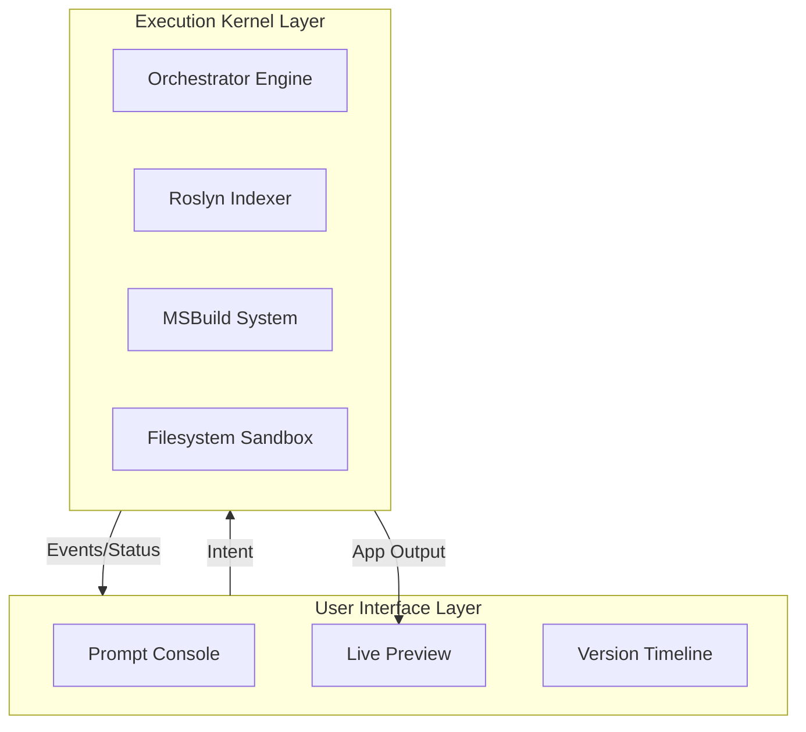
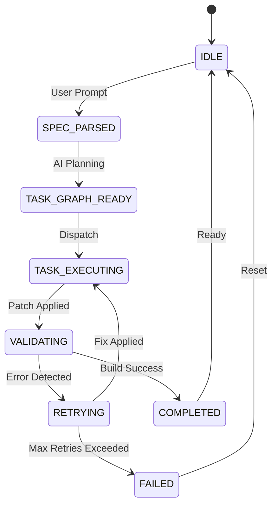
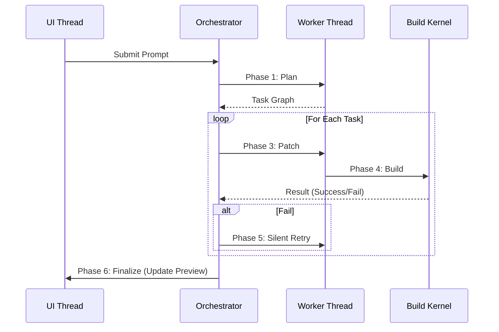
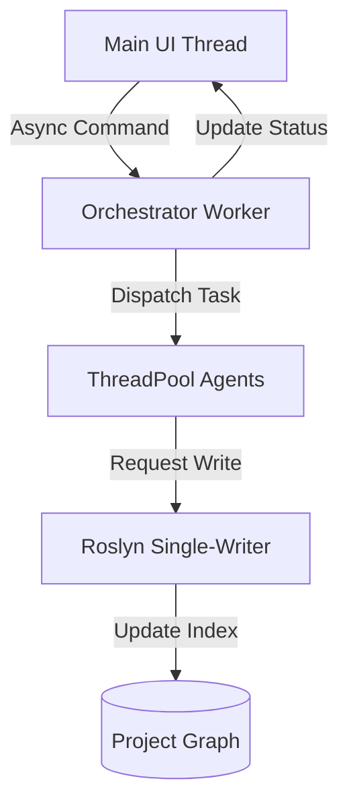

# SYSTEM ARCHITECTURE

> **The Big Picture: 7-Layer Architecture, Deployment Model, Process Lifecycle & Hidden Background Systems**
>
> _Merged from: ARCHITECTURE.md, EXECUTION_ARCHITECTURE.md, EXECUTION_LIFECYCLE_SPECIFICATION.md, BACKGROUND_SYSTEMS_SPECIFICATION.md_
>
> **Related Documentation**:
>
> - [ORCHESTRATION_ENGINE.md](ORCHESTRATION_ENGINE.md) (Orchestrator Logic)
> - [CODE_INTELLIGENCE.md](CODE_INTELLIGENCE.md) (Roslyn & Indexing)
> - [UI_IMPLEMENTATION.md](UI_IMPLEMENTATION.md) (Frontend Specs)
> - [PREVIEW_SYSTEM.md](PREVIEW_SYSTEM.md) (Live Preview)
> - [USER_WORKFLOWS.md](USER_WORKFLOWS.md) (User Flows)
> - [PROJECT_HANDBOOK.md](PROJECT_HANDBOOK.md) (Dev Guide)

---

## Table of Contents

1. [System Overview](#1-system-overview)
2. [The 7-Layer Architecture](#2-the-7-layer-architecture)
3. [Intent and Specification Layer](#3-intent-and-specification-layer)
4. [Planning Layer (Task Graph / DAG)](#4-planning-layer-task-graph-dag)
5. [Multi-Agent Specifications](#5-multi-agent-specifications)
6. [Data Flow](#6-data-flow)
7. [AI Engine Integration with Preview System](#7-ai-engine-integration-with-preview-system)
8. [Validation and Silent Retry Loop](#8-validation-and-silent-retry-loop)
9. [Memory and State Layer](#9-memory-and-state-layer)
10. [Embedded Subsystems](#10-embedded-subsystems)
11. [Execution Lifecycle](#11-execution-lifecycle)
12. [Background Systems](#12-background-systems)
13. [Threading and Concurrency Model](#13-threading-and-concurrency-model)
14. [Security and Isolation](#14-security-and-isolation)
15. [Machine Variability Handling](#15-machine-variability-handling)
16. [Deployment Model](#16-deployment-model)
17. [Builder Project Structure](#17-builder-project-structure)
18. [Module Structure](#18-module-structure)
19. [System-Level Stack](#19-system-level-stack)
20. [Implementation Roadmap](#20-implementation-roadmap)
21. [Key Architectural Decisions](#21-key-architectural-decisions)
22. [Performance Considerations](#22-performance-considerations)
23. [Comparison with Traditional Approaches](#23-comparison-with-traditional-approaches)
24. [Future Evolution](#24-future-evolution)

---

## 1. System Overview

### What is Sync AI?

### What is Sync AI?

Sync AI is a **local-first, AI-powered full-stack application builder** for Windows. It is a **Windows-native autonomous software construction environment** that generates, builds, previews, and iterates on .NET applications — all in-process, with no external CLI calls.

**Mission**: To deliver a seamless, production-grade development experience where complexity is hidden, and the user prompts for results, not code.

### Core Philosophy

> "Complexity is hidden — not absent."

The user sees a simple prompt → app interface. Behind the scenes, 10+ subsystems orchestrate code generation, compilation, error recovery, and preview — all invisibly.

### Architecture Principles

| Principle              | Implementation                                    |
| ---------------------- | ------------------------------------------------- |
| **Local-First**        | All processing runs on the user's Windows machine |
| **Embedded Execution** | MSBuild, NuGet, Roslyn — all in-process via APIs  |
| **Deterministic**      | State machine governs every operation             |
| **Reversible**         | Snapshot system enables rollback at any point     |
| **Isolated**           | Each project runs in a sandboxed directory        |
| **Hidden Complexity**  | User never sees logs, retries, or internal state  |

### Core Principle: The Autonomous Construction Environment

> **"Fully internal" does NOT mean "no tools exist"**
>
> It means: All tools are **embedded services**, not user-facing developer utilities.
> Users never open an IDE, run CLI commands, or manage build systems.

**The Lovable Model (Reference)**:
Lovable feels completely "internal" and seamless, but behind the scenes it manages a Node runtime, package manager, and dev server.

**Sync AI's Windows Equivalent**:

- **Embeds .NET SDK**: No "Install .NET" step for users.
- **Manages MSBuild**: Direct API calls, no `dotnet build` CLI.
- **Wraps XAML Compilation**: Hidden behind the Preview System.
- **Controls NuGet**: In-process restoration and caching.

**Users never see these tools.** They are managed entirely by the orchestrator. This "No IDE Required" model ensures that the complexity of the .NET ecosystem is fully abstracted.

### "No IDE Required" Philosophy

The system is built as an **autonomous software construction environment**, not a developer utility.

- **Zero Tooling Exposure**: Users never open Visual Studio, run `dotnet build`, or manage NuGet manually.
- **Embedded Services**: The .NET SDK, MSBuild, and Roslyn are **internal bundled services**, not external user tools.
- **Developer-Free Workflow**: The Orchestrator and Patch Engine handle all file edits and debugging silently.
- **The Goal**: A self-contained constructor where the only external dependency is the Cloud AI reasoning.

#### Comparison: Sync AI vs. Lovable vs. Visual Studio

| Feature          | Visual Studio    | Lovable (Web)       | Sync AI (Windows)          |
| :--------------- | :--------------- | :------------------ | :------------------------- |
| **Execution**    | Developer manual | Cloud Container     | **Local Embedded**         |
| **Build System** | Explicit MSBuild | Hidden Node.js      | **Hidden MSBuild**         |
| **State**        | Files on Disk    | Ephemeral Container | **Persistent Sandbox**     |
| **Role**         | Tool for Humans  | Web App Builder     | **Autonomous Constructor** |

---

## 2. The 7-Layer Architecture

### High-Level Two-Layer View

Before diving into the 7 layers, it's critical to understand the separation between the **UI Layer** (User Experience) and the **Kernel Layer** (Execution Logic).



### Detailed 7-Layer Stack

```text
┌─────────────────────────────────────────────────────────────┐
│  Layer 7: User Interface (WinUI 3 / XAML)                   │
│  ─ Prompt input, real-time preview, version timeline         │
├─────────────────────────────────────────────────────────────┤
│  Layer 6: Orchestrator Engine                                │
│  ─ Task decomposition, state machine, retry logic            │
├─────────────────────────────────────────────────────────────┤
│  Layer 5: AI Agent Layer                                     │
│  ─ Multi-agent code generation, prompt engineering           │
├─────────────────────────────────────────────────────────────┤
│  Layer 4: Code Intelligence (Roslyn)                         │
│  ─ AST parsing, symbol indexing, impact analysis             │
├─────────────────────────────────────────────────────────────┤
│  Layer 3: Patch Engine                                       │
│  ─ Transactional code mutations, conflict detection          │
├─────────────────────────────────────────────────────────────┤
│  Layer 2: Execution Kernel                                   │
│  ─ In-process MSBuild, NuGet restore, dotnet run             │
├─────────────────────────────────────────────────────────────┤
│  Layer 1: Filesystem Sandbox + SQLite Graph DB               │
│  ─ Isolated projects, snapshots, symbol/dependency storage   │
└─────────────────────────────────────────────────────────────┘
```

### Layer Details

#### Layer 1: Filesystem Sandbox + SQLite Graph DB

**Purpose**: Isolated workspace management and persistent storage.

- Each project lives in `%AppData%/SyncAI/Workspaces/{ProjectId}/`
- Snapshots stored as compressed diffs before every mutation
- SQLite stores: files, symbols, dependencies, errors, architectural decisions, execution logs

**Workspace Structure**:

```text
%AppData%/SyncAI/
├── Workspaces/
│   └── {ProjectId}/
│       ├── src/                    ← Generated code
│       ├── .snapshots/             ← Version history
│       ├── .metadata.json          ← Project metadata
│       └── .build-output/          ← Compiled binaries
├── Database/
│   └── sync-ai.db                  ← SQLite graph DB
├── Cache/
│   ├── NuGet/                      ← Local NuGet cache
│   └── Embeddings/                 ← Vector cache
└── Logs/
    └── execution.log               ← Debug log (hidden from user)
```

#### Layer 2: Execution Kernel

**Purpose**: In-process build and run capabilities.

```csharp
public class ExecutionKernel
{
    private readonly BuildManager _buildManager;  // Microsoft.Build

    public async Task<BuildResult> BuildAsync(string projectPath, string config)
    {
        var buildParams = new BuildParameters
        {
            MaxNodeCount = Environment.ProcessorCount,
            MemoryLimit = 512 * 1024 * 1024  // 512MB limit
        };

        var request = new BuildRequestData(projectPath, globalProperties, null, new[] { "Build" }, null);

        _buildManager.BeginBuild(buildParams);
        var result = _buildManager.PendBuildRequest(request);

        return new BuildResult
        {
            Success = result.OverallResult == BuildResultCode.Success,
            Errors = result.ResultsByTarget.Values
                .SelectMany(r => r.Items.Where(i => i.ItemSpec.Contains("error")))
                .ToList(),
            Duration = stopwatch.Elapsed
        };
    }
}
```

**Key Capabilities**:

- `dotnet restore` → In-process NuGet restore via `NuGet.Commands`
- `dotnet build` → In-process MSBuild via `Microsoft.Build`
- `dotnet run` → Managed `Process` with output capture
- Structured error output (not raw CLI text)

#### Layer 3: Patch Engine

**Purpose**: Transactional, conflict-detecting, reversible code mutations.

```csharp
public interface IPatchTransaction : IAsyncDisposable
{
    Task AddAttributeAsync(string className, string attributeName);
    Task CommitAsync();
    Task RollbackAsync();
}
```

**Guarantees**:

- **Atomic**: Entire patch succeeds or fails
- **Reversible**: Snapshot available for rollback
- **Conflict-Free**: Detect overlapping changes
- **Auditable**: Track every patch

#### Implementation Pattern: Transactional Patch Engine

```csharp
public class TransactionalPatchEngine
{
    private readonly FileSystemSandbox _sandbox;
    private Stack<ISnapshot> _undoStack = new();

    /// Begin patch operation
    public async Task<IPatchTransaction> BeginPatchAsync(string filePath)
    {
        // Create snapshot before patching
        var snapshot = await _sandbox.CreateSnapshotAsync(Path.GetDirectoryName(filePath)!);
        return new PatchTransaction(filePath, snapshot, _undoStack);
    }
}

public class PatchTransaction : IPatchTransaction
{
    private readonly string _filePath;
    private List<Patch> _patches = new();
    private bool _committed = false;

    public async Task AddAttributeAsync(string className, string attributeName)
    {
        // Rosslyn SyntaxTree manipulation...
        var syntax = CSharpSyntaxTree.ParseText(await File.ReadAllTextAsync(_filePath));
        var root = syntax.GetCompilationUnitSyntax();
        // ... (Find class, add attribute via SyntaxFactory) ...
        _patches.Add(new Patch { Type = PatchType.AddAttribute, NewContent = newRoot.ToFullString() });
    }

    public async Task CommitAsync()
    {
        if (_committed) throw new InvalidOperationException("Already committed");
        // Write all patches to file
        await File.WriteAllTextAsync(_filePath, _patches.Last().NewContent);
        _committed = true;
    }

    public async Task RollbackAsync()
    {
        // Restore from snapshot if needed
    }
}
```

**Key Comparison: Traditional vs AST**:
Validation that simple LLM rewrites destroy code (formatting, comments), while AST patches (Roslyn) preserve structure safe for production.

```csharp
// Only modify target node implies:
// - Comments preserved
// - Formatting preserved
// - Minimal diffs
```

#### Layer 4: Code Intelligence (Roslyn)

**Purpose**: Deep understanding of generated code.

- Parse C# into AST (Abstract Syntax Trees)
- Detect breaking changes before build

#### Implementation: Roslyn Code Intelligence Service

```csharp
public class RoslynCodeIntelligenceService
{
    private readonly string _projectPath;
    private Compilation? _cachedCompilation;
    private Dictionary<string, ISymbol>? _symbolIndex;

    /// Build or update symbol index (Async, non-blocking)
    public async Task IndexProjectAsync()
    {
        var workspace = MSBuildWorkspace.Create();
        var project = await workspace.OpenProjectAsync(_projectPath);
        var compilation = await project.GetCompilationAsync();

        _cachedCompilation = compilation;
        _symbolIndex = new Dictionary<string, ISymbol>();

        // Recursively index all symbols in the global namespace
        IndexSymbolsRecursive(compilation.GlobalNamespace);
    }

    /// Analyze impact of changing a file
    public async Task<FileImpactAnalysis> AnalyzeChangeImpactAsync(string filePath)
    {
        // 1. Find syntax tree for file
        // 2. Find all symbols declared in file
        // 3. Find all REFERENCES to those symbols in other files
        var dependentFiles = await FindDependentFiles(filePath);

        return new FileImpactAnalysis
        {
            FilePath = filePath,
            AffectedFiles = dependentFiles,
            ImpactLevel = dependentFiles.Count > 20 ? ImpactLevel.High : ImpactLevel.Low
        };
    }

    /// Incremental Re-Indexing Strategy (Detail)
    public async Task IncrementalIndexFileAsync(string filePath)
    {
        // 1. Parse only the changed file
        var tree = await CSharpSyntaxTree.ParseTextAsync(File.ReadAllText(filePath));

        // 2. Update SyntaxTree Cache
        _syntaxTrees[filePath] = tree;

        // 3. Extract Symbols (Parallel)
        var root = await tree.GetRootAsync();
        var declaredSymbols = ExtractSymbols(root);

        // 4. Update the Symbol Graph (Atomic Swap)
        await _symbolGraph.UpdateSymbolsAsync(filePath, declaredSymbols);
    }
}
```

### detailed Schema

#### File Index

```json
{
  "files": [
    {
      "path": "Models/Customer.cs",
      "type": "class",
      "dependencies": ["System.Data", "DbContext"],
      "exports": ["Customer", "CustomerValidator"],
      "imports": ["System", "System.ComponentModel.DataAnnotations"],
      "size_bytes": 2048,
      "last_modified": "2026-02-16"
    }
  ]
}
```

#### Dependency Graph

```text
Customer.cs
  ├─ imports: DbContext
  ├─ imports: Validator
  └─ used by: CustomerService.cs

CustomerService.cs
  ├─ imports: Customer.cs
  ├─ imports: ILogger
  └─ used by: CustomerController.cs

CustomerController.cs
  ├─ imports: CustomerService.cs
  └─ user-accessible routes: /api/customers/*
```

#### Route Registry

```json
{
  "routes": [
    {
      "path": "/api/customers",
      "method": "GET",
      "handler": "CustomerController.GetAll",
      "auth_required": true,
      "roles": ["admin", "manager"]
    },
    {
      "path": "/api/customers/{id}",
      "method": "GET",
      "handler": "CustomerController.GetById",
      "auth_required": true,
      "roles": ["admin", "manager"]
    }
  ]
}
```

#### Database Schema Map

```json
{
  "tables": [
    {
      "name": "customers",
      "columns": [
        { "name": "id", "type": "int", "pk": true },
        { "name": "name", "type": "string", "nullable": false },
        { "name": "email", "type": "string", "unique": true }
      ],
      "relationships": [{ "foreign_key": "contact_id", "references": "contacts.id" }],
      "models_using": ["Customer.cs"]
    }
  ]
}
```

#### Layer 5: AI Agent Layer

**Purpose**: Multi-agent code generation.

| Agent        | Responsibility                         |
| ------------ | -------------------------------------- |
| **Planner**  | Decomposes user prompt into task graph |
| **Coder**    | Generates C#/XAML per task             |
| **Fixer**    | Patches code after build errors        |
| **Reviewer** | Validates architectural consistency    |

> **Note**: See [Section 3](#3-multi-agent-specifications) for detailed JSON contracts and input/output examples.

#### Layer 6: Orchestrator Engine

**Purpose**: The brain — deterministic state machine governing all operations.

**Purpose**: The brain — deterministic state machine governing all operations.

**🔴 CRITICAL FOUNDATION: Must Implement First**
Without deterministic orchestration, Roslyn indexing and patching will create nondeterministic mutation loops that silently corrupt code.

- **State Transitions**: `IDLE` → `SPEC_PARSED` → `TASK_GRAPH_READY` → `TASK_EXECUTING` → `VALIDATING` → `RETRYING` → `COMPLETED` / `FAILED`.
- **Constraint**: Only 1 mutation task at time (no parallel patching)

See [ORCHESTRATION_ENGINE.md](ORCHESTRATION_ENGINE.md) for complete details.

#### Layer 7: User Interface

**Purpose**: Thin WinUI 3 shell — hides all internal complexity.

- Single prompt input
- Real-time build progress (spinner, not logs)
- App preview (XAML renderer or full launch)
- Version timeline slider

---

## 3. Intent and Specification Layer

### Purpose

Transform unstructured user prompts into structured, machine-readable specifications that prevent hallucination and ensure consistency.

### Process

**Input:**

```
"Build a CRM with authentication, role-based access,
customer database, and analytics dashboard"
```

**Processing:**

1. **NLP Feature Extraction** - Identify requested features
2. **Stack Selection** - Choose appropriate tech stack
3. **Constraint Inference** - Deduce implicit requirements (e.g., auth implies session management)
4. **Dependency Mapping** - Identify feature interdependencies
5. **Validation** - Check for conflicts or impossibilities

**Output (Structured JSON):**

```json
{
  "projectType": "windows-desktop-app",
  "projectName": "CRM System",
  "features": [
    {
      "id": "authentication",
      "type": "auth",
      "subType": "windows-auth",
      "dependencies": ["user-database"],
      "priority": 1
    },
    {
      "id": "rbac",
      "type": "access-control",
      "roles": ["admin", "manager", "user"],
      "dependencies": ["authentication"],
      "priority": 2
    },
    {
      "id": "customer-database",
      "type": "data-model",
      "tables": ["customers", "contacts", "interactions"],
      "dependencies": ["database-setup"],
      "priority": 1
    },
    {
      "id": "analytics-dashboard",
      "type": "ui",
      "components": ["charts", "metrics", "filters"],
      "dependencies": ["customer-database", "rbac"],
      "priority": 3
    }
  ],
  "stack": {
    "ui": "WinUI3",
    "backend": ".NET8",
    "database": "SQLite",
    "auth": "Windows Authentication"
  },
  "constraints": {
    "maxComplexity": "medium",
    "requiredPackages": ["Microsoft.UI.Xaml", "System.Data.Sqlite"],
    "incompatibleFeatures": []
  }
}
```

### Benefits

- **No hallucination** - Features derived from extraction, not free-form
- **Explicit dependencies** - Clear what depends on what
- **Conflict detection** - Catch contradictory requirements early
- **Stack consistency** - All modules use same tech choices

---

## 4. Planning Layer (Task Graph / DAG)

### Purpose

Convert feature spec into an ordered, executable task graph where dependencies are explicit and parallelizable work is identified.

### Task Graph Structure

```text
Task {
  id: "setup-auth",
  type: "infrastructure",
  description: "Configure Windows Authentication",
  dependencies: ["init-project"],
  files_to_create: ["Models/User.cs", "Services/AuthService.cs"],
  validation_strategy: "compile-check",
  expected_artifacts: [
    "AuthService class",
    "User model",
    "Authentication middleware"
  ]
}
```

### Example DAG for CRM App

```text
init-project [0]
    ↓
setup-database [1]
    ↓
    ├─→ define-models [2]
    │   ├─→ customer-model
    │   ├─→ contact-model
    │   └─→ interaction-model
    │
    ├─→ setup-auth [2]
    │   ├─→ auth-service
    │   └─→ user-model
    │
    └─→ db-migrations [2]
        ├─→ create-tables
        └─→ seed-data

generate-ui [3]
    ├─→ login-page (requires: setup-auth)
    ├─→ dashboard-page (requires: setup-database)
    └─→ customer-table (requires: define-models)

wire-api-routes [4]
    ├─→ auth-routes (requires: setup-auth)
    ├─→ customer-crud (requires: customer-model)
    ├─→ analytics-routes (requires: setup-database)
    └─→ rbac-middleware (requires: setup-auth)

validation & fix [5]
    → compile & test
    → detect errors
    → auto-fix
    → retry
```

### Key Insights

- **Parallelizable work** - Tasks at same level can run concurrently
- **Dependencies clear** - Prevents race conditions
- **Validation points** - Each task has success criteria
- **Rollback safe** - Can retry individual tasks

---

## 5. Multi-Agent Specifications

### Purpose

Decompose complex app generation into specialized agents, each with narrow responsibility and deterministic output schema.

### The Agent Stack

#### 1. Architect Agent

**Responsibility:** Define overall app structure

**Input:**

```json
{
  "spec": {...},
  "task": "design-project-structure"
}
```

**Output:**

```json
{
  "project_structure": {
    "Models": ["Customer.cs", "Contact.cs"],
    "Services": ["CustomerService.cs", "AuthService.cs"],
    "UI": ["MainWindow.xaml", "CustomerPage.xaml"],
    "Database": ["DbContext.cs"]
  },
  "design_patterns": ["MVVM", "Repository", "Dependency Injection"]
}
```

#### 2. Schema Agent

**Responsibility:** Generate database models and migrations

**Input:**

```json
{
  "entities": [
    {
      "name": "Customer",
      "properties": [
        { "name": "id", "type": "int", "pk": true },
        { "name": "name", "type": "string" }
      ]
    }
  ]
}
```

**Output:**

```csharp
// Generated Customer.cs
[Table("customers")]
public class Customer
{
    [Key]
    public int Id { get; set; }

    [Required]
    [StringLength(200)]
    public string Name { get; set; }
}
```

#### 3. Frontend Agent

**Responsibility:** Generate UI components and pages

**Input:**

```json
{
  "pages": [
    {
      "name": "CustomerPage",
      "components": ["DataGrid", "Form", "Button"],
      "data_binding": "customer"
    }
  ]
}
```

**Output:**

```xaml
<Page x:Class="CRM.CustomerPage">
  <Grid>
    <DataGrid ItemsSource="{Binding Customers}" />
    <Button Content="Add" Click="OnAdd" />
  </Grid>
</Page>
```

#### 4. Backend Agent

**Responsibility:** Generate API routes and services

**Input:**

```json
{
  "routes": [
    {
      "path": "/api/customers",
      "methods": ["GET", "POST"],
      "auth_required": true
    }
  ]
}
```

**Output:**

```csharp
[ApiController]
[Route("api/[controller]")]
[Authorize]
public class CustomersController : ControllerBase
{
    [HttpGet]
    public async Task<ActionResult<List<CustomerDto>>> GetAll()
    {
        return await _service.GetAllAsync();
    }
}
```

#### 5. Integration Agent

**Responsibility:** Wire dependencies together

**Input:**

```json
{
  "dependencies": {
    "CustomerController": ["CustomerService"],
    "CustomerService": ["ICustomerRepository", "ILogger"]
  }
}
```

**Output:**

```csharp
// Updates Program.cs
services.AddScoped<ICustomerRepository, CustomerRepository>();
services.AddScoped<CustomerService>();
services.AddScoped<CustomersController>();
```

#### 6. Fix Agent

**Responsibility:** Detect and repair build failures

**Input:**

```json
{
  "error": "CS1503: Cannot convert type 'string' to 'int'",
  "file": "Models/Customer.cs",
  "line": 15,
  "context": "public int CustomerId { get; set; } = customerId;"
}
```

**Output:**

```csharp
// Fix suggestion
public int CustomerId { get; set; } = int.Parse(customerId);
// or
public int CustomerId { get; set; } = Convert.ToInt32(customerId);
```

### 5.2 Agent Orchestration Pattern

Detailed interaction logic between agents:

```python
# Conceptual Orchestration Logic
async def orchestrate_generation(spec, task_graph):
    for task in task_graph.topological_sort():
        context = await retrieval_service.get_context(task)

        # 1. Select Specialist Agent
        agent = agent_factory.get_agent(task.type)

        # 2. Generate Candidate Code
        candidate = await agent.generate(spec, context)

        # 3. Apply via Patch Engine (Dry Run)
        if not await patch_engine.validate(candidate):
            # 4. Self-Correction Loop
            attempts = 0
            while attempts < 3:
                error = patch_engine.get_last_error()
                candidate = await fix_agent.fix(candidate, error)
                if await patch_engine.validate(candidate):
                    break
                attempts += 1

        # 5. Commit if Valid
        if await patch_engine.validate(candidate):
            await patch_engine.commit(candidate)
```

---

## 6. Data Flow and Orchestration

### 6.1 Deterministic Orchestrator Engine

The Orchestrator is the deterministic "brain" that governs all operations. It ensures that the system never enters an invalid state.

**State Machine Transitions**:



**Key Responsibilities**:

- **Concurrency Control**: Enforces "One Mutation at a Time" rule.
- **Retry Budget**: Tracks attempts (Max 3 per task, Max 10 total).
- **Error Classification**: Maps huge MSBuild logs to actionable error codes.
- **Timeout Management**: Kills hung processes after 60s.

### 6.2 Application Data Flow

```text
User Prompt
    ↓
Intent Parser → Structured Spec
    ↓
Planning Service → Task Graph (DAG)
    ↓
Code Intelligence (Indexing) → Project Context
    ↓
Multi-Agent Orchestrator
    ├─ Architect Agent
    ├─ Schema Agent
    ├─ Frontend Agent
    ├─ Backend Agent
    ├─ Integration Agent
    └─ [Parallel execution where possible]
    ↓
Structured Patch Engine (Roslyn)
    ├─ Parse to AST
    ├─ Apply patches
    └─ Preserve formatting
    ↓
Build System (MSBuild)
    ├─ Compile
    ├─ [If errors] → Fix Agent → Retry
    └─ Success? → Show to user
    ↓
Live Preview / Deploy
```

**Key Insight**: What looks like "instant generation" is actually:

- Multiple agents working in parallel via the **AI Engine**
- Smart context retrieval (not full project dump)
- Automatic error fixing (hidden from user)
- Silent retries (only success shown)

- Silent retries (only success shown)

---

## 7. AI Engine Integration with Preview System

### Overview

The AI Engine generates code, but **never directly renders or displays it**. The Preview System is a separate layer that consumes AI-generated code and provides visual feedback to users.

### Integration Architecture

```
User Prompt → Orchestrator → AI Engine (Patches) → Roslyn Engine (Apply) → Preview Service (Render)
```

### Preview Modes (Parallel Support)

1. **Embedded XAML Preview**: `XamlReader.Load()` for instant visual feedback of UI components.
2. **Code View**: Syntax-highlighted read-only view of the generated source.
3. **Full Launch**: `MSBuild` compile & `Process.Start()` to run the actual executables.

### Key Separation of Concerns

| Component           | Responsibility               | Does NOT Do                      |
| ------------------- | ---------------------------- | -------------------------------- |
| **AI Engine**       | Generate code patches (JSON) | ❌ Write files, Render preview   |
| **Roslyn Engine**   | Apply patches to workspace   | ❌ Generate code, Render preview |
| **Preview Service** | Render/display code          | ❌ Generate code, Modify files   |

---

## 8. Validation and Silent Retry Loop

### Purpose

Transform potential errors into invisible internal retries, surfacing only final success to the user.

### The Loop

```text
Generate → Install Deps → Compile → Check Errors → Auto-Fix → Retry
```

### Error Classifier Strategy

```csharp
public enum ErrorType
{
    SyntaxError,           // CS1002
    MissingDependency,     // Package not found
    TypeMismatch,          // CS1503
    MissingReference,      // CS0106
    ...
}
```

**Auto-Fix Examples**:

- **Syntax Error**: Insert missing `;` via AST patch.
- **Missing Using**: Add `using Namespace;` if symbol not found.
- **Build Failure**: Running `dotnet add package` for missing nugets.

---

## 9. Memory and State Layer

### Purpose

Preserve architectural decisions and context across iterations, preventing architectural drift.

### What Gets Remembered

#### Project Memory

```json
{
  "project_id": "crm-app-001",
  "stack_decisions": {
    "ui_framework": "WinUI3",
    "database": "SQLite",
    "auth_provider": "Windows-Auth",
    "orm": "Entity Framework Core"
  },
  "architectural_decisions": {
    "pattern": "MVVM",
    "dependency_injection": "Microsoft.Extensions.DependencyInjection",
    "logging": "Serilog"
  },
  "naming_conventions": {
    "models": "PascalCase",
    "private_fields": "_camelCase",
    "public_properties": "PascalCase"
  }
}
```

#### Pattern Memory

```json
{
  "file_naming": {
    "models": "Models/{EntityName}.cs",
    "services": "Services/{EntityName}Service.cs",
    "controllers": "Controllers/{EntityName}Controller.cs",
    "views": "UI/Pages/{PageName}.xaml"
  },
  "routing_style": {
    "api_base": "/api",
    "verb_placement": "method-based",
    "resource_naming": "plural"
  },
  "code_style": {
    "async_by_default": true,
    "nullable_enabled": true,
    "use_records": false
  }
}
```

#### Error Memory

```json
{
  "error_signatures": [
    {
      "error_code": "CS1503",
      "pattern": "Cannot convert type 'string' to 'int'",
      "successful_fix": "Convert.ToInt32(value)",
      "occurrence_count": 12
    },
    {
      "error_code": "CS0103",
      "pattern": "The name 'ILogger' does not exist",
      "successful_fix": "Add using Microsoft.Extensions.Logging;",
      "occurrence_count": 8
    }
  ]
}
```

### Storage Schema

````markdown
### Detailed Storage Schema (SQLite)

```sql
-- Core project data
CREATE TABLE projects (
    id TEXT PRIMARY KEY,
    name TEXT NOT NULL,
    path TEXT NOT NULL,
    created_at DATETIME,
    updated_at DATETIME
);

-- Architectural Decisions (prevent drift)
CREATE TABLE architectural_decisions (
    id TEXT PRIMARY KEY,
    project_id TEXT,
    topic TEXT,          -- e.g., "Pattern", "Logging"
    decision TEXT,       -- e.g., "MVVM", "Serilog"
    rationale TEXT,      -- e.g., "Standard for WinUI 3"
    made_at DATETIME,
    FOREIGN KEY (project_id) REFERENCES projects(id)
);

-- Snapshot Graph (Reversibility)
CREATE TABLE snapshots (
    id TEXT PRIMARY KEY,
    project_id TEXT,
    label TEXT,          -- e.g., "Added Customer Model"
    parent_snapshot_id TEXT,
    timestamp DATETIME,
    is_stable BOOLEAN,   -- True if build succeeded
    FOREIGN KEY (project_id) REFERENCES projects(id)
);

-- File index (for change detection)
CREATE TABLE files (
    id TEXT PRIMARY KEY,
    project_id TEXT,
    file_path TEXT,
    content_hash TEXT,
    content_size INT,
    indexed_at DATETIME,
    FOREIGN KEY (project_id) REFERENCES projects(id)
);

-- Symbol index (Code Intelligence)
CREATE TABLE symbols (
    id TEXT PRIMARY KEY,
    file_id TEXT,
    symbol_name TEXT,
    symbol_kind TEXT,  -- class, method, property
    line_number INT,
    namespace TEXT,
    FOREIGN KEY (file_id) REFERENCES files(id)
);

-- Dependencies (Impact Analysis)
CREATE TABLE dependencies (
    id TEXT PRIMARY KEY,
    source_file_id TEXT,
    target_symbol_id TEXT,
    dependency_type TEXT,  -- references, inherits
    FOREIGN KEY (source_file_id) REFERENCES files(id),
    FOREIGN KEY (target_symbol_id) REFERENCES symbols(id)
);

-- Build errors knowledge base
CREATE TABLE build_errors (
    id TEXT PRIMARY KEY,
    project_id TEXT,
    error_code TEXT,  -- CS0123
    error_message TEXT,
    file_id TEXT,
    line_number INT,
    solution TEXT,  -- Validated fix
    occurrence_count INT,
    FOREIGN KEY (project_id) REFERENCES projects(id)
);

-- Execution log (Deterministic Replay)
CREATE TABLE execution_log (
    id TEXT PRIMARY KEY,
    project_id TEXT,
    event_type TEXT,  -- task_started, build_failed
    event_data JSON,
    timestamp DATETIME,
    FOREIGN KEY (project_id) REFERENCES projects(id)
);

-- Semantic Embeddings (For RAG)
CREATE TABLE embeddings (
    id TEXT PRIMARY KEY,
    file_id TEXT,
    code_snippet TEXT,
    vector BLOB,      -- 1536-dim float array
    model_version TEXT,
    indexed_at DATETIME,
    FOREIGN KEY (file_id) REFERENCES files(id)
);
```
````

#### Graph Service Implementation

```csharp
public class ProjectGraphService
{
    private readonly SQLiteConnection _db;

    /// Get all symbols in project
    public async Task<List<Symbol>> GetProjectSymbolsAsync(string projectId)
    {
        return await _db.QueryAsync<Symbol>(
            @"SELECT s.* FROM symbols s
              JOIN files f ON s.file_id = f.id
              WHERE f.project_id = @projectId",
            new { projectId });
    }

    /// Find previous solutions for error
    public async Task<List<ErrorSolution>> FindErrorSolutionsAsync(string errorCode)
    {
        return await _db.QueryAsync<ErrorSolution>(
            @"SELECT error_message, solution FROM build_errors
              WHERE error_code = @errorCode
              ORDER BY occurrence_count DESC
              LIMIT 5",
            new { errorCode });
    }
}
```

````

---

## 10. Embedded Subsystems

### Why "Embedded"?

Unlike cloud builders that call external services, Sync AI runs everything locally as in-process .NET libraries:

| Component         | Traditional Approach          | Sync AI Embedded Approach                           |
| ----------------- | ----------------------------- | --------------------------------------------------- |
| **Build**         | Shell out to `dotnet build`   | `Microsoft.Build.Execution.BuildManager` in-process |
| **NuGet**         | Shell out to `dotnet restore` | `NuGet.Commands.RestoreCommand` in-process          |
| **Code Analysis** | External linter               | `Microsoft.CodeAnalysis` (Roslyn) in-process        |
| **Database**      | External DB server            | `Microsoft.Data.Sqlite` embedded                    |
| **Preview**       | External browser              | WinUI 3 `WebView2` or XAML renderer                 |

### The 6 Embedded Subsystems

The architecture relies on 6 critical internal subsystems that must be implemented as embedded services:

1.  **Filesystem Sandbox**: Manages isolated workspaces, enforcing security boundaries and ensuring no cross-project contamination. It handles snapshot creation and atomic writes.
2.  **Execution Kernel**: The "engine room" that manages the .NET SDK, MSBuild, and NuGet operations in-process. It abstracts CLI complexity.
3.  **Roslyn Code Intelligence**: The "brain" that parses code into ASTs, maintains the symbol graph, and performs impact analysis for every change.
4.  **Transactional Patch Engine**: The "surgeon" that performs safe, reversible code mutations using AST manipulation, ensuring no syntax errors are introduced.
5.  **SQLite Project Graph**: The "memory" that persists the project's structure, symbols, dependencies, and execution history for intelligent decision-making.
6.  **Process Sandbox**: The "supervisor" that manages isolated execution of the generated app, enforcing resource limits and timeout policies.

### 10.1 Filesystem Sandbox (Deep Dive)

**Overview**:
The sandbox ensures that Sync AI never accidentally modifying user files outside the project scope. It acts as a virtualized file system wrapper.

**Key Responsibilities**:
- **Path Validation**: Rejects any path containing `..` or pointing outside `%AppData%/SyncAI/Workspaces/{Id}`.
- **Atomic Writes**: Uses `.tmp` files and `MoveFileEx` to ensure files are never half-written.
- **Snapshotting**: Differential compression of the entire workspace state before every mutation.

```csharp
public class FileSystemSandbox
{
    private readonly string _rootPath;

    public async Task WriteFileAsync(string relativePath, string content)
    {
        ValidatePath(relativePath); // Throws SecurityException

        var fullPath = Path.Combine(_rootPath, relativePath);
        var tempPath = fullPath + ".tmp";

        await File.WriteAllTextAsync(tempPath, content);
        File.Move(tempPath, fullPath, overwrite: true);

        // Update snapshot hash
        _snapshotManager.RegisterChange(relativePath);
    }

    public async Task<ISnapshot> CreateSnapshotAsync(string label)
    {
        // 1. Pause mutations
        // 2. Compute diff from last snapshot
        // 3. Store compressed diff
        // 4. Return snapshot handle
    }
}
```

### 10.2 Execution Kernel (Deep Dive)

**Overview**:
The Execution Kernel wraps the .NET SDK tools (MSBuild, NuGet) into a managed API. It avoids launching `dotnet.exe` processes where possible, preferring in-process libraries for speed and control.

**Key Responsibilities**:
- **MSBuild Localization**: Uses `Microsoft.Build.Locator` to find the correct SDK without user PATH configuration.
- **NuGet Cache Management**: Maintained a local package cache to avoid redownloading common packages.
- **Build Logger**: Implementation of `ILogger` that captures MSBuild events and converts them into structural definition (Error Code, File, Line).

```csharp
public class ExecutionKernel
{
    public async Task<BuildResult> BuildAsync(string projectPath)
    {
        // 1. Verify SDK
        if (!MSBuildLocator.IsRegistered) MSBuildLocator.RegisterDefaults();

        // 2. Prepare Request
        var projectCollection = new ProjectCollection();
        var buildParams = new BuildParameters(projectCollection)
        {
            Loggers = { new StructuredLogger() } // Captures errors structually
        };

        // 3. Execute In-Process
        var buildResult = BuildManager.DefaultBuildManager.Build(
            buildParams,
            new BuildRequestData(projectPath, new Dictionary<string, string>(), null, new[] { "Build" }, null)
        );

        return new BuildResult(buildResult);
    }
}
```

```text

┌─────────────────────────────────────────────────────────┐
│ SyncAI Process │
│ │
│ ┌──────────────┐ ┌──────────────┐ ┌──────────────┐ │
│ │ Execution │ │ Code │ │ Patch │ │
│ │ Kernel │ │ Intelligence│ │ Engine │ │
│ │ │ │ │ │ │ │
│ │ MSBuild API │ │ Roslyn AST │ │ Transactional│ │
│ │ NuGet API │ │ Symbol Graph │ │ Writes │ │
│ │ Process Mgr │ │ Dep. Anal. │ │ Rollback │ │
│ └──────────────┘ └──────────────┘ └──────────────┘ │
│ │
│ ┌──────────────┐ ┌──────────────┐ ┌──────────────┐ │
│ │ Filesystem │ │ SQLite │ │ Snapshot │ │
│ │ Sandbox │ │ Graph DB │ │ Manager │ │
│ │ │ │ │ │ │ │
│ │ Isolation │ │ Symbols │ │ Versioning │ │
│ │ Path Safety │ │ Deps │ │ Diff/Patch │ │
│ │ Workspace │ │ Errors │ │ Rollback │ │
│ └──────────────┘ └──────────────┘ └──────────────┘ │
└─────────────────────────────────────────────────────────┘

````

### 10.1 FileSystem Sandbox

#### Core Implementation

The sandbox enforces isolation, preventing cross-project contamination and enabling safe rollbacks.

```csharp
public class FileSystemSandbox
{
    private readonly string _projectRoot; // e.g. "C:\Users\John\SyncAIProjects"

    /// <summary>
    /// Validates if a file path is safe to write to (Sandbox Containment)
    /// </summary>
    public bool IsPathSafe(string path)
    {
        var fullPath = Path.GetFullPath(path);
        var workspacePath = Path.GetFullPath(_projectRoot);

        // 1. Ensure path is within workspace root
        if (!fullPath.StartsWith(workspacePath, StringComparison.OrdinalIgnoreCase))
            return false;

        // 2. Block directory traversal attempts
        if (fullPath.Contains(".."))
            return false;

        // 3. Block system files
        if (Path.GetFileName(fullPath).StartsWith("."))
            return false;

        return true;
    }

    /// <summary>
    /// Writes content atomically within the sandbox
    /// </summary>
    public async Task WriteFileAsync(string projectId, string relativePath, string content)
    {
        var fullPath = Path.Combine(_projectRoot, projectId, relativePath);

        if (!IsPathSafe(fullPath))
        {
            throw new SecurityException($"Sandbox Violation: Attempted write to {fullPath}");
        }

        Directory.CreateDirectory(Path.GetDirectoryName(fullPath));
        await File.WriteAllTextAsync(fullPath, content);
    }

    /// <summary>
    /// Silently cleans build artifacts (bin/obj) to free space or reset state
    /// </summary>
    public void CleanBuildArtifacts(string projectId)
    {
        var projectDir = Path.Combine(_projectRoot, projectId);
        var bin = Path.Combine(projectDir, "bin");
        var obj = Path.Combine(projectDir, "obj");

        if (Directory.Exists(bin)) Directory.Delete(bin, true);
        if (Directory.Exists(obj)) Directory.Delete(obj, true);
    }
```

    /// Rollback to previous snapshot
    public async Task RollbackToSnapshotAsync(string projectId, string snapshotPath)
    {
        var projectSrc = Path.Combine(_projectRoot, projectId, "src");
        Directory.Delete(projectSrc, recursive: true);
        ZipFile.ExtractToDirectory(snapshotPath, projectSrc);
    }

}

````

#### Local-Only Enhancements

- **Disk Space Validation**: `DiskSpaceValidator` checks for sufficient space before snapshots.
- **Path Validation**: Prevents directory traversal attacks.
- **Snapshot Compression**: Excludes `bin`, `obj`, `.vs` to save space.

### 10.2 Execution Kernel (In-Process MSBuild)

#### Direct API Implementation

Instead of shelling out to CLI, we use `Microsoft.Build` APIs directly for performance and control.

```csharp
public class ExecutionKernel
{
    /// <summary>
    /// Builds project using Microsoft.Build APIs (No CLI)
    /// </summary>
    public async Task<BuildResult> BuildAsync(string projectPath, string configuration = "Debug")
    {
        return await Task.Run(() =>
        {
            var projectCollection = new ProjectCollection();
            try
            {
                var project = projectCollection.LoadProject(projectPath);
                project.SetProperty("Configuration", configuration);

                var buildParameters = new BuildParameters(projectCollection)
                {
                    Loggers = new[] { new StructuredLogger() },
                    MaxNodeCount = Environment.ProcessorCount
                };

                var buildRequest = new BuildRequestData(
                    project.CreateProjectInstance(),
                    new[] { "Restore", "Build" } // Restore + Build in one go
                );

                var result = BuildManager.DefaultBuildManager.Build(buildParameters, buildRequest);
                return new BuildResult { Success = result.OverallResult == BuildResultCode.Success };
            }
            finally { projectCollection.Dispose(); }
        });
    }
}
````

---

### 10.3 Patch Engine & Mutation Safety Guard

The Patch Engine is the "heart" of the builder, responsible for safely applying AI-generated changes.

#### The 5-Layer Mutation Shield (Safety Guard)

Before any patch is written to disk, it must pass a rigorous 5-layer safety check to prevent build breaks and runtime instability.

| Layer                    | Check                                        | Action on Failure               |
| :----------------------- | :------------------------------------------- | :------------------------------ |
| **1. Target Validation** | Does the file/symbol exist? Has it changed?  | **REJECT** (Stale Context)      |
| **2. Impact Radius**     | Calculate outgoing/incoming edges (Depth=2). | **ANALYZE** (Determine Scope)   |
| **3. Breaking Change**   | Does it modify public contracts or DI?       | **BLOCK** (If deps break)       |
| **4. AST Simulation**    | Dry-run apply on in-memory syntax tree.      | **REJECT** (Syntax Errors)      |
| **5. Pre-Commit Build**  | Run design-time build in sandbox.            | **REJECT** (Compilation Errors) |

#### Implementation

````csharp
public async Task<bool> ValidatePatchAsync(Patch patch)
{
    // Simulate AST modification in memory first
    var tree = await CSharpSyntaxTree.ParseTextAsync(File.ReadAllText(patch.FilePath));
    var root = await tree.GetRootAsync();

    try
    {
        var modifiedRoot = ApplyPatchToNode(root, patch);

        // Validate syntax tree (Layer 4)
        var diagnostics = modifiedRoot.GetDiagnostics();
        if (diagnostics.Any(d => d.Severity == DiagnosticSeverity.Error))
        {
            return false; // Syntax error caught before disk write
        }

        // specific semantic checks (Layers 1-3)...

```csharp
        return true;
    }
    catch
    {
        return false;
    }
}
````

### 10.4 Roslyn Code Intelligence (Deep Dive)

**Overview**: The brain that parses code into ASTs, maintains the symbol graph, and performs impact analysis.

**Key Responsibilities**:

- **Symbol Extraction**: Identifies classes, methods, properties, and their relationships.
- **Impact Analysis**: Determines which files need re-compilation or re-validation after a change.
- **Semantic Search**: Generates embeddings for code snippets to support AI retrieval.

```csharp
public class RoslynCodeIntelligence
{
    public async Task<ImpactReport> AnalyzeImpactAsync(string filePath)
    {
        var tree = await _syntaxCache.GetTreeAsync(filePath);
        var semanticModel = await _compilation.GetSemanticModelAsync(tree);

        // Find dependent files
        var symbol = semanticModel.GetDeclaredSymbol(tree.GetRoot());
        var references = await SymbolFinder.FindReferencesAsync(symbol, _solution);

        return new ImpactReport
        {
            DirectDependents = references.Select(r => r.Location.SourceTree.FilePath).Distinct(),
            RiskLevel = CalculateRisk(references.Count())
        };
    }
}
```

### 10.5 SQLite Project Graph (Deep Dive)

**Overview**: The persistent memory that records the project's structure, symbols, dependencies, and execution history.

**Key Responsibilities**:

- **Graph Persistence**: Stores the DAG of tasks and their statuses.
- **Symbol Indexing**: fast lookups for "Where is class X defined?".
- **Audit Trail**: Records every mutation, error, and fix for debugging and rollback.

**Schema Highlights**:

- `Symbols`: (Name, FileId, Type, Span)
- `Dependencies`: (SourceId, TargetId, Type)
- `TaskHistory`: (TaskId, Prompt, Result, Duration)

### 10.6 Process Sandbox (Deep Dive)

**Overview**: The supervisor that manages isolated execution of the generated app, enforcing resource limits and timeout policies.

**Key Responsibilities**:

- **Resource Quotas**: Limits CPU time and memory usage per build/run.
- **Timeout Enforcement**: Kills processes that hang (e.g., infinite loops).
- **Environment Sanitation**: Clears environment variables to prevent leakage.

```csharp
public class ProcessSandbox
{
    public async Task<int> RunSafeAsync(ProcessStartInfo info, TimeSpan timeout)
    {
        using var process = Process.Start(info);
        using var cts = new CancellationTokenSource(timeout);

        try
        {
            await process.WaitForExitAsync(cts.Token);
            return process.ExitCode;
        }
        catch (OperationCanceledException)
        {
            process.Kill(entireProcessTree: true);
            throw new TimeoutException($"Process exceeded {timeout.TotalSeconds}s limit");
        }
    }
}
```

---

### 11. Execution Lifecycle

````markdown
### Environment Validation Detail

```csharp
public async Task<ValidationResult> ValidateEnvironmentAsync()
{
    var results = new List<ValidationIssue>();

    // 1. Verify embedded .NET SDK
    var sdkValid = await VerifyEmbeddedSdkAsync();
    if (!sdkValid)
    {
        results.Add(new ValidationIssue("Embedded SDK corrupted", Severity.Critical));
    }

    // 2. Verify MSBuild
    var msbuildPath = await FindMSBuildAsync();
    if (msbuildPath == null)
    {
        results.Add(new ValidationIssue("MSBuild not accessible", Severity.Critical));
    }

    // 3. Verify NuGet integrity
    var nugetValid = await ValidateNuGetAsync();
    if (!nugetValid)
    {
        results.Add(new ValidationIssue("NuGet configuration issue", Severity.Warning));
    }

    // 4. Check disk space
    var availableGB = GetAvailableDiskSpace();
    if (availableGB < 1.0)
    {
        results.Add(new ValidationIssue("Low disk space", Severity.Warning));
    }

    // 5. Initialize SQLite connection
    await _database.InitializeAsync();

    return new ValidationResult(results);
}
```
````

### Task Execution Lifecycle (Generate Command)

### 11.1 Full Hidden Background Execution Lifecycle

When user types a prompt and hits "Generate", the system executes a 6-phase lifecycle. Phases 1-5 run on background threads.

#### Phase 0: Pre-Execution Guard (UI Thread)

- **Validation**: Checks if Orchestrator is IDLE.
- **Lock**: Acquires workspace lock.
- **Session Init**: Creates `ExecutionSession` with unique ID.
- **UI Update**: Sets status to "Thinking...".

#### Phase 1: AI Planning (Worker Thread)

- **Context Retrieval**: Pulls relevant snippets from Vector DB.
- **Symbol Resolution**: Queries SQLite for referenced symbols.
- **Planner Agent**: Generates Task Graph (DAG).
- **Validation**: Checks for circular dependencies in tasks.

#### Phase 2: Task Execution Loop (Orchestrator Thread)

- **Topological Sort**: Orders tasks by dependency.
- **Snapshot**: Creates `pre-task` snapshot.
- **Dispatch**: Sends tasks to Worker Pool.

#### Phase 3: Patch Application (Worker Thread)

- **Code Gen**: AI Coder produces C# code.
- **AST Parsing**: Roslyn parses code to SyntaxTree.
- **Mutation**: Applies changes to existing files via `SyntaxRewriter`.
- **Atomic Write**: Saves to `.tmp` then moves to target.

#### Phase 4: Build Execution (Worker Thread)

- **Restore**: `dotnet restore` (in-process).
- **Build**: `dotnet build` (in-process).
- **Error Capture**: StructuredLogger intercepts errors.

#### Phase 5: Silent Retry Loop (AI Fix Worker)

_Only if Build fails (max 3 times)_

- **Analysis**: Classifies error (Syntax vs Logic).
- **Fix Gen**: AI Fixer proposes solution.
- **Patch**: Applies fix.
- **Retry**: Jumps back to Phase 4.

#### Phase 6: Finalization (Orchestrator Thread)

- **Commit**: Marks session as Success.
- **Preview**: Updates Live Preview.
- **Unlock**: Releases workspace lock.



### Crash Recovery

If the application previously crashed mid-build:

```csharp
private async Task HandleCrashRecoveryAsync(ExecutionSession incompleteSession)
{
    // 1. Detect incomplete ExecutionSession
    _logger.LogWarning("Detected incomplete session: {SessionId}", incompleteSession.Id);

    // 2. Rollback to last stable snapshot
    var lastStableSnapshot = await _database.GetLastStableSnapshotAsync(
        incompleteSession.ProjectId
    );
    await _snapshotManager.RollbackAsync(lastStableSnapshot.Id);

    // 3. Mark previous version as failed
    await _database.MarkVersionAsFailedAsync(incompleteSession.Id);

    // 4. Notify user gently
    await ShowToastAsync(
        "We restored your project to a stable version.",
        severity: InfoBarSeverity.Informational
    );
}
```

### 11.2 Execution Session Management

Every user action triggers an `ExecutionSession`. This ensures tractability and cancellation.

```csharp
public class ExecutionSession
{
    public Guid Id { get; } = Guid.NewGuid();
    public string ProjectId { get; init; }
    public string Prompt { get; init; }
    public DateTime StartTime { get; } = DateTime.UtcNow;
    public SessionStatus Status { get; set; } = SessionStatus.Running;
    public CancellationTokenSource Cts { get; } = new();

    // Track detailed phase for UI progress
    public ExecutionPhase CurrentPhase { get; set; }

    // History of what this session changed
    public List<string> ModifiedFiles { get; } = new();

    public void Cancel() => Cts.Cancel();
}
```

### Safety Controls During Boot

```csharp
private async Task EnforceSafetyControlsAsync()
{
    await KillOrphanBuildProcessesAsync();      // No orphan build processes
    CleanLockFiles();                            // Clean leftover lock files
    await TerminateStaleSessionsAsync();         // Terminate stale sessions

    var incompleteSession = await _database.GetIncompleteSessionAsync();
    if (incompleteSession != null)
    {
        await HandleCrashRecoveryAsync(incompleteSession);
    }
}
```

---

## 12. Background Systems

> These systems run invisibly. The user never knows they exist.

### A. Continuous Indexer

**Runs**: After every successful patch or build
**Purpose**: Keep the symbol graph up-to-date for AI context

```csharp
public class ContinuousIndexer
{
    private readonly RoslynIndexer _indexer;
    private readonly IEventAggregator _events;

    public ContinuousIndexer(RoslynIndexer indexer, IEventAggregator events)
    {
        _indexer = indexer;
        _events = events;

        // Subscribe to file change events
        _events.Subscribe<FileChangedEvent>(OnFileChanged);
        _events.Subscribe<BuildCompletedEvent>(OnBuildCompleted);
    }

    private async void OnFileChanged(FileChangedEvent e)
    {
        // Re-index only changed files
        await _indexer.IndexFileAsync(e.FilePath);
    }

    private async void OnBuildCompleted(BuildCompletedEvent e)
    {
        if (e.Success)
        {
            // Full project re-index after successful build
            await _indexer.IndexProjectAsync(e.ProjectPath);
        }
    }
}
```

### B. Snapshot Pruning

**Runs**: Every 30 minutes or when disk usage exceeds threshold
**Purpose**: Prevent unbounded disk growth

```csharp
public class SnapshotPruner
{
    private const int MaxSnapshotsPerProject = 50;
    private const long MaxSnapshotSizeMB = 500;

    public async Task PruneAsync(string projectId)
    {
        var snapshots = await _database.GetSnapshotsAsync(projectId);

        // Keep latest 50
        if (snapshots.Count > MaxSnapshotsPerProject)
        {
            var toDelete = snapshots
                .OrderBy(s => s.CreatedAt)
                .Take(snapshots.Count - MaxSnapshotsPerProject);

            foreach (var snapshot in toDelete)
            {
                await _snapshotManager.DeleteSnapshotAsync(snapshot.Id);
            }
        }
    }
}
```

### C. Resource Monitor

**Runs**: Continuous background thread
**Purpose**: Watch system resources and throttle operations

```csharp
public class ResourceMonitor
{
    private readonly Timer _timer;

    public ResourceMonitor(string workspacePath)
    {
        _timer = new Timer(CheckResources, null, TimeSpan.Zero, TimeSpan.FromSeconds(30));
    }

    private void CheckResources(object? state)
    {
        var memoryUsage = GC.GetTotalMemory(forceFullCollection: false);
        var diskSpace = new DriveInfo(Path.GetPathRoot(_workspacePath)).AvailableFreeSpace;

        if (memoryUsage > 1_500_000_000) // 1.5GB
        {
            _eventAggregator.Publish(new MemoryPressureEvent());
            GC.Collect(2, GCCollectionMode.Optimized);
        }

        if (diskSpace < 500_000_000) // 500MB
        {
            _eventAggregator.Publish(new LowDiskSpaceEvent());
        }
    }
}
```

### D. Token Budget Guard

**Purpose**: Prevents sending entire project to AI, controls context overflow

```csharp
public class TokenBudgetGuard
{
    private const int MaxTokensPerRequest = 8000;

    public async Task<string> TrimContextAsync(List<string> files)
    {
        var context = new StringBuilder();
        var tokenCount = 0;

        foreach (var file in files.OrderByDescending(f => _relevanceScorer.Score(f)))
        {
            var fileContent = await File.ReadAllTextAsync(file);
            var fileTokens = _tokenizer.CountTokens(fileContent);

            if (tokenCount + fileTokens > MaxTokensPerRequest)
            {
                var trimmed = _tokenizer.TrimToTokenLimit(fileContent, MaxTokensPerRequest - tokenCount);
                context.AppendLine(trimmed);
                break;
            }

            context.AppendLine(fileContent);
            tokenCount += fileTokens;
        }

        return context.ToString();
    }
}
```

### What the User Should NEVER See (Normal Mode)

- ❌ Task graph
- ❌ Patch operations
- ❌ Roslyn AST tree
- ❌ MSBuild raw output
- ❌ NuGet logs
- ❌ Snapshot IDs
- ❌ Retry counts
- ❌ File diffs by default

**All of this exists. But hidden.**

---

### 13. Threading and Concurrency Model

### 13.1 Threading Diagram



### 13.2 Threading Roles & Rules

**Roles:**

- **UI Thread (DispatcherQueue)**: Handles all rendering, user input, and animations. Never blocked.
- **Orchestrator Worker**: Manages the state machine and task delegation.
- **Roslyn Single-Writer**: Exclusive thread for all indexing and graph mutations to ensure consistency.
- **Background Agents**: Thread pool for build (MSBuild), AI planning, and telemetry.

**Concurrency Rules:**

1.  **Single-Writer, Multi-Reader**: Only one thread (Patch Engine) can modify the graph/files at a time. Multiple threads (UI, AI) can read.
2.  **Workspace Lock**: Uses a global mutex `Global\Workspace_{ProjectId}` to prevent multiple app instances from opening the same project.
3.  **Strict Ordering**: `PATCH → INDEX → BUILD → COMMIT`. No overlapping steps.

### WinUI 3 Threading Pattern

```csharp
// Update UI from background task
public void UpdateStatus(string message)
{
    _dispatcherQueue.TryEnqueue(() =>
    {
        StatusText.Text = message;
        LoadingSpinner.IsActive = true;
    });
}
```

await DispatcherQueue.EnqueueAsync(() =>
{
BuildProgressText = "Compiling...";
BuildPercentage = 45;
});

````

---

## 14. Security and Isolation

### Challenge: Generated Code Is Untrusted

The builder generates code that runs on the user's PC. Security boundaries must be enforced.

### Explicit Constraints

| ❌ FORBIDDEN                                            | ✅ ALLOWED                          |
| ------------------------------------------------------- | ----------------------------------- |
| Arbitrary shell execution (`cmd.exe`, `powershell.exe`) | Whitelisted dotnet commands only    |
| Elevated privileges (`runas`)                           | Standard user context               |
| Registry writes                                         | Isolated file access within project |
| Directory traversal (`../../`)                          | Path validation within sandbox      |

### Implementation

```csharp
public class SecurityBoundary
{
    private readonly string _projectRootPath;

    private static readonly HashSet<string> AllowedCommands = new()
    {
        "dotnet restore",
        "dotnet build",
        "dotnet run",
        "dotnet publish",
        "dotnet test",
        "dotnet clean"
    };

    public bool IsPathAllowed(string filePath)
    {
        var fullPath = Path.GetFullPath(filePath);
        var rootPath = Path.GetFullPath(_projectRootPath);

        return fullPath.StartsWith(rootPath, StringComparison.OrdinalIgnoreCase)
            && !fullPath.Contains("..");
    }

    public bool CanExecute(string command)
    {
        return AllowedCommands.Any(allowed =>
            command.StartsWith(allowed, StringComparison.OrdinalIgnoreCase));
    }
}
```

### 14.2 Operation Whitelist (LLM Constraints)

To prevent "jailbreak" attempts by the LLM, we enforce a strict whitelist of allowed operations. The LLM cannot execute arbitrary code or shell commands.

```csharp
public class OperationWhitelist
{
    private static readonly HashSet<string> AllowedOperations = new()
    {
        "ADD_CLASS",
        "MODIFY_METHOD",
        "ADD_PROPERTY",
        "ADD_DEPENDENCY",
        "UPDATE_XAML",
        "DELETE_FILE",
        "MOVE_FILE"
    };

    public bool IsOperationAllowed(string operation)
    {
        return AllowedOperations.Contains(operation);
    }
}
```

### Compliance & Data Privacy

- **User prompts not stored** (privacy-first)
- **Generated code validated** before compilation
- **API keys in secure storage** (Azure Key Vault / env vars)
- **Rate limiting** on API calls
- **Input sanitization**

````

---

## 15. Machine Variability Handling

### The Local-Only Challenge

Unlike cloud environments with fixed infrastructure, local execution must handle:

| Issue                          | Solution                                  |
| ------------------------------ | ----------------------------------------- |
| **Embedded Runtime Corrupted** | App self-repair / Reinstall prompt        |
| **Missing Windows Runtime**    | Detected by MSIX installer                |
| **Antivirus blocking MSBuild** | Sign binaries with trusted cert           |
| **Low disk space**             | Check before build, warn user             |
| **Broken NuGet cache**         | Clear local cache, retry restore          |
| **Limited RAM**                | Use incremental builds, limit parallelism |
| **Slow disk**                  | Use smaller snapshots, avoid full ZIP     |
| **Power loss during build**    | Snapshot before = safe recovery           |

### Error Handling with Fallbacks

```csharp
public class MachineVariabilityHandler
{
    public async Task<BuildResult> BuildWithFallbacksAsync(
        string projectPath,
        IProgress<BuildPhase>? progress = null)
    {
        // ... (implementation hidden)
    }
}
```

### Critical Stability Constraints

The kernel must detect and mitigate machine variability that cloud-based systems typically avoid:

- **Environment Bootstrapping**: Automatically detect missing .NET SDKs and **guide the user through installation** or install automatically.
- **SDK Variability**: Detect missing .NET workloads (WinUI 3, XAML) and handle version mismatches.
- **Resource Intelligence**: Monitor disk space and RAM (disable parallel builds if <4GB); warn when system resources are critically low.
- **External Interference**: Detect and handle Antivirus blocking builds or NuGet cache corruption with "self-repair" strategies.
- **Corruption Recovery**: Automated partial project corruption detection and rollback via the snapshot system.

---

## 16. Deployment Model

### Detailed Comparison: Cloud vs. Local Build Model

| Factor                 | Cloud Build (e.g., Lovable/Replit) | Sync AI (Local-First)        |
| :--------------------- | :--------------------------------- | :--------------------------- |
| **Execution Location** | Remote Docker Container            | **Local User Process**       |
| **Latency**            | Network RTT + Container Boot       | **Zero (In-Process)**        |
| **Offline Capable**    | No                                 | **Yes (After AI reasoning)** |
| **Data Privacy**       | Code lives on server               | **Code stays on device**     |
| **Cost**               | High (Compute/Hosting)             | **Zero (User Hardware)**     |
| **Access to Hardware** | Abstracted/Virtual                 | **Native (GPU/File/USB)**    |
| **Persistence**        | Ephemeral (sleeps)                 | **Permanent (Filesystem)**   |
| **Ecosystem**          | Web/Node.js primarily              | **Full .NET Desktop**        |
| **Interop**            | Web APIs only                      | **COM/Win32/Local APIs**     |
| **Dependencies**       | NPM / CDN                          | **Local NuGet Cache**        |
| **Debugging**          | Browser Console                    | **Attached Debugger**        |
| **Distribution**       | Web URL                            | **MSIX / EXE**               |

### Choice A: Local Desktop Application (Current)

| Aspect               | Detail                    |
| -------------------- | ------------------------- |
| **UI**               | WinUI 3 on user's machine |
| **Orchestrator**     | On user's machine         |
| **Execution Kernel** | On user's machine         |
| **Database**         | On user's disk (SQLite)   |

**Pros**: No network latency, user owns all code, works offline, no cloud costs
**Cons**: Requires .NET 8 SDK embedded, large disk space, update distribution complexity

### Choice B: Hybrid (Future)

| Aspect           | Detail                                |
| ---------------- | ------------------------------------- |
| **UI**           | WinUI 3 on local machine              |
| **Orchestrator** | Pluggable (local or cloud)            |
| **Execution**    | Local default, cloud option for scale |
| **Database**     | Local cache + cloud sync              |

### WinUI 3 Stack

- **Framework**: WinUI 3 (.NET 8)
- **Target OS**: Windows 10 Build 22621+ (Windows 11 standard)
- **Deployment**: MSIX packaging
- **UI Pattern**: MVVM Toolkit (Microsoft recommended)
- **DI**: Built-in dependency injection
- **SDK**: WinAppSDK 1.5+

```text
SyncAIAppBuilder.sln
├── SyncAIAppBuilder.Orchestration/       (Class library)
├── SyncAIAppBuilder.ExecutionKernel/     (Class library)
├── SyncAIAppBuilder.CodeIntelligence/    (Class library)
└── SyncAIAppBuilder.Desktop/             (WinUI 3 App)
    ├── App.xaml(.cs)
    ├── MainWindow.xaml(.cs)
    ├── Views/
    └── ViewModels/
```

---

## 17. Builder Project Structure

The builder application itself is partitioned to ensure clean separation between the user interface, the deterministic engine, and the local execution kernel.

```text
SyncAIAppBuilder/
├── UI/                        # WinUI 3: Prompt Console, Explorer, Logs, Status
├── Orchestrator/              # StateMachine.cs, TaskExecutor.cs, RetryController.cs
├── Kernel/                    # BuildRunner.cs, RoslynIndexer.cs, PatchEngine.cs, SandboxManager.cs
├── Memory/                    # DatabaseContext.cs, GraphRepository.cs (SQLite)
├── Services/                  # IntentService.cs, PlanningService.cs
├── Agents/                    # Specialized AI Agent logic for code generation
└── Infrastructure/            # AI Engine Wrapper (z-ai-web-dev-sdk)
```

---

## 18. Module Structure

```text
SYNC-AI-FULL-STACK-APP-BUILDER/
├── docs/                              # Documentation
│   ├── SYSTEM_ARCHITECTURE.md         # System design (this file)
│   ├── PROJECT_HANDBOOK.md            # Internal guide
│   └── ...
│
├── src/
│   ├── SyncAIAppBuilder/              # Main WinUI 3 app
│   │   ├── UI/                        # User interface (thin layer)
│   │   ├── Services/
│   │   │   ├── IntentService.cs       # Intent & spec parsing
│   │   │   ├── PlanningService.cs     # Task graph generation
│   │   │   ├── CodeIntelligenceService.cs  # Project indexing
│   │   │   ├── AgentOrchestrator.cs   # Multi-agent coordination
│   │   │   ├── PatchEngine.cs         # AST-based patching
│   │   │   ├── BuildService.cs        # MSBuild wrapper
│   │   │   ├── ErrorClassifier.cs     # Error categorization
│   │   │   ├── FixAgent.cs            # Auto-error fixing
│   │   │   └── StateManager.cs        # Persistent memory
│   │   ├── Agents/
│   │   │   ├── ArchitectAgent.cs
│   │   │   ├── SchemaAgent.cs
│   │   │   ├── FrontendAgent.cs
│   │   │   ├── BackendAgent.cs
│   │   │   └── IntegrationAgent.cs
│   │   ├── Models/
│   │   ├── ViewModels/
│   │   └── Utils/
│   │
│   ├── SyncAIAppBuilder.Core/         # Shared interfaces
│   │   ├── Interfaces/
│   │   │   ├── IAgent.cs
│   │   │   ├── ICodeGenerator.cs
│   │   │   ├── IPatchEngine.cs
│   │   │   ├── IStateManager.cs
│   │   │   └── ...
│   │   ├── Models/
│   │   └── Enums/
│   │
│   └── SyncAIAppBuilder.Tests/
│
├── templates/                         # Working templates
├── ai-agents/                         # Agent prompts
├── scripts/                           # Build automation
└── README.md
```

---

## 19. System-Level Stack

Complete stack when fully internalized:

```text
┌──────────────────────────────────────────────────┐
│          WinUI 3 Frontend (Thin Layer)           │
│    (Prompt input, progress, app preview)         │
└──────────────┬───────────────────────────────────┘
               │
┌──────────────▼───────────────────────────────────┐
│       Orchestrator API / HTTP Layer              │
│   (Task dispatch, status queries, results)       │
└──────────────┬───────────────────────────────────┘
               │
┌──────────────▼───────────────────────────────────┐
│         Orchestrator Engine (State Machine)      │
│  (Task graph, retries, error classification)     │
└──────────────┬───────────────────────────────────┘
               │
    ┌──────────┼──────────┐
    │          │          │
┌───▼───┐  ┌──▼───┐  ┌──▼─────┐
│ Code  │  │Patch │  │Execute │
│ Intel │  │Engine│  │Kernel  │
├───────┤  ├──────┤  ├────────┤
│Roslyn │  │Trans-│  │MSBuild │
│Indexer│  │action│  │NuGet   │
│Symbol │  │Writes│  │DotNet  │
│Graph  │  │Rollb │  │Process │
└───┬───┘  └──┬───┘  └───┬────┘
    │         │          │
    └─────────┼──────────┘
              │
    ┌─────────▼────────────┐
    │   File System        │
    │   Sandbox            │
    ├──────────────────────┤
    │ Isolated Projects    │
    │ Snapshots + Diffs    │
    │ Temp Workspaces      │
    └────────┬─────────────┘
             │
    ┌────────▼──────────────┐
    │  SQLite Graph DB      │
    ├───────────────────────┤
    │ Symbols               │
    │ Dependencies          │
    │ Errors                │
    │ Decisions             │
    │ Execution Log         │
    └───────────────────────┘
```

---

### 20. Implementation Roadmap

#### Phase 1: Foundation (Weeks 1-3)

1. **Filesystem Sandbox**: Isolation, Snapshots, Rollback.
2. **Orchestrator**: State Machine, Task Graph, Kernel hooks.
3. **Project Graph DB**: SQLite schema for Symbols, Files, Errors.

#### Phase 2: Code Intelligence (Weeks 4-6)

4. **Roslyn Indexing**: Symbol extraction, Dependency graph.
5. **Impact Analysis**: Change detection.
6. **Embedding Integration**: Semantic search.

#### Phase 3: Mutation Safety (Weeks 7-9)

7. **Patch Engine**: Transactional AST-based writes.
8. **Conflict Detection**: Prevent overlapping edits.
9. **Rollback System**: Automated recovery.

#### Phase 4: Execution & Recovery (Weeks 10-12)

10. **Execution Kernel**: In-process MSBuild/NuGet.
11. **Error Classification**: Structured diagnostics.
12. **Auto-Fix Strategies**: Self-healing loops.

#### Phase 5: Production & UI (Weeks 13-15)

13. **Testing & Hardening**: Stress tests, variability handling.
14. **Deployment Model**: MSIX packaging, Auto-update.
15. **WinUI 3 Polish**: Fluent Design, Animations.

### Threading Model

**Roles:**

- **UI Thread (DispatcherQueue)**: Handles all rendering, user input, and animations. Never blocked.
- **Orchestrator Worker**: Manages the state machine and task delegation.
- **Roslyn Single-Writer**: Exclusive thread for all indexing and graph mutations to ensure consistency.
- **Background Agents**: Thread pool for build (MSBuild), AI planning, and telemetry.

**Concurrency Rules:**

1.  **Single-Writer, Multi-Reader**: Only one thread (Patch Engine) can modify the graph/files at a time. Multiple threads (UI, AI) can read.
2.  **Workspace Lock**: Uses a global mutex `Global\Workspace_{ProjectId}` to prevent multiple app instances from opening the same project.
3.  **Strict Ordering**: `PATCH → INDEX → BUILD → COMMIT`. No overlapping steps.

### Phase 1: Foundation

1. Filesystem Sandbox (week 1)
2. Orchestrator (week 2-3) — with Execution Kernel hooks
3. Project Graph DB (week 3)

### Phase 2: Code Intelligence

4. Roslyn Indexing Service (week 4-5)
5. Impact Analysis (week 5)
6. Embedding Integration (week 6)

### Phase 3: Mutation Safety

7. Patch Engine (transaction-based) (week 7-8)
8. Conflict Detection (week 8)
9. Rollback System (week 9)

### Phase 4: Execution

10. Execution Kernel (managed .NET) (week 10-11)
11. Error Classification (week 11)
12. Auto-Fix Strategies (week 12)

### Phase 5: Production

13. Testing & Hardening (week 13-14)
14. Deployment Model (week 14-15)
15. Documentation (ongoing)

### Internalization Checklist

- ✅ Filesystem Sandbox (isolated projects, snapshots, rollback)
- ✅ Execution Kernel (managed .NET, MSBuild, NuGet)
- ✅ Code Intelligence (Roslyn indexing, symbol graph)
- ✅ Patch Engine (transactional, conflict-detecting, reversible)
- ✅ Orchestrator (deterministic state machine, task graph)
- ✅ Memory Layer (SQLite project graph, error patterns, decisions)
- ✅ Process Isolation (each build isolated, resource limits)
- ✅ Error Classification (before retry, actionable fixes)
- ✅ Snapshot Support (rollback capability)
- ✅ Deployment Model (local, cloud, or hybrid)

---

> **Status**: 🟢 Architecture Finalized — Ready for Implementation
> **Framework**: WinUI 3 (.NET 8)
> **Target OS**: Windows 10 Build 22621+
> **Deployment**: MSIX packaging

---

---

## 21. Key Architectural Decisions

### 1. Multi-Agent Over Monolithic AI Engine

- **Why**: Specialized agents produce better code than single generalist AI Engine
- **Benefit**: Easier to control output, debug, test
- **Tradeoff**: More orchestration complexity (but hidden from user)

### 2. Structured Specs Over Free-Form Generation

- **Why**: Prevents hallucinated features and contradictions
- **Process**: Parse prompt → Extract features → Validate → Generate spec

### 3. AST Patches Over Full Rewrites

- **Why**: Preserves code quality, comments, formatting
- **Technology**: Roslyn for C# manipulation
- **Benefit**: Minimal diffs, merge-friendly, safer

### 4. Smart Retrieval Over Full Context

- **Why**: Solves AI Engine context window limits
- **Strategy**: Embed code → Search semantically → Send only relevant files
- **Result**: Stable generation as project grows

### 5. Silent Retry Loop Over Error Bubbling

- **Why**: Perfect user experience (no visible errors)
- **How**: Auto-classify errors → Apply fixes → Retry until success

### 6. Persistent Memory Over Stateless Generation

- **Stores**: Stack decisions, patterns, error solutions

---

## 22. Performance Considerations

- **Semantic Caching**: Store embeddings, reuse for similar prompts
- **Parallel Agents**: Execute independent agents concurrently
- **Incremental Builds**: Only recompile changed modules
- **Smart Retrieval**: Send ~2-5 relevant files, not entire project

---

## 23. Comparison with Traditional Approaches

| Aspect                    | Simple Generator                  | Our Multi-Agent System    |
| ------------------------- | --------------------------------- | ------------------------- |
| Code quality              | Medium (hallucinates)             | High (controlled)         |
| Build errors              | Frequent                          | Rare (auto-fixes)         |
| User experience           | See errors                        | See only success          |
| Stack reliability         | Chaotic                           | Curated & stable          |
| Iteration speed           | Fast on first pass, slow on fixes | Consistent                |
| Scalability               | Poor (context overload)           | Good (smart retrieval)    |
| Architectural consistency | Drifts over time                  | Maintained (memory layer) |

---

## 24. Future Evolution

### Phase 2: Advanced

- Template marketplace
- Custom agents for domain-specific code
- Team collaboration
- Performance profiling

### Phase 3: Production-Grade

- Cloud compilation
- Automated testing
- Security scanning
- SLA-backed reliability

---

---

# Why This Approach Works

The key insight from analyzing Lovable and similar systems:

> **The smoothness is not from simplicity — it's from sophisticated, hidden orchestration.**

Every "magic" moment (code that "just works", instant fixes, no visible errors) is the result of:

- Structured specifications (prevent hallucination)
- Multi-agents (decompose complexity)
- Smart indexing (stay in context)
- Silent retry loops (hide failures)
- Persistent memory (maintain consistency)

This is what separates production AI tools from basic generators.

---

## References

- [ORCHESTRATION_ENGINE.md](./ORCHESTRATION_ENGINE.md) — State machine, task lifecycle, build system, retry, concurrency
- [CODE_INTELLIGENCE.md](./CODE_INTELLIGENCE.md) — Roslyn, indexing, DB schema, mutation safety
- [UI_IMPLEMENTATION.md](./UI_IMPLEMENTATION.md) — XAML specs, visual state machine
- [USER_WORKFLOWS.md](./USER_WORKFLOWS.md) — Features, refinement flows
- [PREVIEW_SYSTEM.md](./PREVIEW_SYSTEM.md) — Preview rendering, sandbox launch
- [PROJECT_HANDBOOK.md](./PROJECT_HANDBOOK.md) — Project structure, dev setup, deployment

````

---

## 25. API Contracts & Interface Specifications

### Internal Service Interfaces

**Orchestrator Service (`IOrchestrator`)**
The central control point for all mutations.
- `Task<BuilderState> DispatchAsync(BuilderEvent @event)`: Dispatches an event to the state machine.
- `Task<TaskResult> ExecuteTaskAsync(TaskDefinition task)`: Entry point for agents to request work execution.
- `BuilderContext GetCurrentContext()`: Returns the current immutable state of the builder.

**Code Intelligence Service (`IRoslynService`)**
Provides AST-based analysis and indexing.
- `Task<ProjectGraph> IndexProjectAsync(string path)`: Recursively indexes symbols in a .NET project.
- `Task<List<Symbol>> FindUsagesAsync(ISymbol symbol)`: Finds all references to a specific symbol.
- `Task<SemanticModel> GetSemanticModelAsync(string filePath)`: Returns the Roslyn semantic model for a file.

**Patch Engine (`IPatchEngine`)**
Surgically modifies source code.
- `Task<string> ApplyPatchAsync(string filePath, PatchDefinition patch)`: Applies an AST-based patch.
- `Task<bool> ValidatePatchAsync(string filePath, PatchDefinition patch)`: Checks for conflicts.

**Execution Kernel (`IExecutionKernel`)**
Manages the isolated .NET execution environment.
- `Task<BuildResult> BuildAsync(string projectPath)`: Runs an isolated MSBuild process.
- `Task<TestResult> RunTestsAsync(string projectPath)`: Executes unit tests.
- `Task<ExecutionResult> RunAppAsync(string projectPath)`: Launches the app in a controlled environment.

### AI Engine Output Contracts

**1. Project Specification Contract (`ProjectSpec`)**
High-level structural definition of the application.
```json
{
  "$schema": "http://json-schema.org/draft-07/schema#",
  "type": "object",
  "properties": {
    "projectId": { "type": "string" },
    "projectName": { "type": "string" },
    "stack": {
      "type": "object",
      "properties": {
        "ui": { "enum": ["WinUI3", "WPF", "Console"] },
        "language": { "const": "C#" },
        "framework": { "const": ".NET 8.0" },
        "database": { "enum": ["SQLite", "None"] }
      },
      "required": ["ui", "language", "framework"]
    },
    "features": {
      "type": "array",
      "items": {
        "type": "object",
        "properties": {
          "id": { "type": "string" },
          "type": { "type": "string" },
          "description": { "type": "string" },
          "dependencies": { "type": "array", "items": { "type": "string" } }
        },
        "required": ["id", "type", "description"]
      }
    }
  },
  "required": ["projectId", "projectName", "stack", "features"]
}
````

**2. Task Graph Contract (`TaskGraph`)**
Ordered sequence of construction steps.

```json
{
  "$schema": "http://json-schema.org/draft-07/schema#",
  "type": "object",
  "properties": {
    "tasks": {
      "type": "array",
      "items": {
        "type": "object",
        "properties": {
          "id": { "type": "string" },
          "type": { "enum": ["INFRASTRUCTURE", "MODEL", "SERVICE", "UI", "INTEGRATION", "FIX"] },
          "description": { "type": "string" },
          "targetFiles": { "type": "array", "items": { "type": "string" } },
          "dependencies": { "type": "array", "items": { "type": "string" } },
          "validationStrategy": { "enum": ["COMPILE", "UNIT_TEST", "XAML_PARSE"] }
        },
        "required": ["id", "type", "description", "targetFiles", "dependencies"]
      }
    }
  },
  "required": ["tasks"]
}
```

**3. Patch Engine Contract (`CodePatch`)**
Targeted modifications for the Patch Engine.

```json
{
  "type": "object",
  "properties": {
    "filePatches": {
      "array": {
        "items": {
          "type": "object",
          "properties": {
            "path": { "type": "string" },
            "changes": {
              "type": "array",
              "items": {
                "type": "object",
                "properties": {
                  "action": {
                    "enum": [
                      "ADD_CLASS",
                      "ADD_METHOD",
                      "ADD_PROPERTY",
                      "ADD_FIELD",
                      "MODIFY_METHOD_BODY",
                      "MODIFY_PROPERTY",
                      "INSERT_USING",
                      "REMOVE_MEMBER",
                      "UPDATE_XAML_NODE",
                      "ADD_XAML_ELEMENT",
                      "MODIFY_XAML_ATTRIBUTE"
                    ]
                  },
                  "targetSymbol": { "type": "string" },
                  "content": { "type": "string" }
                },
                "required": ["action", "content"]
              }
            }
          }
        }
      }
    }
  }
}
```

````

---

## 26. Database Specification

### Database Architecture
The system uses **SQLite** for all local data persistence. Each component has its own database file to ensure separation of concerns and enable independent backups.

**File Location**: `C:\Users\{User}\AppData\Local\SyncAIAppBuilder\Workspaces\{ProjectId}\.builder\`
- `application.db`: Application-level data (settings, projects list)
- `project_graph.db`: Symbol index, dependencies, Roslyn data
- `orchestrator.db`: State machine, event log, task history
- `build_history.db`: Build results, error classifications

### Complete Database Schemas

#### 1. Application Database (`application.db`)
```sql
CREATE TABLE Projects (
    Id TEXT PRIMARY KEY,
    Name TEXT NOT NULL,
    WorkspacePath TEXT NOT NULL UNIQUE,
    CreatedDate DATETIME NOT NULL,
    LastOpenedDate DATETIME,
    HealthStatus TEXT DEFAULT 'Unknown'
);

CREATE TABLE Settings (
    Key TEXT PRIMARY KEY,
    Value TEXT NOT NULL,
    Category TEXT,
    ModifiedDate DATETIME NOT NULL
);
````

#### 2. Project Graph Database (`project_graph.db`)

**Files Table**

```sql
CREATE TABLE files (
    id INTEGER PRIMARY KEY,
    path TEXT NOT NULL UNIQUE,
    hash TEXT NOT NULL,
    last_modified_utc TEXT NOT NULL,
    language TEXT NOT NULL,
    snapshot_id INTEGER NOT NULL
);
```

**Symbols Table**

```sql
CREATE TABLE symbols (
    id INTEGER PRIMARY KEY,
    file_id INTEGER NOT NULL,
    name TEXT NOT NULL,
    fully_qualified_name TEXT NOT NULL,
    kind TEXT NOT NULL,
    return_type TEXT,
    accessibility TEXT,
    snapshot_id INTEGER NOT NULL,
    FOREIGN KEY(file_id) REFERENCES files(id)
);
```

**Symbol Edges Table**

```sql
CREATE TABLE symbol_edges (
    id INTEGER PRIMARY KEY,
    from_symbol_id INTEGER NOT NULL,
    to_symbol_id INTEGER NOT NULL,
    edge_type TEXT NOT NULL, -- 'CALLS', 'INHERITS', 'IMPLEMENTS'
    snapshot_id INTEGER NOT NULL
);
```

#### 3. Orchestrator Database (`orchestrator.db`)

**Tasks Table**

```sql
CREATE TABLE Tasks (
    Id TEXT PRIMARY KEY,
    TaskType TEXT NOT NULL,
    Status TEXT NOT NULL,
    CreatedDate DATETIME NOT NULL,
    RetryCount INTEGER DEFAULT 0,
    Payload TEXT,
    Result TEXT
);
```

**Task Events (Event Sourcing)**

```sql
CREATE TABLE TaskEvents (
    Id INTEGER PRIMARY KEY AUTOINCREMENT,
    TaskId TEXT NOT NULL,
    EventType TEXT NOT NULL,
    Timestamp DATETIME NOT NULL,
    EventData TEXT
);
```

#### 4. Build History Database (`build_history.db`)

**Build Results**

```sql
CREATE TABLE BuildResults (
    Id TEXT PRIMARY KEY,
    TaskId TEXT,
    Success INTEGER NOT NULL,
    DurationMs INTEGER NOT NULL,
    BuildLog TEXT
);
```

**Build Errors**

```sql
CREATE TABLE BuildErrors (
    Id INTEGER PRIMARY KEY AUTOINCREMENT,
    BuildResultId TEXT NOT NULL,
    ErrorCode TEXT,
    Severity TEXT NOT NULL,
    Message TEXT NOT NULL,
    FilePath TEXT,
    LineNumber INTEGER
);
```

### Graph Update Algorithm

Updates must be **deterministic** and **transactional**.

**Scenario: On Single File Mutation**

1. **Begin Transaction**
2. **Clear Old Records**: Delete symbols/edges for file in current snapshot context.
3. **Parse & Insert**: Parse syntax tree, insert new nodes, symbols, and resolve edges.
4. **Commit Transaction**

If any step fails, the transaction rolls back, ensuring the graph never enters an inconsistent state.

### AI Retrieval Pipeline

Optimized for token efficiency.

1. **Intent Classification**: Identify target symbol and operation.
2. **Impact Analysis**: Query `symbol_edges` to find immediate dependencies (depth 1) and dependents.
3. **Context Assembly**: Prioritize System Rules > Target Code > Direct Dependencies > Error Context.
4. **Token Trimming**: Stop adding context when budget is reached.

```

---

## 27. Core Development Guide

> [!NOTE]
> This guide is for **contributors developing the SyncAI Explorer tool itself**.

### 27.1 Guided Implementation Sequence (Critical Path)
**WARNING**: Do not start with UI or Intent. The system must be built bottom-up to ensure determinism.

1.  **Phase 1: Deterministic Foundation**
    *   Implement `BuilderReducer.cs` (Pure functions only).
    *   Define `TaskSchema.cs` and immutable `BuilderEvent.cs`.
    *   Implement `IOrchestrator` interface.
    *   *Why?* Prevents "state spaghetti" in later complex agents.

2.  **Phase 2: The Graph Brain**
    *   Implement `SQLite` schema (Section 26).
    *   Implement `RoslynService.cs` (Indexing only).
    *   *Why?* Agents need a queryable world model before they can act.

3.  **Phase 3: Safe Mutation**
    *   Implement `PatchEngine.cs` (AST manipulation).
    *   Implement `SnapshotManager.cs` (Rollback).
    *   *Why?* AI will make mistakes. We need a safety net before turning it on.

4.  **Phase 4: Execution Kernel**
    *   Implement `BuildService.cs` (MSBuild wrapper).
    *   Implement `ProcessSandbox.cs`.

5.  **Phase 5: Agents & AI**
    *   Only NOW do we connect the actual LLM `ArchitectAgent`, `CoderAgent`.

### 27.2 WinUI 3 Patterns
*   **Threading**: Use `DispatcherQueue.TryEnqueue` for ALL UI updates. Never blocks.
*   **Binding**: Use `x:Bind` (compiled binding) for performance.
*   **DI**: Register services in `App.xaml.cs` (Microsoft.Extensions.DependencyInjection).
*   **MVVM**: Inherit from `ObservableObject` (CommunityToolkit.Mvvm).

### 27.3 Local Constraints & Optimization
*   **Memory**: If RAM < 8GB, disable parallel builds (`GetMaxParallelTasks`).
*   **Disk**: Warn if free space < 2GB. Prune snapshots aggressively.
*   **Nuget**: Detect corrupted local caches (`dotnet nuget locals all -clear`).
*   **Process**: Every async method MUST accept a `CancellationToken`.

### 27.4 Core Dev Workflow
*   **API Keys**: Never commit to git. Use `appsettings.local.json`.
*   **Validation**: Run `BuildKernelValidator` before every build.
*   **Logs**: Use structured logging (`Serilog`) for tracing deterministic flows.

```
